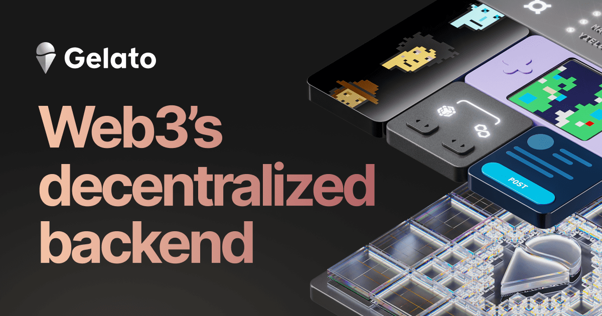

Welcome to the Build3rs Stack, Fleek’s **web3 infrastructure overview series**. This week we will take a look at [Gelato Network](https://www.gelato.network/), a decentralized web3 backend that helps to automate smart contracts.

We will talk in depth about its main features, resources, and all the necessary information you need to start using it. Let’s dive into it!

---

## TL;DR: What is Gelato Network?

Gelato Network is a decentralized web3 backend protocol designed to automate the execution of smart contracts. It’s EVM compatible and allows developers to create and deploy automated applications, services, and tools without the need to build and manage custom infrastructure.

Gelato also offers a Relay service with an SDK, providing a user-friendly toolbox for seamless interaction with the API. This service grants users and developers quick, dependable, and secure transaction validation while avoiding the technical complexities blockchains present. API requests are sent to Gelato Relay, a decentralized network of Relay Executors that ensures prompt transaction validation. Data integrity is maintained through EIP-712 signatures, and gas fees can be managed with their various supported payment options.

Finally, Gelato offers Web3 Functions–decentralized cloud functions that work similarly to AWS Lambda or Google Cloud, built for web3. They enable developers to execute on-chain transactions based on arbitrary off-chain data (APIs / subgraphs, etc) & computation. These functions are written in Typescript, stored on IPFS, and run by Gelato.

**To achieve this, the architecture is based on three different components:**

**Event Listener:** Gelato Network utilizes an event listener mechanism that persistently scans the blockchain, keeping an eye on emitted events. In EVM-compatible protocols, events offer a more cost-efficient method for sharing non-essential on-chain data, which reduces gas usage. This mechanism allows off-chain entities, like event trackers, to perform efficient queries on indexed data.

**Checker:** This component is responsible for determining if a Gelato task is executable at a particular moment by specifying the necessary conditions for task execution. It can also outline other conditions that may update a task's state, such as limit order cancellations. The Checker can access the Event Monitoring component and subscribe to any number of smart contracts and topics for observation. The listener events are then decoded and converted into a specific data structure using predefined mappers. This process leads to the creation of new tasks or updates, cancellations, and executions of existing tasks.

**Executor:** The executors within Gelato Network are responsible for carrying out tasks as soon as the specified conditions are fulfilled. They work together to ensure tasks are completed efficiently and securely. To maintain a dependable and robust network of nodes that execute smart contracts, executors are rewarded with fees for their services.

---

## Gelato Network in Features: Smart Contract Automation, Relays

In short, the main features Gelato Network provides are:

1. **Automation of smart contract execution:** Gelato Network enables developers to automate various tasks related to smart contracts on EVM blockchains. By defining conditions and actions, developers can create decentralized applications that automatically perform operations like limit orders, dollar-cost averaging, liquidation protection, and automated harvesting being on-chain and off-chain aware.
2. **Relays (Gasless transactions):** This service utilizes Gelato’s Relayer to provide users with gasless transactions. Users sign a message off-chain to use a service (like a dApp), and Gelato will relay the transaction and handle the gas payment for the corresponding network, ensuring the user gets the best abstracted experience when using a web3 app.

---

## **How you can use Gelato Network as a Builder: Applied Use-Cases.**

Let’s take a look at Gelato Network real-use case examples to understand how these features can add value to your builds!

**Automated Smart Contract Execution (e.g [MakerDAO](https://makerdao.com/))**

MakerDAO is a protocol that benefits from Gelato Network’s automated smart contract execution - by integrating Gelato, MakerDAO can help users automatically manage their CDPs, ensuring loan repayments are made when needed to avoid liquidation.

**DeFi Automation (e.g [Yearn Finance](https://yearn.finance/))**

Yearn Finance is a DeFi protocol that utilizes Gelato Network to automate specific tasks, such as optimizing yield farming strategies or rebalancing users' portfolios. With Gelato's automation, users can achieve better returns on their investments with less manual intervention.

**Vault Collateral Management (e.g [Rysk Finance](https://www.rysk.finance/)**)

Rysk Finance uses Gelato's Web3 Functions to automate the _adjustVaults_ function within the _VaultCollateralMulticall_ contract. This ensures efficient monitoring of vault health factors and timely execution of collateral adjustments when needed.

**Automated Rent Distribution (e.g [Tangible](https://www.tangible.store/))**

Tangible leverages Gelato's Web3 Functions to monitor rent collection and automatically distribute payments to real estate token holders when sufficient rent is accrued, streamlining the process and enhancing efficiency.

**Token Buybacks (e.g. [Aavegotchi](https://www.aavegotchi.com/)**)

Aavegotchi automates GHST token buybacks using Gelato's Web3 functions. The Web3 function interacts with the GHSTAutoBuy smart contract's buyGHST function to periodically swap USDC for GHST. Additionally, it employs the ParaSwap API to fetch optimal swap rates and execute transactions, purchasing GHST tokens with USDC.

---

## Getting Started with Gelato

A great starting point for developers is the [official documentation](https://docs.gelato.network/introduction/what-is-gelato) for Gelato Network. Gelato also provides other helpful resources like:

- [How does Gelato Network work?](https://docs.gelato.network/introduction/how-it-works)
- [Architecture](https://docs.gelato.network/introduction/architecture)
- [Supported Networks](https://docs.gelato.network/developer-services/automate/supported-networks)
- [Guides and Tutorials](https://docs.gelato.network/developer-services/automate/guides)
- [Use Cases](https://www.gelato.network/#use-cases)
- [Developer Resources](https://docs.gelato.network/introduction/what-is-gelato)

---

We hope this guide has given you the necessary information and tools to start using Gelato Network! Make sure to follow [Gelato Network](https://twitter.com/gelatonetwork) for further updates and developments.

Additionally, we encourage you to check out our previous **Build3rs Stack** series and keep an eye out for upcoming ones so that you can stay informed about the latest updates about web3 infrastructure. You can also join our [Discord community](https://discord.gg/fleek) to connect with us quickly.

For more resources, please visit our [LinkTree](https://linktr.ee/fleek)!
