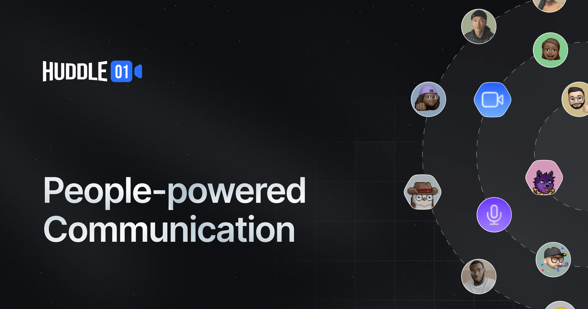
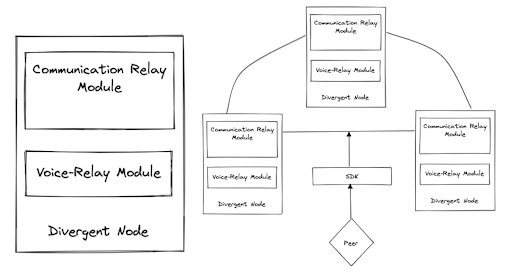
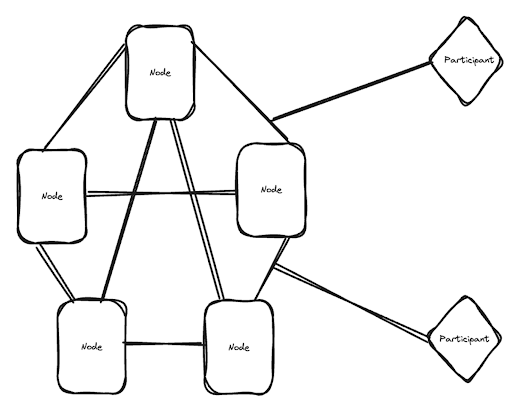

Welcome back to the Build3rs Stack, a series where our team shares insights on different web3 infrastructure! This week we are jumping into <u>[Huddle01](https://www.huddle01.com/)</u>, a decentralized communication protocol, network, and app. The Huddle01 team is bringing video, audio, streaming and more to any web3 protocol!

---

## TLDR; What is Huddle01 and how does it work?

Huddle01 is a protocol and network that implements principles of decentralization (p2p and trustless) and privacy to deliver real-time communication between browsers.

Huddle01 is working to provide what the team calls dRTC Protocol (decentralized real-time communication protocol), a secure and decentralized alternative to real-time communication via WebRTC. WebRTC is an open framework for the web that enables Real-Time Communications (RTC) capabilities in the browser.

WebRTC is a P2P technology. However, WebRTC still relies on a centralized signaling server to connect two peers, which can expose sensitive information and create a single point of failure. Huddle01 is implementing dSignaling (decentralized signaling, more on this to come) to avoid centralization and the need for expensive centralized servers. The signaling discovery mechanism also aims to allow the network to scale and adapt to growing demands.

## Protocol Overview

The Session Description Protocol (SDP) is a standardized format used to describe multimedia session parameters, like audio and video streams, in applications such as video conferencing and online gaming. SDP utilizes simple syntax to define media types, codecs (program, algorithm, or device that encodes or decodes a data stream), and network details, along with participant information.

In the dRTC network, SDP info is relayed between nodes for establishing connections. Nodes act as intermediaries, maintaining temporary connections during SDP exchange, ensuring privacy between peers. Decentralized protocols like LibP2P and IPFS enable secure, trustless SDP exchange.

## Node Components

Huddle01’s dRTC nodes implements three subcomponents of node functionality to power the network:

<u>**Networking Component**:</u> The network's central component handles data submission, retrieval, node connections, and identities. The networking component uses an IPFS node as a data storage layer and has components called Orbs, which are dedicated storage spaces for non-persistent or persistent data storage. IPFS PubSub (publish subscribe) automatically syncs nodes and uses conflict-free replicated data types (CRDTs) to maintain the network state.

<u>**Media Component:**</u> The media component is responsible for handling the audio, video and synchronous messages required for the functioning of a meeting room. The media components employ simulcast, which allows for streaming a single video source at multiple resolutions simultaneously, enabling viewers with varying bandwidths to choose the optimal resolution for their connection. The component also employs a Last-N algorithm, an algorithm where only the video streams of the "last N" active speakers are sent to a participant. If someone else starts speaking, the least recent active speaker's stream will be dropped, ensuring that only the "last N" active participants' streams are sent. This helps manage bandwidth and computational resources, especially in large group calls.

<u>**Incentive Component:**</u> The incentivized component rewards back the people powering the communications in the network. How much people are rewarded depends on their reputation, determined by how good their service is and their service history.

The dRTC Protocol allows users to connect with each other, without connecting with each other directly. Users can connect to any node on the network and do not have to be connected to the same node as peers they are communicating with.

---

## Huddle01 in Features: Web3 Audio/Video Communication

These are some of the features that you can implement in your project using Huddle01:

<u>**Audio Spaces:**</u> Create audio rooms, surfacing a feature similar to Twitter Spaces.

<u>**Video Calls:**</u> Integrate audio/video communication functionality into your web3 app so users can communicate on your platform, instead of visiting third-party apps.

<u>**Token Gated Rooms:**</u> Create token-gated rooms for your application using ERC20, ERC1155, ERC721, and chains like Etherum, BSC, Polygon, and Arbitrum.

<u>**Access Via Social Graphs:**</u> Leverage CyberConnect and Lens to implement access criteria like following a particular Lens profile or mirroring a post.

<u>**Recording & Livestreaming:**</u> Record and livestream audio and video calls. Multi-streaming/livestreaming to YouTube, Twitch and Livepeer and event recordings.

<u>**Event Recordings:**</u> Record meetings, audio calls and video calls to be saved to IPFS and emailed to participants or downloaded later.

<u>**Identity Features:**</u> Sign in with your wallet to unlock NFT Avatars, ENS, DIDs as Display Names.

<u>**Mint-a-Moment:**</u> Create snippets from meetings and mint them as NFTs.

<u>**Analytics:**</u> View statistics on number of hosted meetings, duration of meetings, collectibles, Huddle IPFS storage.

---

## Examples of Projects Leveraging Huddle01

There are a bunch of fun web3 apps leveraging Huddle01 so users can meet without having to use an external video app like Zoom, Google Meets or Discord.

**Web3 Calendly (e.g. <u>[Meet with Wallet](https://meetwithwallet.xyz/)</u>)**

Meet with Wallet is just like Calendly, but powered by web3. The web3 app integrates with L1 and L2 blockchains, IPFS, ENS, Push, Huddle01 and more for a scheduling experience tailored to web3.

**Decentralized Social Media (e.g. <u>[Soccly](https://www.soclly.com/))</u>**

Soccly is a decentralized social network powered by Polygon, Lens, XMTP, Push and Huddle01. The platform provides a decentralized calendly, a community space for sharing art, music, film, escrow services for monetizing creativity and token gated educational courses.

**Web3 Email (e.g. <u>[EtherMail](https://ethermail.io/))</u>**

Ethermail is reimagining email for web3. The app provides an email folder and paywall as a spam filter for users, as well as, on-chain mailing lists, email campaigns and web3 segmentation for companies and DAOs.

View the <u>[full list](https://huddle01.com/docs/showcase)</u> of projects leveraging Huddle01.

---

## Getting Started

The Huddle01 team provides SDKs and APIs for projects to integrate their protocol and enable audio and video communication and messaging within their applications. SDKs facilitate SDP exchange, real-time messaging, event tracking, and error handling.

- Adding video chat to a web app in <u>[7 steps](https://huddle01.hashnode.dev/add-video-chat-to-your-web-app-in-7-quick-steps)</u>
- SDKs
  - <u>[Javascript](https://huddle01.com/docs/Javascript)</u>
  - <u>[ReactJS](https://huddle01.com/docs/React)</u>
  - <u>[React Native](https://huddle01.com/docs/React-Native)</u>
- <u>[CLI](https://huddle01.com/docs/cli-tool)</u>
- <u>[iFrame](https://huddle01.com/docs/iFrame/intro)</u>
- <u>[What is Wallet01 and how to make a chain-agnostic application on NextJS](https://huddle01.hashnode.dev/wallet01-huddle01s-all-new-open-source-multi-chain-wallet-package)</u>
- <u>[Wallet01 Dev Docs](https://www.notion.so/66b9a56d73964fd19614743fb7a38780?pvs=21)</u>
- <u>[Wallet 01 Github](https://github.com/Huddle01/Wallet01)</u>
- <u>[Divergent Whitepaper](https://docs.google.com/document/d/1wAynFzZyhFHcRZS5nkz07q6HVpfoLMM2HaXtknIj9mU/edit)</u>
- <u>[Run a Divergent node](https://www.notion.so/74e8b2c12812407d98483abb9c4c3d82?pvs=21)</u>

---

We hope you enjoyed learning about Huddle01 and their goal to decentralize and scale real time WebRTC to develop a web3 multimedia communication system.

Want more information on cool infrastructure projects? Check out more of our <u>[Build3rs Stack articles](/guides/)</u>. You can also <u>[join our Discord server](https://discord.com/invite/fleek)</u> to jam with the team and learn more!

For more resources, visit <u>[our LinkTree](https://linktr.ee/fleek)</u>
