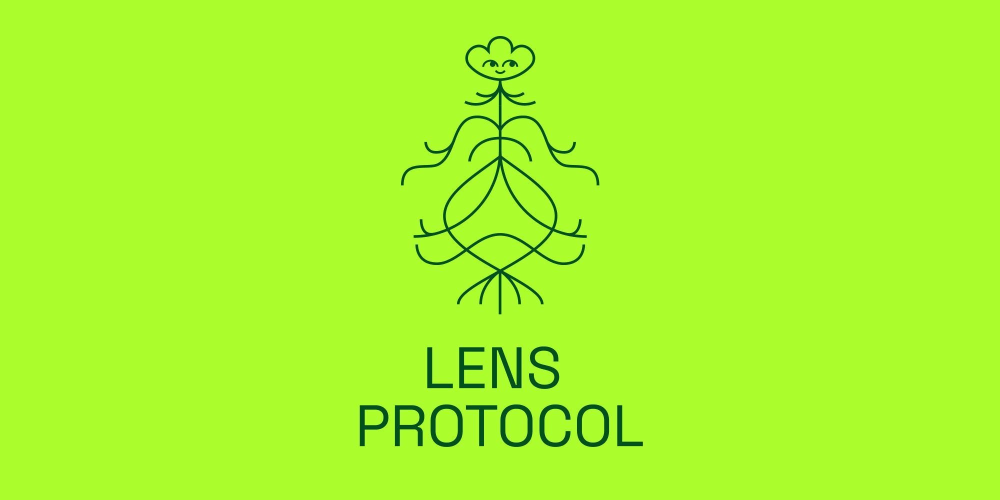

Welcome to the Build3rs Stack, Fleek’s **web3 infrastructure overview series**. This week we will take a look at [Lens Protocol](https://lens.xyz) - A decentralized social media protocol! We will talk in depth about its main features, resources, and all the necessary information you need to get started.

In a nutshell, Lens Protocol is a **decentralized and composable social graph**, enabling you to concentrate on crafting exceptional experiences rather than managing a siloed social infrastructure. Let’s dive into it!

---

## TL;DR: What is Lens Protocol?

Lens Protocol is a **Web3-based social graph** implemented on Polygon PoS. The main idea of this is to create a completely composable and **user-owned** social network. Designed with modularity as a core principle, the protocol allows for the seamless addition of new functionalities and improvements while preserving the immutability of user-generated content and social connections.

This also aims to address the significant challenges present in traditional and centralized social media networks. In particular, Web2 platforms rely on their proprietary, centralized databases, which lack portability. User profiles, connections, and content are confined to a single network and controlled by the platform operator, resulting in a competitive struggle for user attention - the protocol addresses these issues by establishing a user-owned, **open social graph** accessible to any application. As users retain control of their data, they can easily transition it between applications built on Lens Protocol.

Lens Protocol is presently governed by a multisig, which will eventually transition to a more inclusive DAO- responsible for proposing and voting on new modules and extended features.

### How does the architecture work?

Lens Protocol's architecture revolves **around profile creation, publishing, and interaction**. To create a profile, users receive a sequentially ID'd profile NFT, which grants them control over their profile and content:

- **Profile owners**: Can publish and create content types, including posts, comments, and mirrors. Comments and mirrors contain pointers that execute a pointed publication's "reference module" logic, and can also set their "follow module," which is a whitelisted logic contract that determines the actions required when a wallet follows a profile. This could include fees paid to the profile owner via the fee follow module contract. Furthermore, they can set their profile's image URI and designate a "dispatcher" address that can act on their behalf, allowing it to publish content and set the profile's URI.

- **Regular wallets**: Can follow profiles and execute the "follow module" logic. This action mints a sequentially ID'd "follow NFT" for the following wallet, with a custom URI set by the profile owner. Additionally, wallets can collect publications, executing any "collect module" logic present. If the publication is a mirror, this execution applies to the originally mirrored publication with a referral. Collecting a publication mints a sequentially ID'd "collect NFT" unique to the publication, and its URI points to the collected publication's URI.

---

## Lens in Features: Profiles, Interactions, and Monetization.

As a social media web3 protocol, Lens enables you to leverage the following features:

- **Profile NFTs (Users)**: Every social media account is associated with its own NFT. Both the content and interactions related to that content are saved on the token. If desired, a wallet address can hold multiple profile NFTs, enabling the management of several social media accounts.

- **Composable Publications, Comments, Follows, Mirrors (Interactions):**: You can create and share (mirror) publications in a composable social graph, and allow users to interact with other user content by leaving live comments and can following others or gaining followers. Each connection is represented by a unique token ID. These are all different social media primitives that with Lens are available in a composable way.

- **Collecting (Monetization)**: This module provides you the option of monetizing your content when you publish it into Lens, and this also allows you to mint the publication as a NFT thanks to the publication’s content URI mentioned before.

---

## How can you use Lens as a Builder: Applied Use-Cases

To understand the value of this protocol, let's explore some real-world examples of how Lens can be used by builders.

**Social Media Platform (e.g: [Lenster](https://lenster.xyz/))**

Lenster is a decentralized and permissionless social media protocol built on the top of Lens Protocol - this provides you the benefit of owning your own data, reducing exposure to censorship.

**NFT images collection (e.g: [Pinsta](https://pinsta.xyz/))**

Pinsta is a platform where you can post & collect images in the form of NFTs, powered by the Lens social graph.

**Publishing Platform (e.g: [ShareXYZ](https://theshr.xyz/))**

Censorship-resistant and decentralized platform where you can read, publish and connect with writers easily, built on the top of Lens Protocol.

---

## Getting Started with Lens

With the developer tools that Lens provides you can easily start to create your own decentralized social media applications! But first, let’s start with the [official documentation](https://docs.lens.xyz/docs)! And after that, you will find many other useful resources:

- [Quick Start Guide](https://docs.lens.xyz/docs/developer-quickstart) - get started with Lens.
- [Lens API](https://docs.lens.xyz/docs/introduction) - get started with Lens.
- [Lens React SDK](https://docs.lens.xyz/docs/sdk-react-intro).
- [LensKit](https://github.com/daoleno/lenskit) - Set of libraries in a mono-repo for integrating Lens.
- [Lens SDK Examples](https://github.com/lens-protocol/lens-sdk/tree/main/examples) - Production-ready starter kits.
- [Ecosystem Lensverse](https://aave.notion.site/Lensverse-a5926eab1d8148eda10053af9f4e28a0) - where you can find hackathons, projects, etc.
- [Lens API](https://docs.lens.xyz/docs/introduction) - the graphQL API to start to build on Lens.
- [Modules](https://docs.lens.xyz/docs/module-interfaces) - Create a module to include essential functionalities.
- [Lens SDK reference](https://lens-protocol.github.io/lens-sdk/) - references for the Lens SDK.

With all these resources you can quickly start to build on the top of Lens. Check [out the entire ecosystem list of projects](https://github.com/0xJuancito/awesome-lens-protocol) built on it (made by the community)!

---

We hope that this guide has given you the necessary information and tools to start building with Lens! Make sure to follow [Lens](https://twitter.com/LensProtocol) for further updates and developments.

Additionally, we encourage you to check out our previous [Build3rs Stack](/guides/) series and keep an eye out for upcoming ones so that you can stay informed about the latest updates about web3 infrastructure. You can also join our [Discord](https://discord.gg/fleek) community to connect with us quickly.

If you need more resources, please visit our [LinkTree](https://linktr.ee/fleek)!
