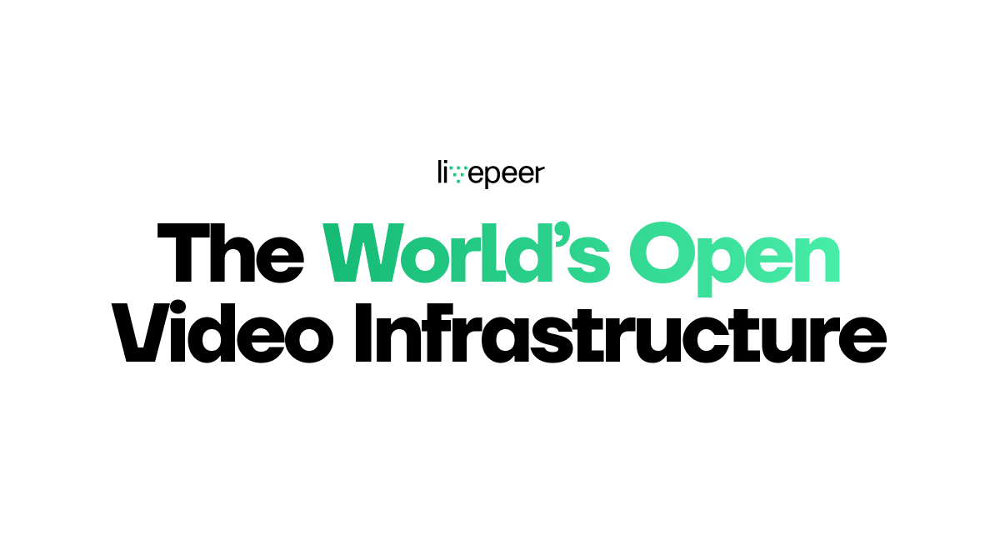

Welcome to the Build3rs Stack, our web3 infrastructure overview series! This week we will take a look at **[Livepeer](https://livepeer.org/) – a decentralized video streaming network**! We will talk about the main features, resources to get started and the necessary info!

In brief, **Livepeer is an open-source decentralized protocol designed to provide a way to stream video content via a peer-to-peer network**. It introduces many foundational elements to Web3 development such as a decentralized network of nodes that can efficiently and trustlessly serve video content.

Let’s dive in!

---

## TL;DR: What is Livepeer?

[Livepeer](https://livepeer.org/) was designed to efficiently and securely serve video content through a network of decentralized nodes, introducing many foundational elements to web3 development in the ecosystem!

This protocol allows for seamless **video transcoding, packaging, and delivery, ensuring high-quality video streaming across all devices**. Through its efficient and trustless network, Livepeer offers a decentralized alternative to centralized video streaming services.

To achieve its decentralized infrastructure, Livepeer relies on several critical roles in the network, including:

- **Gateway Providers**: These are Livepeer node operators that provide gateway access to the Livepeer API for developers.
- **Delegators**: These are users who stake Livepeer's native token, LPT, to back Orchestrators, thereby participating in the network's governance and earning a portion of the network's fees.
- **Broadcasters**: These are the video content creators who use the Livepeer protocol to stream their content in a decentralized manner.

Together, these actors on the network compose the network's demand and supply flow, where broadcasters request resources, which are provided by orchestrators filtered and verified by delegators.

---

## Livepeer in Features: On-demand video Streaming, Uploading, and Transcoding.

As a protocol, Livepeer can enable you to leverage the following features from its decentralized infrastructure:

**On-demand video streaming (live or stored)**: Streaming is one of the main features of Livepeer - this allows users to stream video content to their viewers in real-time, or through a stored asset. This means that viewers can watch a video live, transcoded by Livepeer, without the need to download the entire video file before playback. On-demand video streaming is particularly useful for live events, webinars, and other real-time video broadcasts.

**Uploading**: Users can upload their video content to the platform, where it is then transcoded into multiple formats to ensure compatibility with various devices and internet connections. Transcoding is the process of converting video content from one format to another. This ensures that you can stream to any viewer type, and have them watch the video on different devices and at different connection speeds without any issues.

**Transcoding Other Sources**: Not only you can stream live video, or upload and transcode video files to be served by Livepeer. You can also point Livepeer to other video sources, like videos stores on Arweave and IPFS, and have them stream from origin but be transcoded and optimized by Livepeer!

---

## How can you use Livepeer as a Builder: Applied Use-Cases.

Let's explore some real-world examples of how Livepeer can be used by builders to create innovative video applications and services.

**Decentralized Live Streaming Platform (e.g: [Xeenon](https://xeenon.xyz/))**

Xeenon can use Livepeer's infrastructure for live streaming to improve the quality and scalability of live video streaming on its platform. As a decentralized live streaming infrastructure, it can help ensure low latency, high-quality video streaming that can scale to meet demand during peak traffic periods.

**Decentralized Video Sreaming (e.g: [BEEM](https://www.beem.xyz/))**

BEEM is another example that leverages Livepeer's live streaming capabilities to create a **web3 video broadcasting alternative to Twitch**, setting up streamers on decentralized infrastructure and enabling both creators and live events to have an easy way to broadcast live.

For more resources visit [our LinkTree](https://linktr.ee/fleek).

---

## Getting Started with Livepeer

With the developer tools that Livepeer provides you can easily start to create on-demand and decentralized video streams. The easiest starting point is [Livepeer Studio](https://livepeer.studio/) or alternatively, you can interact with the network directly as seen in guides below.

1. [**Create an API Key**](https://docs.livepeer.org/guides/developing/quickstart): To get started you need to first create an API key, this refers to the process of generating a unique code that allows developers or users to access and use the Livepeer API, which is a set of programming tools and interfaces for creating, managing, and streaming video content on the Livepeer network.

2. [**Add a Player**](https://docs.livepeer.org/guides/developing/player): After that you can add a player, this involves adding a video player to a website or application that enables users to watch Livepeer video streams. The player can be customized to fit the look and feel of the site, and can also include features like play/pause, volume control, and fullscreen mode.

3. [_Create a Livestream_](https://livepeer.studio/): Set up a [livestream video](https://docs.livepeer.org/guides/developing/create-a-livestream) feed! You can also sign up for a Livepeer Studio account (a toolkit and gateway to using Livepeer) to use the REST API or SDK it offers to create a livestream very quickly.

4. [**Mint a Video NFT**](https://docs.livepeer.org/guides/developing/mint-a-video-nft): With this simple integration, Livepeer allows you to create a unique (NFT) that represents a specific piece of video content on Livepeer network. The NFT can be sold, traded, or otherwise exchanged on a blockchain-based marketplace, and serves as a digital certificate of authenticity for the video.

5. [**Play a Video from IPFS or Arweave**](https://docs.livepeer.org/guides/developing/mint-a-video-nft): As we mentioned above, Livepeer also allows you to stream a video file that has been uploaded to either the InterPlanetary File System (IPFS) or Arweave, which are decentralized storage networks that allow for secure, distributed storage of large files (like videos!). Users can access the file by specifying its IPFS or Arweave address, and can then stream it using a compatible player or application, transcoded and served efficiently by Livepeer.

If you want to build and explore all the API’s and tools - you can start with the official [documentation](https://docs.livepeer.org/)! Or here you have other useful resources to get started:

- [API reference doc](https://docs.livepeer.org/reference/api)
- [Livepeer Javascript SDK](https://docs.livepeer.org/reference/livepeer-js)
- [Example Applications](https://docs.livepeer.org/reference/example-applications)
- [Projects building on Livepeer](https://livepeer.org/ecosystem)
- [Livepeer Studio](https://livepeer.studio/)

---

## Wrapping it Up

Hope that this guide has provided you with the essential information and tools to begin building with Livepeer! Make sure to follow [Livepeer](https://twitter.com/Livepeer) for further updates.

Additionally, we encourage you to check out our previous Build3rs Stack series and keep an eye out for upcoming ones so that you can stay informed about the latest updates about web3 infrastructure. You can also join our Discord community to connect with us quickly.

For this and more resources, visit [our LinkTree](https://linktr.ee/fleek).
