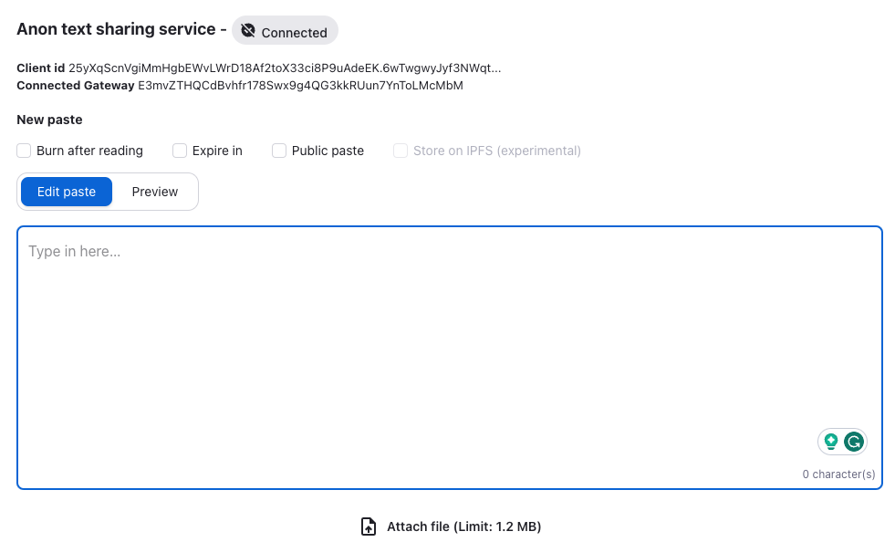

Welcome back to the Build3rs Stack, Fleek’s web3 infra overview series! This week dive into Nym– the privacy platform protecting end users’ communication patterns, IP addresses, and metadata.

Developers can use Nym to create privacy-enhanced applications (PEAs), using an architecture of Nym nodes, clients, and Nym’s blockchain, [Nyx](https://nymtech.net/docs/architecture/network-overview.html).

Let’s get into how you can leverage Nym in your Web3 builds:

---

## TLDR; What is NYM?

Nym provides network-level privacy-preserving software for end users and developers. Along with protection against sophisticated end-to-end attackers, Nym also solves a major problem facing developers today: traffic patterns are visible to anyone observing or monitoring a network. Nym solves this, routing traffic through a decentralized _[mixnet](https://nymtech.net/docs/architecture/traffic-flow.html)_.

### Key Aspects of Nym:

- **Decentralized**: Operated by a community of node operators and stakers.
- **Tokenized**: Incorporates incentivization to reward operators.
- **Open Source**: All Nym software is open source and can be audited by anyone.
- **Permissionless**: Anyone can build with Nym, or spin up their own Nym node.
- **Trustless**: The mixnet is trustless, meaning neither the operator nor the system can access users’ private information.

---

## How Does Nym Work?

At its core, **Nym employs blinded, re-randomized, decentralized credentials to transport data**. This protects privacy at the network level, by encrypting and relaying internet traffic through a multi-layered mixnet network. Within each layer, mix nodes combine and mix a user’s internet traffic with other network users.

Nym and its privacy-enhancing signature scheme, called [Coconut](https://nymtech.net/docs/coconut.html), creates a paradigm shift in how we approach private resource control and access: moving from an identity-based system centered around `who you are`, to a privacy-preserving `right to use` system.

### Nym Traffic Flow

1. Mixnet breaks [Sphinx packets](https://cypherpunks.ca/~iang/pubs/Sphinx_Oakland09.pdf) into uniformly sized packages and encrypts them according to the path it will take.
2. Mixnet re-orders and sends broken packets through various gateways and mix nodes.
3. Packets are sent through the mixnet with a combination of real and fake, dummy traffic.
4. Each time a packet is sent from one node to another, each known as a `hop`, a layer of decryption is removed from each packet– this reveals the address of the next hop.
5. The packet is held in each layer by a node for a variable amount of time, before being forwarded to the next one.
6. When each hop is completed, the receiving node sends back an acknowledgment (ack), so the sending node knows it was received.

The traffic follows a similar pattern every time–first being sent by the client registered gateway, through a mix node on three different layers on the network, and finally to the recipient’s gateway or application client.

---

## Nym in Features: Zk-nym, NymConnect, Mixnet

### Zk-nym

[Zk-nym](https://nymtech.net/about/zk-nyms)’s are credentials that can be used to access digital apps and services without revealing the end user’s sensitive information. Based on the Coconut protocol, they allow users to request anonymous credentials from issuing authorities, like validators from Nym’s Cosmos-based blockchain ([Nyx](https://nymtech.net/docs/nyx/smart-contracts.html)).

These validators issue anonymous credentials that have “threshold issuance,” meaning they only hold part of the key of the credential and cannot piece together the full key to deanonymize end users. This makes the ability to cryptographically prove sensitive information to a digital service, while still maintaining privacy, possible.

### NymConnect

[NymConnect](https://nymtech.net/download/nymconnect) acts as a versatile interface for connecting to applications in the Nym Mixnet. The coolest thing about NymConnect is that it can enhance the privacy for any app that can run [SOCKS5](https://www.ibm.com/docs/en/secure-proxy/6.0.2?topic=scenarios-socks5-configuration), including Telegram, Electrum, and Blockstream Green.

### Mixnet

The aforementioned mixnet is the backbone of Nym, encrypting and mixing sphinx packet traffic, protecting communication patterns and traffic from external parties. Based on a modified [Loopix Anonymity System](https://arxiv.org/abs/1703.00536), it is comprised of:

- [Mix Nodes](https://nymtech.net/docs/architecture/network-overview.html#mixnet-infrastructure)
- [Gateways](https://nymtech.net/docs/architecture/network-overview.html#mixnet-infrastructure)
- [Services](https://nymtech.net/docs/nodes/network-requester.html)
- [Nyx Blockchain Validators](https://nymtech.net/docs/architecture/network-overview.html#mixnet-infrastructure)

The Mixnet is crucial for the flow of anonymous traffic within the network, making it a fundamental component of the Nym platform.

---

## Applied Use-Cases

A great example of building with Nym is [Pastenym](https://pastenym.ch/#/)– an anonymous messaging service, that allows users to send end-to-end encrypted texts wallet-to-wallet. Users can choose to have the message burnt after reading, expire after a set amount of time, have it stored on IPFS, or have it not encrypted at all.

Anonymous e-cash payments or self-sovereign identities are also possible with Nym, using a zk-nym scheme to enable private financial transactions or prove you’re a certain age without revealing your birthdate/personal information.

---

## Getting Started With Nym

- [Developer Portal](https://nymtech.net/developers/introduction.html)
- [Quickstart Guide](https://nymtech.net/developers/quickstart/overview.html)
- [Rust SDK](https://nymtech.net/developers/tutorials/rust-sdk.html)
- [TypeScript](https://nymtech.net/developers/tutorials/typescript.html)
- [MixNode Starting Guide](https://nymtech.net/build/nodes?name=mixnodes)
  - [Operator’s Guide](https://nymtech.net/operators)
- [NymConnect](https://nymtech.net/download/nymconnect)
- [Nym Wallet](https://nymtech.net/download/wallet)
- [Nym vs other Systems](https://nymtech.net/developers/infrastructure/nym-vs-others.html)
- [Blog](https://blog.nymtech.net/)

---

That’s all for this week on Nym! This blog should be a good jumping-off point to get started with Nym, giving you all the resources you need to start building your first Privacy-enhanced application.

Follow Nym on [X](https://twitter.com/nymproject) to stay up to date on what the team is working on.

If you enjoyed learning about the protocol check out more of our [Build3rs Stack](/guides/) articles.

You can also join our [Discord](http://discord.gg/fleek) server to jam with the team and learn more!

For more resources, visit our [LinkTree](https://linktr.ee/fleek)⚡
