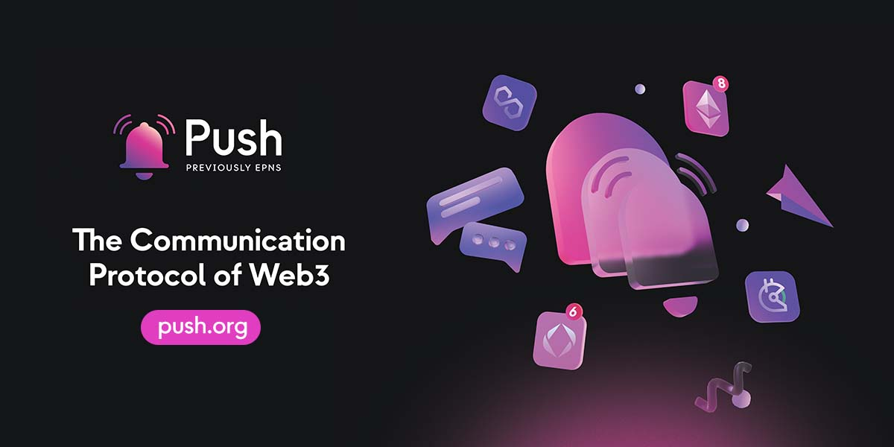
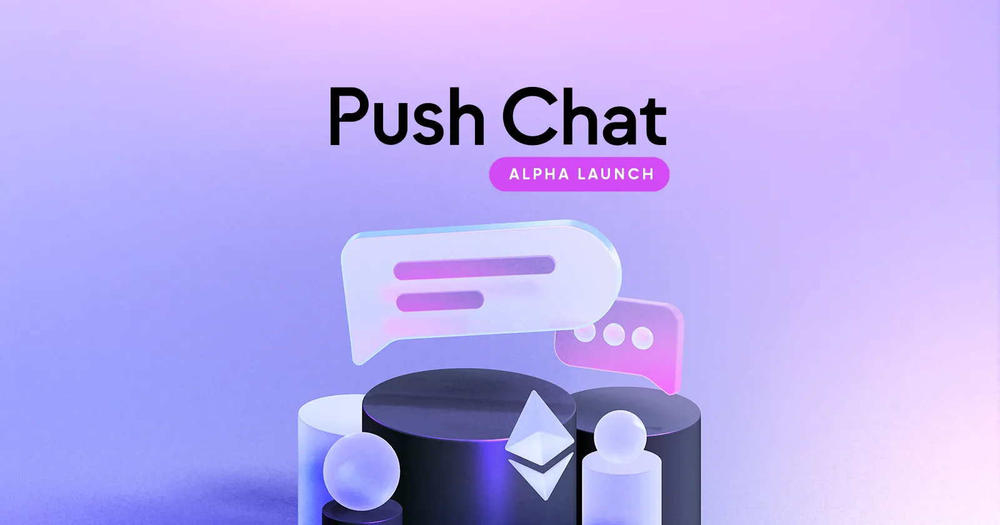
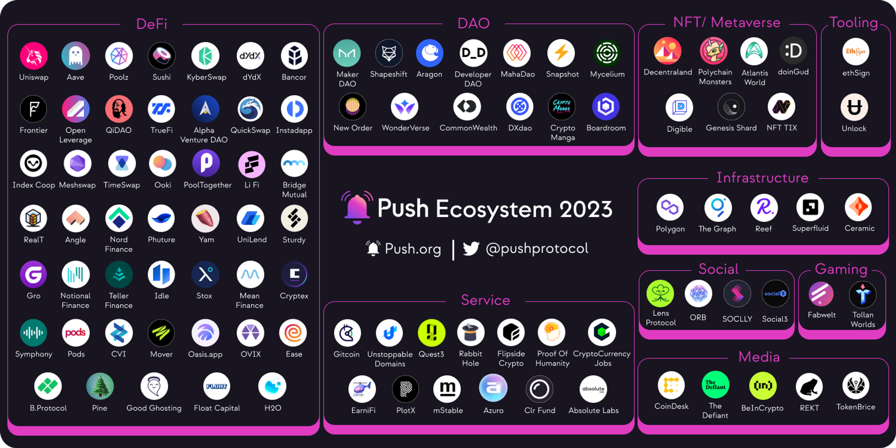

Welcome to the Build3rs Stack, Fleek’s web3 infrastructure overview series. This week we will take a look **at [Push Protocol](https://push.org/) – a web3 communication protocol!** We will talk about the main features, resources to get started, and the necessary info you need to start building with it.

In brief, Push Protocol is an open-source decentralized protocol designed to provide a way to **send and receive push notifications and messages in a peer-to-peer network**.

Let's dive in!

---

## TL;DR: What is Push Protocol?

Push Protocol is an open source and decentralized protocol for communication in web3 that provides **off-chain messages in a gasless, and protocol-agnostic way**, allowing apps to communicate with users, or have wallet addresses message each other!

Push introduced an important standard, as originally there was no web3-native method for dApps service providers, and wallets to communicate with one another. The majority of interactions in the current ecosystem are based on conventional web2 messaging tools or standards **that are not really interoperable/composable, and have trouble communicating with each other** (e.g. sending a message across messaging platforms!).

The core elements of the Push Protocol can be primarily divided into three main actors:

- **Channels**: A Channel on the protocol can be any user-activated service, such as a dApp, protocol, or web2 service, that seeks to send notifications to its web3 users.

- **Notification Providers**: These are the nodes that process and deliver notifications to the recipients. Providers are incentivized to deliver high-quality service and are selected based on their reputation and stake in the network.

- **Subscribers**: These are the users or applications that are subscribers to a specific channel to receive notifications. When a user subscribes to a push notification service, they give permission for the service to send them messages, alerts, or updates. These notifications can be delivered to the user's device even when the user is not actively using the app or website that the notifications are related to.

While Push initially started with notifications, as a communication protocol, the next natural evolution was to evolve into [Push Chat](https://medium.com/push-protocol/push-chat-the-solution-to-centralized-messaging-4bac88dab2c0)! Evolving the protocol’s use case from static client-to-user messages, to an overall communication primitive (message, or notification) that enables two-way communication, and unlocking a plethora of decentralized communication use cases (in-app messaging, chat apps, support chats, etc.).

---

## How does Push Protocol Work?

To understand how the architecture of the protocol is composed and how the data/messages flow, let’s run through Push end-to-end:

1. **Server**: This is the central component in the architecture. It maintains a list of connected clients and is responsible for pushing data to them when updates are available.

2. **Server Subscription Management**: The server will keep track of all connected clients and their subscriptions and send updates to them when new data arrives.

3. **Data Push**: When the server has new data to share, it "pushes" this information to the relevant clients. This push can be initiated by an external event, such as a change in stock prices or a new message on a chat platform.

4. **Client Connection**: The process begins when a client establishes a connection with the server indicating what channels they want to subscribe to. This can be done using various methods, such as WebSocket connections, HTTP/2, or other custom protocols.

5. **Client Update**: Once the clients receive the pushed data, they can process and display the information accordingly. This enables real-time updates and reduces the latency associated with traditional request-response models.

---

## Push Protocol in Features: Push Notifications, and Push Chat Messaging.

As a decentralized communication system, Push Protocol can be the backbone of your project's communication stack. From alerting and messaging to event updates, you can build, manage, and deliver notifications for your decentralized application end-to-end using Push Protocol, so let’s explore some of these features!

### Push Notifications:

This feature allows applications to send real-time updates to users' devices efficiently. They serve as a means for servers to send instant messages or updates to clients without the need for the client to request the information explicitly. For example… Notifying your users of a new feature release in-app!

### Push Chat Messaging:

Push started with notifications, and evolved to offer Push Chat as well! Enabling encrypted chat messaging with embedded notifications through the protocol. The user’s address being the wallet address. This can be embedded into any experience for users to leverage via the [Push Chat SDK](https://medium.com/push-protocol/push-chat-the-solution-to-centralized-messaging-4bac88dab2c0). Give users chat groups, interoperable DMs, or a support chat.

---

## How can you use Push Protocol as a Builder: Applied Use-Cases.

To understand what you can build with Push Protocol in your web3 app, let’s explore some applications that use the protocol with applied use-cases!

**Notifications on a Decentralized Social Network (e.g: [Lens Protocol](https://www.lens.xyz/))**

Lens Protocol has an integration of Push Protocol for trigger push notifications to users based on their subscriptions, comments, and account activity

**Messaging with Push Chat ([Push Chat App](https://app.push.org/#/chat))**

The Push team recently released the [Push Chat and Push Group App in Alpha](https://medium.com/push-protocol/launching-the-future-of-web3-messaging-with-push-chat-push-group-chat-de4cb7a65231), the best showcase of what you can achieve with Push as a messaging and notification layer (and a ready-to-go web3 messaging app as well!). Powered by the [Push Chat SDK](https://docs.push.org/developers/developer-guides/integrating-push-chat), you can achieve similar integrations embedding it into your web3 apps.

You can explore all the projects building on Push Protocol in this [link](https://push.org/frens).

---

## Getting Started with Push Protocol

To get started with Push Protocol you can read the [official documentation](https://docs.push.org/developers/) for developers to find all the resources that you need! But let’s take a look at how to start creating your own channels to generate your own notifications/messages via Push, and some other useful tools.

1. [Creating a Channel:](https://docs.push.org/developers/developer-guides/create-your-notif-channel) Each wallet address can create one Channel. Creating a Channel requires 50 PUSH tokens, Channel info (name, image, description, CTA), and some ETH.
2. [Sending Notifications](https://docs.push.org/developers/developer-guides/sending-notifications): Which you can do so via the JS SDK, the Showrunner's Framework, Smart Contract to Smart Contract, and Manually from the Push dApp integration.
3. [Receiving Notification](https://docs.push.org/developers/developer-guides/receiving-notifications): Via Restful API, AWS SNS, or a Delivery Node.
4. [Using Delegation](https://docs.push.org/developers/developer-guides/create-your-notif-channel/adding-delegates-for-channel): Channels can delegate or revoke the ability to send notifications to other wallet addresses on their behalf.
5. [The Push Chat SDK](https://docs.push.org/developers/developer-guides/integrating-push-chat): Using the SDK, it’s easy to give any web3 app Push Chat capabilities, with groups, DMs, or other features.

---

## Wrapping it up

We hope this guide has served you with the essential knowledge and resources to start building with Push Protocol! Stay tuned to [Push's Twitter](https://twitter.com/pushprotocol) account for more updates.

Don't forget to explore our earlier Build3rs Stack series and watch for future editions to stay up-to-date on the latest web3 infrastructure developments. To stay in touch with the team, feel free to join our Discord community and visit [our LinkTree](https://linktr.ee/fleek).
