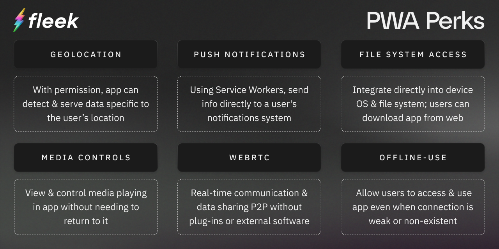

Welcome back to the Build3rs Stack– our web3 infra overview series! **Going forward we're tweaking this series to explore some broader concepts and building trends, starting with a look into Progressive Web Apps (PWAs).**

Progressive Web Apps have emerged as a hot development trend recently, with platforms like [Friend.tech](https://www.friend.tech/) leading the way and the overall concept gaining traction in the web3 development community. This rise isn’t just a temporary trend but instead, a fix for a longstanding issue—**the mobile web experience and distribution of applications is objectively subpar compared to its desktop counterpart**. PWAs are a cool solution to this issue, offering users the familiarity and ease of use of mobile App Store applications combined with the power, versatility, and reach of desktop web apps.

TLDR:

- Progressive Web Apps (PWAs) are applications installable from the web that bring near-native experiences and distribution to all devices within a single, uniform application.
- Users can visit the browser version of an application, and install it as a PWA, instead of needing to download it from a traditional App Store.
- Apps launch from the user's home screen or dock and are built as sandboxed systems operating in their own browser window on the user's device.
- Have all of the capabilities of web-based applications, including search indexing, and combine that with the best of mobile-based applications.
- Can be configured for offline/no connection use.
- Best practices like prioritizing fast performance, compatibility, responsive design, branding, and more should be followed when developing a PWA.

Let’s get into some more details about PWAs:

---

## What are Progressive Web Apps (PWAs)?

<video width="100%" height="auto" autoplay loop>
 <source src="./pwa-download.mp4" type="video/mp4">
 Your browser does not support the video tag.
</video>

**Progressive Web Apps are built using modern APIs to deliver near native-level reach, reliability, and capabilities across all devices**. They are a blend of the best elements of desktop-web and mobile apps, offering the accessibility and versatility of web-based applications with the user-centric, intuitive, and accessible experience of mobile apps. Additionally, the ability to avoid certain centralized app store restrictions (think high fees on Apple Store transactions) has made a lot of web3 companies turn to PWAs as a way to become available on mobile user’s devices.

_From the user's P.O.V:_

- PWAs look and function like traditional applications.
- They can be instantly launched from the user's mobile home screen or laptop dock.
- Built to run in a standalone browser window on the users’ device, not just another tab.
- Give the look, feel, and benefits of a traditional desktop or mobile application.
- Equipped with all the functionalities of a web-based experience.
- Despite app-like functionality and appearance, PWAs are indexed by search engines and offer the discoverability of traditional web-based applications.

### PWA in Features: Merging Desktop and Mobile Experiences

For a more in-depth overview of PWA capabilities, and links to APIs to get started with them today, check out [this article](https://web.dev/learn/pwa/capabilities/) from web.dev.

### Getting Out of App Stores

But even further than just providing desktop web-level experiences to mobile, PWAs also **offer mobile native apps a way to reach their users without having to follow the terms and conditions set out by centralized app stores**.

Traditionally, to get a mobile application into the hands of users, developers would need to have their app approved by each store they want their app available, and adhere to revenue share and fees determined by the hosting store. With PWAs developers can completely avoid this step, giving users the ability to install an application directly from the web and interact with the app without any third-party intermediaries.

---

## PWA Examples and Use-Cases

The recent PWA rise to prominence has started to shine some light on already great examples of the tech and how it can be used. It doesn’t just stop at web3 companies, like [Friend.tech](https://www.friend.tech/), turning to PWAs as a method of avoiding restrictions; [major companies across the web](https://www.dizzain.com/blog/pwa-examples/) have been using the tech to supercharge their applications and offer uniform experiences across devices for years now.

### Web2 Applications

[Starbucks](https://app.starbucks.com/) released a PWA in 2017 to mirror the experience of their native app, aiming to provide a responsive, user-friendly online ordering system regardless of network connection. The result? They saw a [2x increase in DAU](http://kedin.com/pulse/beginners-guide-progressive-web-apps-itechnolabs-ca/?trk=pulse-article_more-articles_related-content-card) and 23% increase in order diversity.

It doesn’t stop there though.

Messaging apps like [WhatsApp](https://www.whatsapp.com/) and [Telegram](https://web.telegram.org/) have released their own PWAs recently, with Telegram seeing a 50% increase in retention rate and user sessions itself.

### Web3 Applications: PWAs + NFAs

Integrating PWAs with [Non-Fungible Apps (NFAs)](https://fleek.xyz/blog/uncategorized/nfa-update-ens-layerzero-3dns/) could lead to the development of truly decentralized and easy-to-distribute apps, functioning like traditional applications but without the limitations of centralized app stores. This integration offers a decentralized, on-chain alternative, enabling apps to be loaded and accessed on-chain, free from centralized intermediaries.

This means we can create a more open and user-friendly way to build and use apps. This approach can help web3 apps, which often struggle to get into centralized app stores, by providing a decentralized way to reach their users. Any PWA will be able to be made into a PWA, and any PWA will have the ability to be made into an NFA, allowing persistent on-chain access and installability for any application that wants it.

---

## Making Your First PWA: Discoverability & Offline Capabilities

Creating an installable PWA is easy– it just requires you to meet some technical criteria. **A PWA must be served over HTTPS and should have a Web App Manifest, a JSON file that contains the app's properties**. The manifest tells the browser and the user's device how the app should look and function. The manifest includes required information such as:

- `name` or `short_name`: the application's name.
- `icons`: images representing the app in various resolutions.
- `start_url`: the starting URL of the app when launched.
- `display`: determines how browser UI is shown on the user’s specific device.

The manifest can also include a range of other members, each playing a role in determining how the application behaves on the end-user’s device. You can see a full list of possible manifest members [here](https://developer.mozilla.org/en-US/docs/Web/Manifest). The distribution of a PWA is typically done as a traditional web app, making it discoverable through web searches. When users visit a page deemed installable by the browser, they are usually offered an installation prompt in the browser URL or mobile UI if they meet the above criteria.

PWAs should also offer offline usability and a true app-like experience, utilizing IndexedDB for in-browser NoSQL storage and service workers for storing content for offline use. This involves securing and storing all the necessary static resources that enable the app to initialize and present content instantly. In instances where pages are not cacheable, directing users to a specially designed offline page is a good way to reduce bounce rates while still providing content to users. Additionally, consider more advanced strategies like providing options for users to download data for viewing when offline. More tips and tricks for offline configuration can be found [here](https://learn.microsoft.com/en-us/microsoft-edge/progressive-web-apps-chromium/how-to/service-workers).

---

## PWA Development: Best Practices

When building a Progressive Web App, following some best practices is key to the app being user-friendly, secure, efficient, and most importantly, functioning as a true PWA. Here are some general tips and factors to prioritize for developers aiming to build their own PWA:

### Fast Performance

PWA or not, it's key that your site works fast. Why? Users don’t wait for sites to load– according to a Google study, as page load time increases from one second to five, [user bounce rate probability increases by 90%](https://www.thinkwithgoogle.com/marketing-strategies/app-and-mobile/mobile-bounce-rate-statistics/). PWAs, and in turn your site, should operate as fast as native app store applications. To measure this, utilize user-centric performance metrics and tools like Lighthouse and PageSpeed Insights to benchmark and optimize performance.

One way to improve the performance of your PWA is to employ cache-first networking–use a service worker that caches and fetches content, creating an environment that loads pre-cached content quickly no matter the network coverage. Developers can also take steps to optimize for network quality, CSS, Resource Delivery, JavaScript, images, [and more](https://web.dev/fast/#core-web-vitals) to improve the speed and performance of their apps.

### Compatibility and Responsive Design

It’s key you ensure your PWAs work across all browsers, mobile or desktop. That’s the entire point of PWAs– provide a uniform experience across as many devices as possible. Key factors to consider when optimizing compatibility and responsiveness for a PWA:

- Employ feature detection techniques and responsive design to fit a user's device and identify the features supported by a user's browser.
- Make sure CSS and styling (Image, font, section resizing, etc.) are compatible for a variety of devices and browsers for a uniform user experience across devices.

Developers can do this by turning to something called _Responsive Design_, a type of web design [developed by Ethan Marcotte](https://alistapart.com/article/responsive-web-design/) that prioritizes content-first design and content-out responsive layouts. In short, all content should be usable regardless of a user’s device by rearranging content at different viewport sizes. For more details on developing apps with Responsive Design, click [here](https://www.toptal.com/designers/responsive/responsive-design-best-practices).

### Discoverability and Accessibility

A major advantage of developing an application as a PWA– Search Engine Discoverability. Previously, mobile applications were optimized for search engines, and the only way to discover them was through App Stores. PWAs can be indexed by search engines, but they need some specific strategies to make sure they rank well thanks to their reliance on JavaScript.

[Dynamic rendering](https://developers.google.com/search/docs/crawling-indexing/javascript/dynamic-rendering#:~:text=Dynamic%20rendering%20is%20a%20workaround%20for%20indexable%2C%20public%20JavaScript%2Dgenerated,the%20crawlers%20you%20care%20about.) is key; it allows different content to be presented to users and search engines, preserving SEO integrity and user experience. Mixing rendering methods for important content is also a good tip, balancing between client-side and server-side rendering. This allows key information to be indexed by web crawlers immediately through SSR and then the rest via client-side rendering afterward.

Keep in mind that developing an app with perfect SEO isn’t a one-and-done task; it requires continuous effort and maintenance. Regular SEO audits and updates are essential to ensure that the PWA remains in line with SEO best practices and adapts to the evolving SEO landscape. At the end of the day, stick to [SEO fundamentals](https://developers.google.com/search/docs/fundamentals/seo-starter-guide) and you can ensure that your PWA is not only user-friendly but also search-engine friendly, helping it to rank well and be easily found by users.

### Branding and App Icon

Finally, the home screen install feature that PWAs enable is a powerful tool; leverage it by creating a distinctive brand icon to stand out on different devices. A well-designed icon can make your brand, and application, stand out on a user's home screen.

---

That’s all for now! This guide should give you a good overview of Progressive Web Apps, and some best practices for when you develop your first.

For guides on integrating web3 infrastructure into your PWA builds, check out our Build3rs Stack series.

Make sure to follow us on [X](https://twitter.com/fleek) for the release of the next entry into this series, and hop in our [Discord](http://discord.gg/fleek) server to join the conversation ⚡

For more, check out our [Linktree](https://linktr.ee/fleek).
