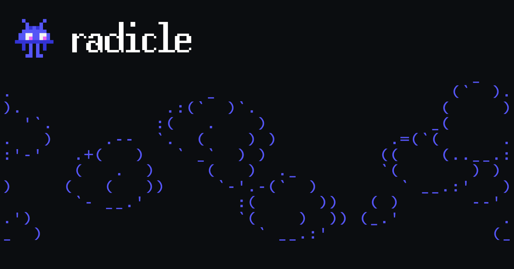

Welcome to the Build3rs Stack, Fleek’s **web3 infrastructure overview series**. This week we will take a look at Radicle - A P2P network for code! We will talk in depth about its main features, resources, and all the necessary information you need to start using it.

In brief, Radicle is a decentralized, **peer-to-peer (P2P) code collaboration platform** designed to provide an open-source alternative to traditional centralized platforms like GitHub and GitLab. Let's explore it!

---

## TL;DR: What is Radicle?



Radicle is a solution for **decentralized code collaboration** that empowers developers to work together in a self-governed, and censorship-resistant environment. It’s integrated with Git, and a distributed data structure called a "content-addressed Merkle DAG,"  enabling secure and efficient sharing of data among peers making it easier for developers to adopt!

Data is stored and shared using DAGs. This data structure ensures that the content is tamper-proof and can be easily verified by all participants in the network. Each piece of data has a unique address (hash) based on its content, and using cryptography, Radicle verified authorship of all data.

To achieve this, Radicle Network serves as a decentralized p2p network that disseminates code, and updates across the internet, thereby establishing a robust system for code collaboration. Employing the Git protocol for data duplication, Radicle incorporates its communication protocol to share data about peers and repositories among nodes. To create secure, encrypted connections between peers they utilize the [Noise](http://www.noiseprotocol.org/) protocol within their network.

Radicle is built on top of Git, the widely used version control system. This means that developers can use familiar Git commands and workflows to interact with Radicle repositories. Radicle extends Git with P2P capabilities, allowing developers to push and pull changes directly from other users in the network.

### Three key components of Radicle include:

**Peer-to-peer networking**: Radicle uses a P2P networking protocol called **libp2p**, developed by Protocol Labs, to enable direct connections between users. This allows developers to share repositories and collaborate on code without relying on a central server or third-party intermediaries.

**Decentralized identity**: Radicle uses a public key infrastructure (PKI) to provide secure, decentralized identities for users. Each user has a unique public/private key pair, and the public key serves as their identity on the network. This approach ensures that users can sign their commits and authenticate their actions, without relying on a central authority.

**Nodes**: The core of Radicle consists of a gossip-driven protocol that facilitates metadata exchange among nodes, identifiable by public keys. Nodes share repository data to create routing tables that aid in discovering and replicating repositories.

---

## Radicle in Features: Self-governance, P2P Decentralized Code Collaboration, and Offline-First

In short, the main features Radicle can provides are:

**P2P & Secure Code Collaboration and Sharing**: Radicle uses a P2P network to enable developers to share and collaborate on code directly with each other. This eliminates the need for a central server or authority, reducing the risk of censorship, downtime, or single points of failure.

**Self-governance**: Radicle allows users to create their own governance structures and rules for their projects. This enables communities to manage their projects in a self-governed, bottom-up manner, without relying on centralized decision-making

**Offline-first design**: Radicle is designed to work seamlessly in offline or partially connected environments, allowing developers to collaborate on code even without constant internet access. Changes made offline can be easily synced with the network once a connection is available.

---

## How you can use Radicle as a Builder: Applied Use-Cases

Let’s take a look at Radicle real-use case examples to understand how these features can add value to your builds!

**Open-source project collaboration**:

An open-source software project with contributors from around the world could use Radicle to ensure that the codebase remains accessible and censorship-resistant. As a decentralized platform, it would allow developers to collaborate without relying on a central authority or service, reducing the risk of censorship, service outages, or data breaches affecting the project.

**Decentralized autonomous organizations (DAOs)**:

DAOs, which are organizations governed by code and community consensus, could use Radicle to manage their code repositories and governance rules. By creating a decentralized, self-governed environment for code collaboration, Radicle could facilitate the transparent development and maintenance of DAOs' smart contracts and decision-making processes.

---

## Getting Started with Radicle

- Learn more about Radicle on the [official website](https://radicle.xyz/).
- [How Does Radicle Work?](https://app.radicle.xyz/seeds/seed.radicle.xyz/rad:z3trNYnLWS11cJWC6BbxDs5niGo82/tree/master/0001-heartwood.md)
- [Open source code](https://app.radicle.xyz/seeds/seed.radicle.xyz/rad:z3gqcJUoA1n9HaHKufZs5FCSGazv5)
- [Radicle Community](https://radicle.zulipchat.com/)
- [Try it out!](https://radicle.xyz/#try)

Or you can easily start to use Radicle running the following command:

```
sh <(curl -sSf [https://radicle.xyz/install](https://radicle.xyz/install))
```

---

We hope this guide has given you the necessary information and tools to start using Radicle! Make sure to follow [Radicle](https://twitter.com/radicle) [](https://twitter.com/litprotocol)for further updates and developments.

Additionally, we encourage you to check out our previous [Build3rs Stack](/guides/) series and keep an eye out for upcoming ones so that you can stay informed about the latest updates about web3 infrastructure. You can also join our [Discord community](https://discord.gg/fleek) to connect with us quickly.

If you need more resources, please visit our [LinkTree](https://linktr.ee/fleek)!
