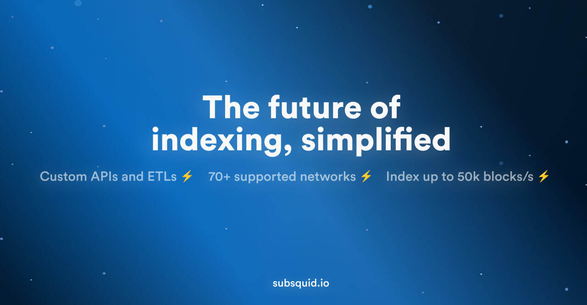

Welcome to the Build3rs Stack, Fleek’s **web3 infrastructure overview series**. This week we'll take a look at Subsquid— enabling easy access to large volumes of on-chain data, allowing developers to extract, filter, and decode millions of events, transactions, traces, and more **without having to pay for expensive RPC access**.

With Subsquid, developers can build and deploy custom GraphQL APIs and ETLs for a variety of blockchain use cases. Let’s explore some of these use cases and the architecture that makes them possible!

---

## TL;DR: What is Subsquid?

Subsquid is a versatile service that allows developers to **extract, filter, and decode on-chain data without the need for RPC access**. It can be used for both real-time and analytic use cases, including as a flexible backend for decentralized applications, a data pipeline for preparing and loading on-chain data for analysis, and a customizable data source for dashboards and monitoring.

Subsquid is designed around batch processing, which is different from other block-based and event-based indexers. This allows Subsquid to replace client RPC read requests with a tailored GraphQL API, reducing infrastructure costs and shortening frontend development cycles. The Squid SDK can **boost indexing performance to over 50k blocks per second!**

When comparing Subsquid to other blockchain indexing services it's important to note that Subsquid aims for an **open and modular architecture**. Subsquid employs separated data extraction and filtering (Archives) and data transformation and presentation (Squid SDK), which means that developers can use pluggable data targets for both online and offline use cases.

Subsquid is comprised of Data Lakes, the Squid SDK, and Aquarium-hosted services, all of which play a key role in the indexing and querying service supporting 70+ networks.

---

## Subsquid in Features: Indexing and Serving Blockchain Data

Subsquid offers comprehensive solutions for blockchain data management, focusing on two primary features: Indexing and Querying/Serving Data:

1.  **Indexing:** Through the Squid SDK, Subsquid allows for the real-time ingestion and transformation of historical and new on-chain data from the Archive. It provides user-defined processing, a built-in GraphQL API server for data presentation, and customizable adapters for databases and data lakes, offering a robust solution for blockchain data indexing.
2.  **Querying/Serving Data:** Subsquid's querying feature employs "Squids," projects that utilize Archives for data extraction and transformation. Archives are specialized data lakes ideal for handling large volumes of raw on-chain data. Managed by Subsquid Labs, these Archives offer free Squid SDK access. Squids, adaptable to various environments, can run locally, on-premises, or be deployed on the Aquarium-hosted service.

---

## How to Use Subsquid as a Builder: Use-Case Examples

Subsquid serves as a versatile backend for decentralized applications, offering cost-effective infrastructure and shortened frontend development cycles, while also acting as a data pipeline for on-chain data analysis and forensics, and providing a customizable data source for dashboards and on-chain activity monitoring.

### Secure and Scalable Computing (e.g. [Phala](https://phala.network/))

Phala is a decentralized cloud that offers secure and scalable computing. The [Phala App UI](https://app.phala.network/) is powered by a custom squid that indexes the activity on the Phala Network.

### Realtime Analytics (e.g. [Stellaswap](https://stellaswap.com/))

StellaSwap is a leading DEX on the Moonbeam Network. Stellaswap has leveraged Subsquid to build real-time dashboards and build internal reporting and analytics pipelines.

### Developer Tooling (e.g. [Enjin](https://enjin.io/))

Enjin is a GameFi and metaverse ecosystem offering a suite of products from wallets to NFT marketplaces. Enjin has built a custom explorer and a set of APIs to extend the developer tooling for their platform.

---

## Getting Started with Subsquid

- [What is Subsquid?](https://docs.subsquid.io/)
- [Quickstart Guide](https://docs.subsquid.io/quickstart/)
- [Environment Setup](https://docs.subsquid.io/tutorials/development-environment-set-up/)
- [Index EVM-based Chains](https://docs.subsquid.io/evm-indexing/)
- [Index Substrate-based Chains](https://docs.subsquid.io/substrate-indexing/substrate-processor/)
- [Query a Squid](https://docs.subsquid.io/query-squid/)
- [Deploy a Squid](https://docs.subsquid.io/deploy-squid/quickstart/)

---

We hope this overview has given you a good starting point for getting started with Subsquid! Be sure to follow [Subsquid](https://twitter.com/subsquid) to keep up to date on further updates.

Keep expanding your stack— check out our previous [Build3rs Stack](/guides/) for more web3 infrastructure overviews. You can also join our Discord server to jam with the team and learn more!

For more resources, please visit our [LinkTree](https://linktr.ee/fleek) ⚡
