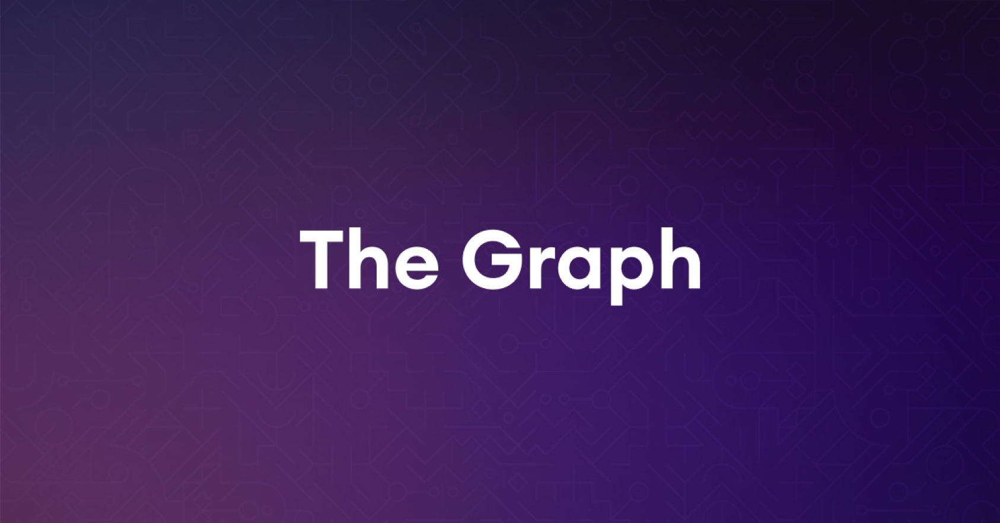

Welcome to the Build3rs Stack, our web3 infrastructure overview series! This week we will take a look at **The Graph– an indexing and querying protocol for decentralized networks, applications, and data!** We'll talk about how you can use this protocol w’hen building web3 apps and projects, and the features and options it can enable for you as a developer.

In a nutshell, **[The Graph](https://thegraph.com/en/) is an open-source decentralized protocol designed to provide a way to index, query and retrieve data from blockchain networks and other data sources.** It introduces many foundational elements to Web3 development such as a GraphQL-based query language and a decentralized network of indexers that can efficiently and trustlessly serve queries.

We have a lot to cover, let’s dive in!

---

## TL;DR: What is The Graph?

With the explosion of blockchain networks and other decentralized data sources, web3 developers need a way to easily access and query this data. The Graph provides a solution to this problem via a **decentralized network of indexers that serve these queries, the web3 way**.

So, how does The Graph work? At a high level, let's break down four of the main components that compose The Graph: **Subgraphs, Query Language, Graph Node, and Indexers**.

**Subgraphs extract data from a blockchain, process it and store it so users of The Graph can query it via GraphQL**. In a subgraph, you define what data source or contracts you want to listen to, and how that data is to be processed. Think of them as open-source APIs, with a set schema and data mappings that then nodes will use to start querying/indexing information. For each chain, contract, or on-chain data-set, there is either a [subgraph already created](https://thegraph.com/explorer) or one that can be created.

**The Query Language is based on [GraphQL](https://graphql.org/)**, a powerful query language that enables developers to easily retrieve specific data from a database. With The Graph, developers can use GraphQL to query data from blockchain networks and other data sources.

**Indexers are the decentralized network of nodes** that store and index data. When a new data subgraph is added to (and signaled on) The Graph Network, an Indexer will be created to start indexing data from that source. Once the data is indexed, it can be queried by developers using GraphQL. They are the providers that power and service the network, and they use **the Graph Node** software to process queries and return results to users, receiving query fees for it.

Also, in The Graph ecosystem; **curators play an important role in helping to index and organize the vast amount of data**. They are responsible for selecting and signaling high-quality subgraphs to improve network quality and reward opportunity. Users stake GRT tokens to **signal subgraphs' value to curators**, who decide whether to include them in the index. Curators earn a portion of fees generated by queries on included subgraphs, incentivizing them to assess valuable subgraphs. **This mechanism encourages high-quality subgraph creation and ensures a robust and performant network.**

**Additionally, Delegators in The Graph Network delegate**, or stake, GRT with Indexers. Delegators choose Indexers that they deem trustworthy and helpful in the network. In return, Delegators receive a portion of their chosen Indexer’s rewards. Delegating to an Indexer also enables that Indexer to serve more queries and allocate more stake to subgraphs.

---

## The Graph in Features: Subgraphs, Indexing and Querying Data

The Graph has many features that anyone can use easily and efficiently in their build. Users can easily query data from various blockchains and decentralized applications, build custom indexes and data sources, and create powerful analytics tools and visualizations. Let’s take a look at each:

### Custom Subgraphs:

Anyone can create their own subgraphs to index custom data sets from specific smart contracts or collections of smart contracts. Subgraphs can be published on The Graph's decentralized network, making them available to other developers who can use them to query data for their own applications, making app or chain-specific data schemas.

### Data Indexing:

With your data schema set, you can index transactions/data from any compatible blockchain source - giving you a decentralized indexing infrastructure without having to rely on a centralized database or provider.

### Data Querying:

Last but not least, with your data indexed, you can create complex queries that filter, sort, and aggregate data from the blockchain through The Graph. This makes it easier to build decentralized applications that require real-time access to blockchain data. **The most important part? You can query ANY subgraph on The Graph (e.g. Aave, Ethereum, IPFS), so you are not limited to your own data-set**. Visit [Graph Explorer](https://thegraph.com/explorer) to see pre-existing subgraphs that you can query today.

---

## How can you use The Graph as a Builder: Applied Use-Cases.

Let’s take a look at some examples of real use-cases to understand the value of The Graph!

**Query and Index data on DeFi Protocols (e.g: [Aave](https://twitter.com/AaveAave))**

The Graph can be used to index and query data related to Aave's borrowing and lending activity, including the number of loans originated, the amount of collateral posted, and the interest rates charged. This data can be used to inform decision-making related to loan origination and to track the impact of changes in the protocol's interest rate policies.

**Optimize Distribution (e.g [Livepeer](https://twitter.com/Livepeer))**
You can track the participation of Livepeer network nodes, including the number of nodes running, their geographic location, and their performance. This data can be used to optimize the network's geographic distribution and to identify nodes that may be experiencing issues.

---

## Getting Started with The Graph

Creating a subgraph is essential if you’re trying to build with this protocol and is very easy to do.

But first, if you have a custom data set (e.g a contract in Ethereum) want to index you need to:

1. **[Create a subgraph](https://thegraph.com/docs/en/developing/creating-a-subgraph/)**: To get started, you need to create a subgraph. A subgraph is essentially an indexing layer for your custom data set that allows you to query it efficiently. You can use The Graph's CLI tool to create a new subgraph project.

2. **[Publish your subgraph](https://thegraph.com/docs/en/deploying/subgraph-studio/)**: Once you have created your subgraph, you need to publish it on The Graph's hosted or decentralized network. To do this, you'll need to compile your subgraph and deploy it to The Graph's network. You can do this using The Graph CLI tool. When you deploy your subgraph, The Graph will create an instance of your subgraph on its network, making it available for other developers to use.

3. **[Querying Data](https://thegraph.com/docs/en/querying/querying-the-graph/):** After you have published your subgraph, you can query it to retrieve data. The Graph uses GraphQL to query data, and you can use any GraphQL client to query your subgraph. You can use GraphiQL, Apollo Client, or any other GraphQL client to query your subgraph. You'll need to specify the endpoint of your subgraph when querying it.

If your data already exists on a subgraph (you can find it in the [Subgraph Explorer](https://thegraph.com/explorer)) you can just move to querying!

Here are other resources, tooling, and examples you can follow:

- [About The Graph](https://thegraph.com/docs/en/about/)
- [Quick Start Guide](https://thegraph.com/docs/en/cookbook/quick-start/)
- [Graph Tooling Repository](https://github.com/graphprotocol/graph-tooling)
- [Graph Node - Rust](https://github.com/graphprotocol/graph-node)
- [GrapQL Libraries and Tools](https://graphql.org/code/)
- [Fleek's Experience Building a Subgraph](https://blog.fleek.xyz/post/thegraph-and-nfas-deploying-subgraphs)

---

## Wrapping it Up

We hope this guide offers you the necessary info and resources to get started with The Graph! Follow [The Graph](https://twitter.com/graphprotocol) for more information!

Don’t forget to take a look into our past Build3rs Stack series and look out for the coming ones to stay up-to-date with the best web3 infra. Also join our Discord to get in touch with us ⚡

For more resources visit [our LinkTree](https://linktr.ee/fleek).
