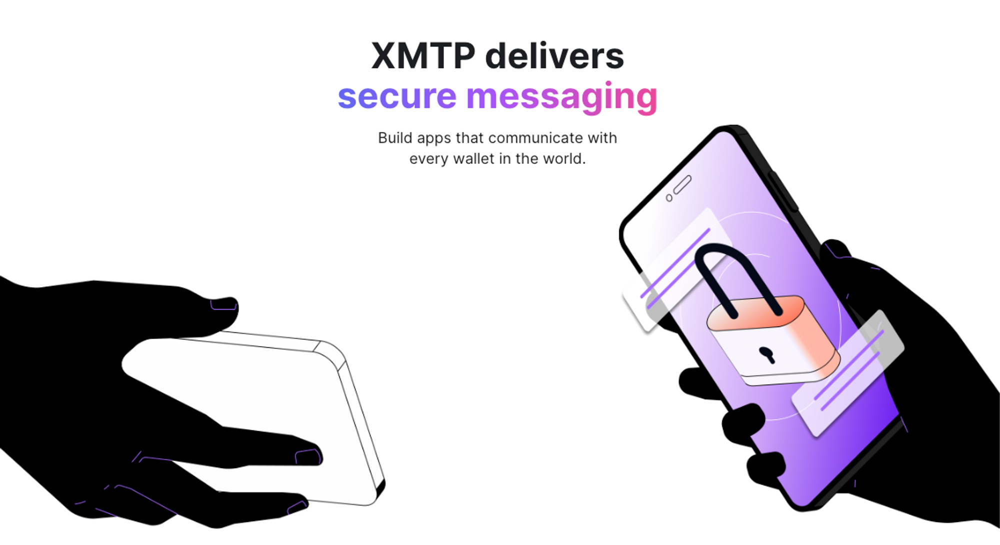
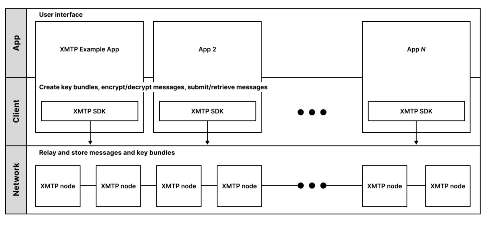

Welcome back to Build3rs Stack, our web3 infrastructure overview series! This week we’ll explore [XMTP](https://xmtp.org/) (Extensible Message Transport Protocol), an open network, protocol and standard for secure messaging between blockchain accounts.

---

## TLDR: how does XMTP work?

XMTP is a protocol built across distributed nodes to provide encrypted, interoperable messaging capabilities to users, wallets and apps. XMTP allows users to chat with each other with assurance that their data is safe. Wallets and apps can offer messaging functionality by integrating XMTP into their products.

Clients communicate with XMTP via API to bring messaging to their applications. There are no fees for developers to implement XTMP, and there are no fees for users to message each other.

XMTP´s infrastructure is composed of three layers:

### Network Layer

The network layer is composed of XMTP nodes. The team has further plans to decentralize their protocol, including adding smart contract wallet support, consensus, economics and sharding.

The responsibilities of nodes are to form a peer-to-peer network to communicate, relay and gossip messages though the network.

### Client Layer

The client layer is made of XMTP message API clients from apps built with the SDK. API clients connect with APIs on an XMTP node to communicate with the network. In short, the responsibilities of nodes on the network layer are:

- Create blockchain account-based XMTP identities, [including public and private key bundles](https://xmtp.org/docs/concepts/key-generation-and-usage).
- [Encrypt and decrypt](https://xmtp.org/docs/concepts/invitation-and-message-encryption) private key bundles, invitations, and messages.
- Encode and decode message [content types](https://xmtp.org/docs/content-types/introduction), submit and retrieve key bundles, encrypted invitations, and encrypted messages to and from the XMTP network.

The final layer is apps building on top of XMTP!

---

## XMTP in Features: Web3 Identity Messaging

As a protocol, XMTP enables developers to surface the following messaging features to their products:

**Alerts:** Similar to iMessage, WhatsApp, Telegram, Discord or DMs on your favorite social media app, XMTP has implemented event based notifications to ping users when they have a new message.

**Announcements:** Integrating the protocol allows teams to send messages that are one to many, similar to a Discord announcement channel, these messages can serve as updates, announcements and so much more.

**Direct messaging**: Like any of your favorite chat applications, users can send messages peer-to-peer.

**Feedback features:** When submitting feedback on [xmtp.org](https://xmtp.org/), XMTP implements a burner wallet to send a message and a persistent wallet to receive [feedback from XMTP users](https://xmtp.org/blog/feedback-widget).

---

## How to Use XMTP as a Builder: Use-Case Examples

Let's explore some real-world examples of how XMTP can be used by builders to create innovative products.

**Interoperable Messaging App (e.g. [Converse](https://getconverse.app/))**

To counter the norm of companies like WhatsApp, Telegram and Snapchat owning your conversations, Converse has developed an encrypted, decentralized and interoperable alternative so users can feel safe and assured that their private conversations remain just that– private. Converse leverages XMTP’s protocol to enable wallet owned messaging in their application.

**In Wallet Messaging (e.g. [Coinbase](https://www.coinbase.com/))**

Coinbase implemented in-wallet [instant messaging](https://www.youtube.com/watch?v=ukBODIGWLFY) capabilities with XMTP. Coinbase was the first self-custodial wallet to integrate XMTP. Coinbase does not have access to users’ messages, ensuring that their conversations remain private. Digital assets can also be transacted using the same inbox, allowing users to send free global payments in a way that feels like WhatsApp joined forces with Cash App.

**Social Media (e.g. [Lenster](https://xmtp.org/blog/lens-dms-with-xmtp))**

The social media app, [Lenster, uses XMTP](https://xmtp.org/blog/lens-dms-with-xmtp) to allow users to send end-to-end encrypted messages to each other. Now, users can message on web3 social media, much like in web2, but users own the messages and can bring their communications to other products surfacing XMTP.

**Decentralized eBay ([zBay](https://ethglobal.com/showcase/zbay-r0724))**

In June XMTP hosted a hackathon at [EthWaterloo](https://xmtp.org/blog/eth-waterloo-2023). The hackathon produced a wide array of interesting applications leveraging the messaging protocol, including first place winning zBay. zBay is a decentralized version of eBay that uses XMTP to power communication between merchants and buyers.

---

## Getting started with XMTP

- [Quickstart](https://xmtp.org/docs/developer-quickstart)
- [Trending Tutorials](https://xmtp.org/docs/hackathons#trending-tutorials-)
- [Example Apps](https://xmtp.org/docs/hackathons#trending-tutorials-)
- [Contribute](https://xmtp.org/docs/contribute)
- [Blog](https://xmtp.org/blog)

---

Want learn more about XMTP? Join the community in the [XMTP Discord](https://discord.gg/xmtp) and check out the open source projects in the [XMTP](https://github.com/xmtp) and [XMTP Labs](https://github.com/xmtp-labs) GitHub repos.

Or, if you want to keep expanding your knowledge of web3 infrastructure by checking out more of our [Build3rs Stack articles](/guides/). You can also [join our Discord server](https://discord.com/invite/fleek) to jam with the team and learn more!

For more resources, visit [our LinkTree](https://linktr.ee/fleek)
