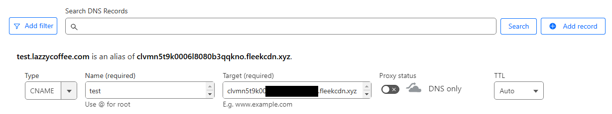
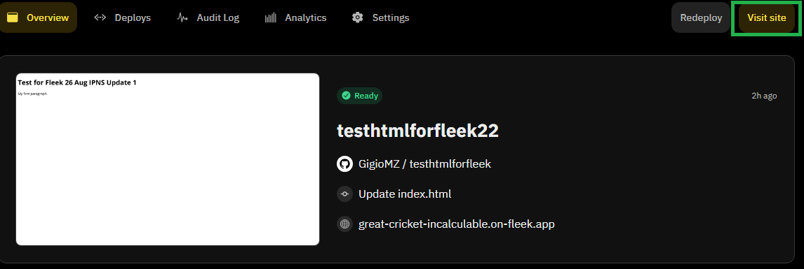
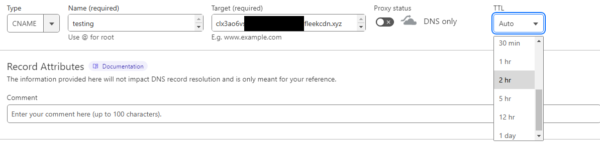
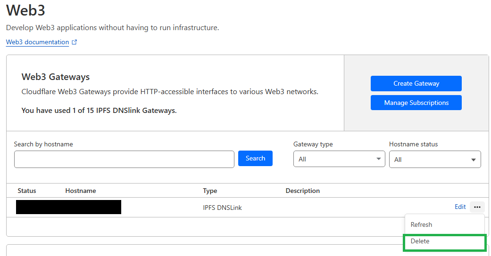

With Cloudflare’s recent Web3 product deprecation, many users are looking for alternative platforms to host their decentralized websites and applications. Fleek [now has a powerful, user-friendly option](https://fleek.xyz/guides/cf-web3-to-fleek/) that offers a smooth migration process with minimal downtime. This guide will walk you through the necessary steps to migrate from Cloudflare Web3 to Fleek, ensuring a seamless transition.

---

## **Step 1: Deploy Your Site on Fleek**

Before starting the migration process, you need to set up your site on Fleek. Here’s how:

1. **Sign up or Log in to Fleek**:
   - Navigate to [Fleek](https://fleek.xyz) and sign up or log in to your account.
2. **Create a New Project**:
   - Click on ["Create New Site"](https://fleek.xyz/docs/platform/hosting/#start-hosting) and choose your preferred framework (e.g., Next.js, React).
   - Follow the prompts to link your GitHub repository, select the branch you want to deploy, and configure the build settings.
3. **Deploy the Site**:
   - Click "Deploy" to initiate the build process. Fleek will automatically handle the deployment of your site to IPFS.
4. **Verify the Deployment**:
   - Once deployed, access your site using the provided IPFS link to ensure everything is functioning as expected.

---

## **Step 2: Add a New CNAME Record**

To prepare for the migration, add a [CNAME record on your domain’s DNS that points to Fleek](https://fleek.xyz/docs/platform/domains/#adding-a-custom-domain):

1. **Access Your DNS Settings**:
   - Go to your domain registrar or DNS provider's dashboard (e.g., Cloudflare).
2. **Create a CNAME Record**:
   - Add a new CNAME record for a subdomain (e.g., `test.yourdomain.com`).
   - Point this CNAME record to the URL provided by Fleek for your deployed site.
3. **Save the DNS Settings**:
   - Ensure the settings are saved and that the subdomain is live by visiting the subdomain in your browser.
     

---

## **Step 3: Test the Site on Fleek**

Before making the final switch, you should test your site to ensure everything is working correctly:

1. **Visit the Subdomain**:
   - Open your browser and go to `test.yourdomain.com` to see your site hosted on Fleek.
2. **Check Functionality**:
   - Verify that all features, links, and content are functioning as expected.
     

---

## **Step 4: Prepare for Gateway Deletion**

You’ll need to delete the Cloudflare Web3 gateway to complete the migration. Here’s how to prepare:

1. **Set a High TTL**:
   - In your DNS settings, increase the TTL (Time to Live) for your DNS records. This gives the DNS changes time to propagate smoothly, reducing downtime.
     
2. **Double-Check the CNAME Setup**:
   - Ensure that the CNAME record pointing to Fleek is correctly configured and active.

---

## **Step 5: Delete the Cloudflare Web3 Gateway**

Now that you’ve prepared your DNS settings and tested the Fleek deployment, it’s time to delete the Cloudflare Web3 gateway:

1. **Delete the Gateway**:
   - Go to the Cloudflare Web3 dashboard and delete the IPFS gateway. This will remove the DNS records associated with it. \

## **Step 6: Update the DNS Gateway to Point to Fleek**

After deleting the Cloudflare Web3 gateway, you need to update your DNS settings to ensure your main domain (e.g., `www.yourdomain.com`) now points to your site hosted on Fleek.

1. **Access Your DNS Settings:**
   - Return to your domain registrar or DNS provider's dashboard.
2. **Update the DNS Record:**
   - Locate the DNS record for your main domain (e.g., `www.yourdomain.com`).
   - Point the CNAME record to the URL provided by Fleek for your deployed site.
3. **Save and Verify:**
   - Save the updated DNS settings.
   - Verify the change by visiting your main domain (`www.yourdomain.com`) in a browser.
   - Ensure that the site loads correctly from Fleek and that all links, resources, and functionalities are working as expected.
4. **Monitor Propagation:**
   - DNS changes can take some time to propagate across the internet. Monitor your site to ensure it remains accessible during this transition period.

---

## **Conclusion**

Migrating from Cloudflare Web3 to Fleek can be a straightforward process if done correctly. By following these steps, you can ensure a smooth transition with minimal downtime, keeping your site or application live and accessible throughout the migration.

You can learn more about Fleek's IPFS gateway [here](https://fleek.xyz/blog/announcements/fleek-decentralized-ipfs-gateway/).

That’s all for now. You can learn more about getting started with the new IPFS gateway in our [docs](https://fleek.xyz/docs/), by joining our Discord [server](discord.gg/fleek), or by following Fleek [X](https://x.com/fleek).

Get started using the new Fleek IPFS Gateway:

Dive into IPFS Storage: https://fleek.xyz/blog/learn/understanding-ipfs-storage-fleek/

Host your dApp on IPFS: https://fleek.xyz/blog/templates/ethereum-boilerplate-ipfs-nextjs/