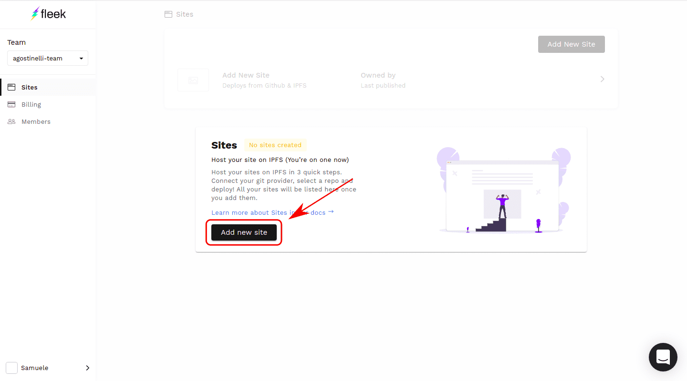

## **Overview**

We’ll create a Next.js app and deploy it on Fleek. This whole process should take 10 minutes.

Tools:

- Fleek account
- GitHub account
- node.js/npm

### **Step 1: Set Up a Repo on Github**

Create an empty repository and clone it.

Create a Next.js app using:

`$ mkdir nextjs && cd nextjs` `$ npm init --y' '$ npm install next react react-dom`

Open `package.json` and add in the following scripts

`"scripts": {
    "dev": "next",
    "build": "next build",
    "start": "next start",
    "export": "next export"  
}`

Create a `next.config.js` file in the root directory

`module.exports = {
  exportTrailingSlash: true,
};`

Let’s create some pages: Create a folder called pages Inside pages, create `index.js`

`// index.js
import Link from "next/link";

export default function Index() {
return (

<h1> Index </h1>
<Link href="/about">
<a> About </a>
</Link>

);
}`

and `about.js`

`// about.js
export default function About() {
  return (
    

      <h1> About </h1>
    

  );
}`

It should look something like this

To test, run `npm run dev` and visit localhost:3000

git add, commit, push

### **Step 2: Set Up Fleek**

Sign into https://app.fleek.co/

Sign in with Github

Add New Site

Connect with Github.

Pick your Next.js repository.

To create a new site:

Build command: `npm install && npm run build && npm run export`

docker image: `fleek/next-js`

Publish directory: `out`

Of course, fleek will autodetect next-js and enter those configurations automatically. :P

It’s worth noting that the docker image `fleek/next-js` runs the most recent version of node.js by default, which, by the time of this writing, is version 13.

If you need to use another node version, you can do so via the docker tag. EG: For node 10, use `fleek/next-js:node-10`

Deploy Site

Once complete, view your website.

You can view the website using the provided domain name.

`https://<your-domain>.on.fleek.co`

Or verify with the CID.

`https://ipfs.io/ipfs/<CID>`

### **Step 3: Updates**

Fleek will automatically redeploy your website whenever you make changes to GitHub. Make sure to provide the domain name will remain the same and will point to the new CID. This enables you to build fast modern websites hosted on IPFS.

- [Sign up](https://app.fleek.xyz/) to try yourself
- Join our [Community Chat](https://discord.com/invite/fleek)
- Follow us on [Twitter](https://twitter.com/fleek)
- Check out our [Tech Docs](/docs/)
- Contact us at support@fleek.xyz
