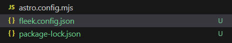

The [Fleek.xyz](https://app.fleek.xyz/projects/clpr76gbq0000jt0861oo66rh/home/) platform empowers developers to build lightning-fast web apps and services that are edge-optimized for performance. In this detailed guide, you’ll learn how to deploy a Astro web app onto Fleek using the Fleek CLI.

### What is Astro?

Astro is a web framework designed for creating content-driven websites, such as blogs, marketing sites, and e-commerce platforms. It stands out for its innovative frontend architecture, which minimizes JavaScript overhead and complexity compared to other frameworks. If you're looking for a fast-loading website with excellent SEO, Astro is the ideal choice.

### Requirements:

- Fleek account
- [Fleek CLI Installation](https://app.fleek.xyz/) (preferably - v2.8.8)
- NodeJS 18+( preferably - v18.17.0)

Let’s get started:

---

## Create a new Astro project

The first thing we’ll do will be to set up our Astro project.

To create a new Astro project open your terminal, `cd` into the directory of your choice, and run the following command:

```
git clone https://github.com/fleekxyz/astro-template.git
```

> 💡 This code takes the Astro template from the Fleek.xyz template library and automatically kickstarts your project. You can access an expanding library of other application and framework templates, including Lens, React, and more [here](https://app.fleek.xyz/templates/).

### Start up your dev server

After cloning, we’ll need to `cd` into the directory we created and start our dev server. To do that while still in our terminal, run the following command:

```
cd astro-template && npm i && npm run dev
```

This will start up the Astro web app. We can visit it by opening `http://localhost:3000` on our web browser.

Now that we have a fully functional Astro web app, we can proceed to the next step — getting configurations ready for our Fleek deployment.

### Fleek deployment preparation

To successfully deploy our project on Fleek.xyz, we must ensure that we are able to produce static files and add the appropriate configuration to the app.

Next, let's build the Astro project. This will compile the Astro project and produce the corresponding HTML code into a folder called **`dist`**.

```
npm run build
```

Once we’ve successfully built our app, we can start the deployment process.

---

## Fleek deployment

### Fleek account creation

The first thing we’ll need to do is create a Fleek account: head over to [https://app.fleek.xyz](https://app.fleek.xyz/), and click on the `Create a free account` button.

> 💡 Feel free to skip this step if you already have an account on Fleek.xyz!


You’ll be prompted to create an account with your wallet or an email address. For the sake of this tutorial, we’ll be making an account using our MetaMask account.

Click on the `MetaMask` option from the wallet list and you’ll be presented with a **sign-in** request in your browser extension. This is to verify ownership of your account.


Once you click on the **Sign in** button, you’ll be redirected to the Fleek dashboard.

### Fleek CLI installation

As we are deploying the website using the **fleek-cli**, our next step will be to install the **fleek-cli** on our computer.

Open up your terminal and run:

```
npm install -g @fleek-platform/cli
```

This will globally install the **`fleek-cli`** onto your machine. Once installed, open the astro-template project in VSCode, and log into your Fleek account via the CLI. This will enable us to run CLI-related commands directly from our terminal.

To login, open your terminal and run:

```
fleek login
```

Click on the link displayed to log into your Fleek account. You should see a **Success! You are now logged in to the Fleek platform.**


### Configurations

Now that we’ve successfully logged in, it’s time to get our app ready for deployment on Fleek.

To do that, you’ll need to initialize the site through a wizard in the CLI:

```
fleek sites init
```

You’ll get a few prompts. Populate them as you wish.


The following paragraph shows the values entered above:

- _Select a project from the list:_ `First project`
  - Note: you may only receive this prompt once after first using `fleek login`
- _We've found existing sites. Would you like to link to one of them?_: › `no`
  - If there’s an existing site already with this name, it may ask if you want to link to this site. Please note that when you do this, you will overwrite everything on the previous site. Ensure that this is the outcome you desire, otherwise, select **N** and create a new site.
- _Enter the name of your new site_: `astro-template-site`
- _Please specify the directory containing the site files to be uploaded_: › **`dist`**
- _Would you like to include the optional "`build`" command?_: › **`yes`**
- _Specify `build` command_: › `npm run build`
- _Select a format for saving the site's configuration_: › `JSON (fleek.config.json)`

You should see:

`> Success! The Fleek configuration file has been successfully saved.`

And a `fleek.config.json` file should appear in your root directory.



---

## Deployment

We’re close to the finish line — the next step is to deploy our Astro app to Fleek.

We’ll do that by running:

```
fleek sites deploy
```

Fleek will begin uploading the files in our `dist` folder to IPFS. You should get a response that looks like this:

```
> Success! Deployed!> Site IPFS CID: QmVgNN84eJMPoxznUEFmjAhkbhiKS8ic39zucNkWfux3ft> You can visit through the gateway:> https://ipfs.io/ipfs/QmVgNN84eJMPoxznUEFmjAhkbhiKS8ic39zucNkWfux3ft
```

Your site has been successfully deployed!

Now head over to the dashboard [https://app.fleek.xyz](https://app.fleek.xyz/), and ensure you are on the right project (open the drop-down menu on the top left of the homepage and select the current project).

Congratulations! You should find your newly-created site on your dashboard.
