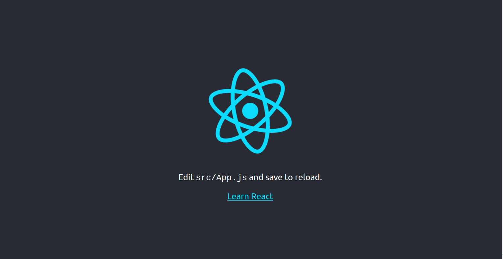
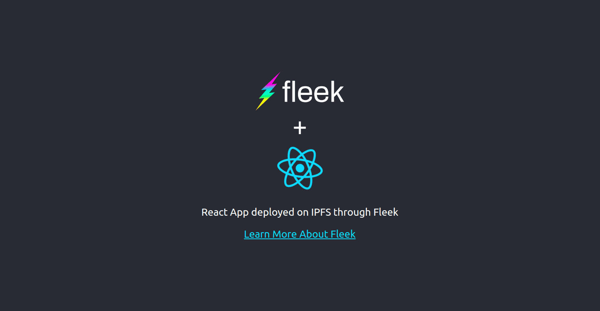
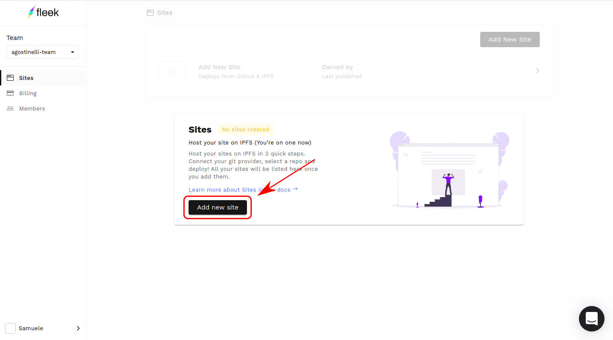
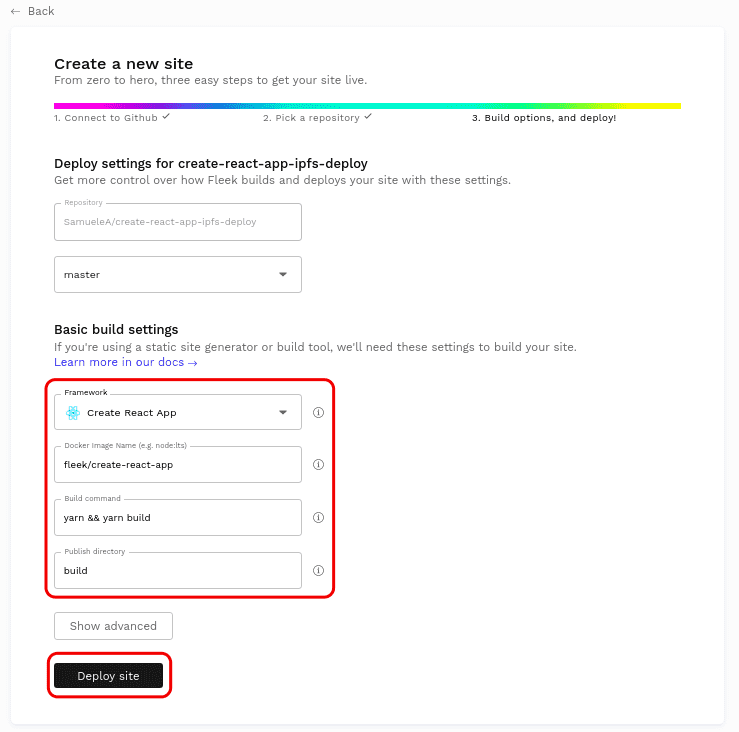
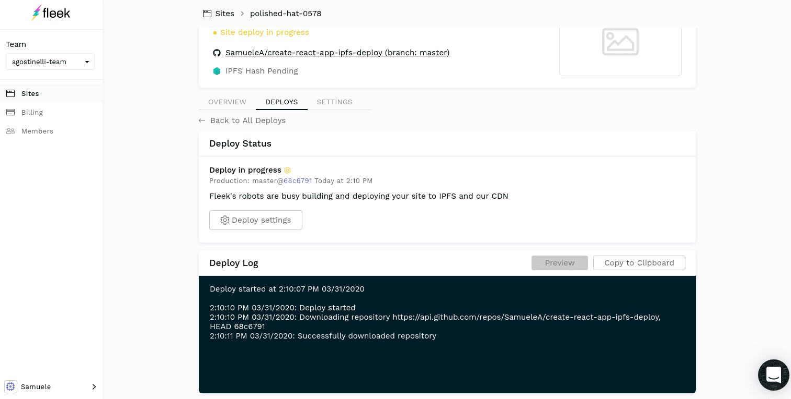
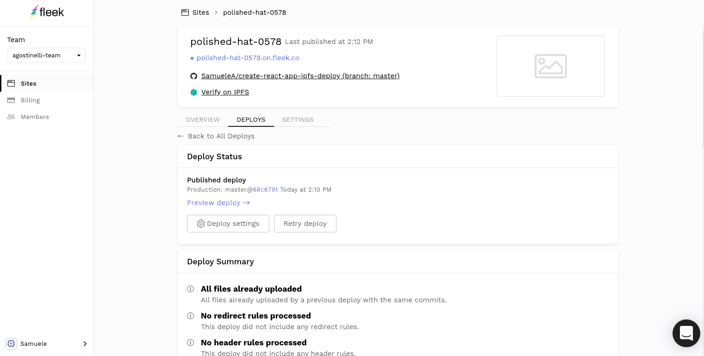

A React application can be bootstrapped in a matter of minutes with create-react-app. Fleek allows apps to be deployed to IPFS in a matter of minutes. These two go together like peanut butter and jelly, allowing for development and deployment to be complete in a flash.

We will do it in two steps which are: 1. Creating a react application with create-react-app 2. Deploying our app to IPFS on Fleek. This process takes less than ten minutes. Let’s go!

### **Step 1: Creating a React application with create-react-app**

Create-react-app requires npm => 5.6 and node >= 8.10, so make sure they are installed at the correct version.

We will start by running the following commands to create and preview the react application.

`npx create-react-app my-app`

`cd my-app`

`npm start`

Go to [http://localhost:3000](http://localhost:3000/) in your browser and you will see the default create-react-app application.

Now, it’s time to develop the app if you wish to do so, or simply use the default application. For this tutorial, I made some slight modifications to the default react app.

Finally, we need to make a slight modification to the package.json file by adding the field `homepage: '.'`.

`{
  "name": "my-app",
  "homepage": ".",
  "version": "0.1.0",
  "private": true,
  "dependencies": {
    "@testing-library/jest-dom": "^4.2.4",
    "@testing-library/react": "^9.3.2",
    "@testing-library/user-event": "^7.1.2",
    "react": "^16.13.0",
    "react-dom": "^16.13.0",
    "react-scripts": "3.4.0"
  },
  "scripts": {
    "start": "react-scripts start",
    "build": "react-scripts build",
    "test": "react-scripts test",
    "eject": "react-scripts eject"
  },
  "eslintConfig": {
    "extends": "react-app"
  },
  "browserslist": {
    "production": [
      ">0.2%",
      "not dead",
      "not op_mini all"
    ],
    "development": [
      "last 1 chrome version",
      "last 1 firefox version",
      "last 1 safari version"
    ]
  }
}`

This will make it so the page will also work on IPFS gateways whose URLs are in the format `/ipfs/HASH`

Fleek will grab the application from your GitHub repo, so the next thing to do is to create a GitHub repository with our app in it. This is the repo for the app above: https://github.com/SamueleA/create-react-app-ipfs-deploy Feel free to fork it. Let’s deploy it now!

### **Step 2: Deploying the App Through Fleek**

Upon first signing up on Fleek, we are asked to add a new site.

Next, we input additional information such as the repo branch, the build commands, and the build directory. Luckily for us, the default values will work perfectly so there is no need to change anything. Clicking the “Deploy Site” button at the bottom will commence the deployment.

Note: The default docker image is `fleek/create-react-app` which runs the latest node.js version (13 as of this writing). If you have an app requiring another version, you can specify it in the docker tag. EG: For node 10, `fleek/create-react-app:node-10`

The deployment is in progress! In a few minutes, we’ll have access to our deployed app. The deploy log at the bottom of the page tracks the progress of the deployment.

Success! The deployment worked and the yellow indicator at the top turned blue and a clickable URL ending in .tmnl.co appeared. This URL is provided by Fleek and it points to the IPFS deployment.

You can also click on the “Verify on IPFS” link which will lead you to an IPFS gateway using the IPFS hash, where the app can be admired in all its distributed, uncensorable glory.

### **Additional Considerations Concerning Routing**

The app we’ve creating is very simple since it does not contain any routes. In most serious applications, however, you will want to organize your app into routes.

One problem that will occur is that the routes will work properly when accessing the site through the main domain, but will not work when accessing it through an IPFS gateway with the hash in the path such as`https://ipfs.io/ipfs/HASH`.

This is due to fact that the gateway is formatted with the hash in a path in the URL which causes the gateway to think the user is looking for a file while in reality the user is trying to access the app from a particular route. The problem is explained in more details [here](https://youtu.be/EOca15VdP-8?t=155).

The solution we recommend is to use hash routing instead. Urls will then render in the following format: `https://ifps.io/ipfs/HASH/#/YOUR_ROUTE` and the problem will be fixed.

Creating the default react app and deploying it to IPFS takes less than 10 minutes, so I invite you to create and deploy your application by signing up for Fleek.

**Documentation**

**[Create-React-App](https://reactjs.org/docs/create-a-new-react-app.html)**

- Join our [Community Chat](https://discord.com/invite/fleek)
- Follow us on [Twitter](https://twitter.com/fleek)
- Check out our [Tech Docs](/docs/)
- Contact us at support@fleek.xyz
