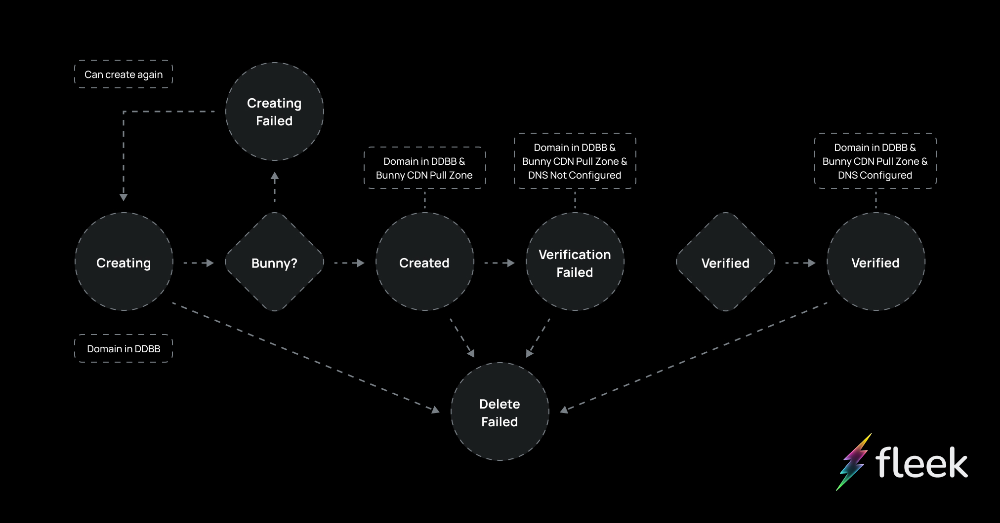
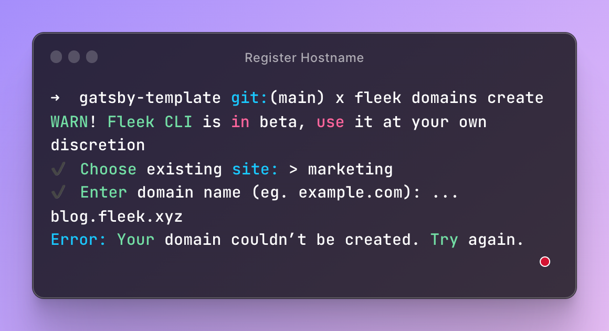
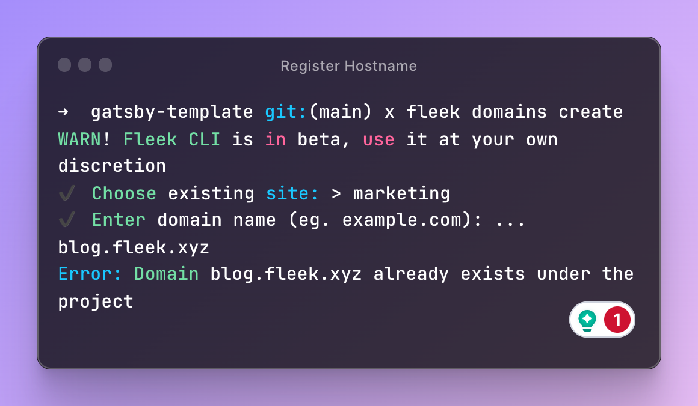
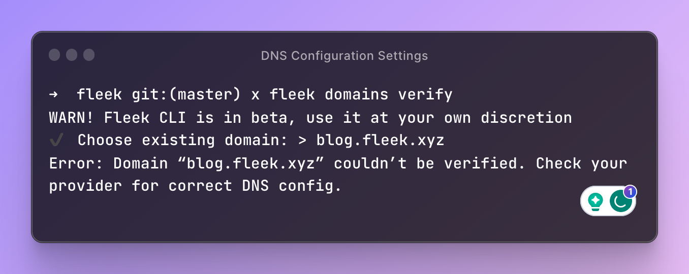

Through the Fleek.xyz beta, we’ve introduced a new domain states process to improve and streamline the flow of associating domains to Fleek-deployed sites for our users.

Originally, users would receive a traditional error stack trace when encountering errors across the CLI and SDK betas, which isn’t as easy to decode! [Recently](/blog/announcements/error-management-improvements/), we made some changes to our error-handling system to make these errors more user-friendly:

In this blog post, we'll dive into the details of this new approach, discussing each step in depth to understand what happens when a domain is added to your site through the Fleek CLI beta, and the errors you may encounter in each step of the process! Let's get started:

---

## Providing a Hostname

When initiating the domain creation process, the user first needs to provide a hostname, like blog.fleek.xyz for example!

Each domain provided by users needs to be unique, so Fleek's backend will then perform a series of checks to ensure that the hostname has not already been claimed by another user, or was previously deployed to this project through the Fleek CLI.

If the hostname has already been registered, users will be returned:

If the hostname has already been added to the project, users will see:

After retrying with a unique hostname, users will be prompted to the next step.

## Creating a Content Acceleration Zone

After the validations for the hostname have been successfully completed, users are then automatically generated a Content Acceleration Zone through our CDN provider. This content acceleration zone tells the CDN provider how to locate your files and how to serve them to your users.

Users can access their Content Acceleration Zone through the URL provided to them.

If this process fails, the entire domain creation process will also fail, alerting the user of a `CDN Pull-zone Creation Failure`.

## Configuring Domain Settings

Once the domain has been successfully created, along with the Content Acceleration Zone, the user is guided to set the appropriate DNS records using the pullzone created in the previous step. This verifies that all necessary settings are in place for the domain and pullzone to function in synergy, ensuring the domain loads content in that zone.

The system will then run a verification check to ensure that the records are set correctly.

**Successfully Verified:** The user successfully deployed the site and configured the domain, and can move on to the next steps.

**Unsuccessfully Verified:** The user remains in the verification phase and can rerun the configuration verifications until they are successful. Keep in mind, verification may still fail even if the configuration has been appropriately configured per DNS replication. If Verification fails, users will be returned an error:

---

With the new domain states process, we’ve made it easier to understand potential issues you’re facing while deploying your domains through the Fleek.xyz CLI beta. Gone are the days of wrestling with traditional, unreadable error stack traces!

Our refined error-handling system allows for a much more user-friendly experience, enabling you to decode the issues you face with significantly less difficulty. If you are still encountering issues with your domains, or any of the other services in the Fleek.xyz beta, reach out and open a ticket in our [Discord](https://discord.gg/fleek) server.

For more resources, and to follow us on social media, check out our [Linktree](https://linktr.ee/fleek) ⚡️
