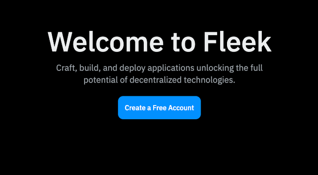

The Fleek.xyz platform empowers developers to build lightning-fast web apps, and services that are edge optimized for performance. In this detailed guide, you’ll learn how to deploy a **Next.js** web app using the Fleek.xyz UI and your site’s **GitHub repo**.

> 💡 If you want to deploy your app without having to leave the command line, or without having to use Github, we have a guide that shows you how to deploy your Next.js app to Fleek directly via the [Fleek CLI](https://fleek.xyz/guides/fleek-nextjs-guide/).

## What is Next.js?

Next.js is a React framework that simplifies the creation of server-rendered React applications. It offers features like automatic code splitting, route pre-fetching, and built-in support for server-side rendering and static site generation, enabling faster, more SEO-friendly web development.

# Requirements

- [Fleek Account](http://app.fleek.xyz)
- [GitHub Account](http://github.com)
- Repository of the app you’d like to deploy

> 💡 If you don’t have a Next.js app ready to deploy for this guide don’t worry— you can access one through our open-source template repository https://github.com/fleekxyz/nextjs-template, along with a bunch of other framework & protocol templates and boilerplates.

**Let’s get started**:

---

## Fleek Account Creation

The first thing we’ll need to do is create a Fleek account: head over to http://app.fleek.xyz, and click on the `Create a Free Account` button.

> 💡 Feel free to skip this step if you already have an account on Fleek.xyz!

You’ll be prompted to create an account with your wallet or an email address. For the sake of this tutorial, we’ll be making an account using our MetaMask account.

Click on the `Metamask` option from the wallet list and you’ll be presented with a **sign-in** request in your browser extension. This is to verify ownership of your account.

### GitHub Account

You’ll also need to head over to http://github.com to create an account. For the sake of this tutorial, we’ll be making use of this [repository](https://github.com/fleekxyz/nextjs-template)https://github.com/fleekxyz/nextjs-template. Simply clone this repo onto your account, and we can move to the next step.

---

## Deploying Site On Fleek

Once we have our repo cloned, the next step is the deployment!

Head over to the dashboard [http://app.fleek.xyz](http://app.fleek.xyz/), Create a new project, give it a name. You’ll automatically get switched to that project.

Click on the `Add New` button at the top right. Then click on `Deploy my site`

You’ll be brought to this page:

> 💡 Support for Gitlab and Bitbucket are underway!

Click on the GitHub icon. You’ll see a pop-up like this:

Choose the preferred account or organization. This will lead you to a page where you can grant access to either specific repositories or all repositories.

Once you’ve selected the repo(s) you would like to grant Fleek access to, click on `Save`. You should see this— the image below shows a list of repos Fleek has access to.

> 💡 If you want to grant Fleek access to a different repo, simply click on the ‘**Adjust GitHub App Permission**’ button underneath.

The next step will be to click on the ‘Deploy’ button of the repo you would like to deploy to Fleek.

You’ll then be brought to this page:

A few things to note about this page.

1. You can modify the `Site Name` to anything you want.
2. The framework is automatically detected by Fleek.
3. The `main` branch is automatically selected. If you’d like to deploy code from a different branch, feel free to select that branch.
4. The `Publish Directory` is also automatically determined by Fleek based on the **Default** publish directory by the framework. If you’ve made any modifications to this, change the name to reflect this.
5. The `Build Command` is also automatically determined by Fleek. If this is different from yours, modifications can be made.

### Advanced Options

When you click on the `Show Advanced Options`

You can make modifications to things like:

- Docker Image & Tag
- The Base Directory
- The Environmental Variables

Once you are satisfied with the modifications you’ve made, simply click on the `Deploy Site` button to allow Fleek to begin the deployment process.

You will be automatically redirected to this page on the Fleek dashboard:

The `Overview` page shows you the status of your site deployment, you can also monitor the status of your deployment by clicking on the `Deploys` tab. The `Audit Log` , `Analytics`, `Settings`, have helpful information about your deployment as well.

Once your site has been successfully deployed, you should see a `Site is live` notification and your site’s URL.

Click on the URL (For this example it’s https://wailing-action-mammoth.on-fleek.app/ but yours will be different) and it’ll take you to your fully functional static NextJs blog!

From the [Fleek.xyz](http://fleek.xyz/) dashboard, you have the ability to manage a custom domain or ENS address for your site, as well as see deployment history and quickly manage site settings.

---

Congratulations! You’ve successfully deployed your Next.js App on Fleek!

### Resources:

- Understanding Projects: https://fleek.xyz/docs/platform/projects/
- Sites: https://fleek.xyz/docs/cli/sites/
- Fleek CLI: https://fleek.xyz/docs/cli/
