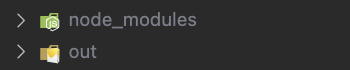
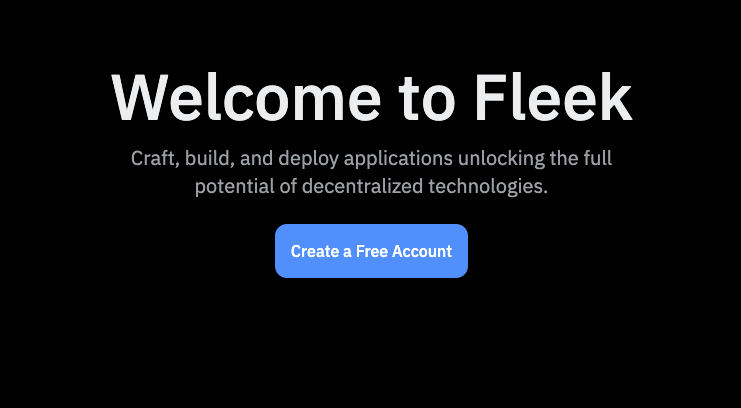
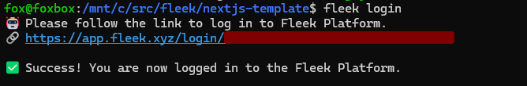
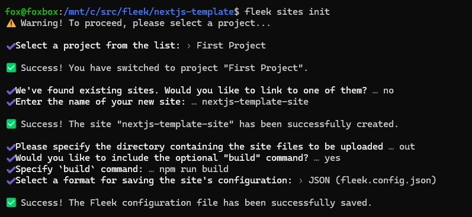
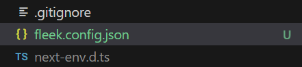

The Fleek.xyz platform empowers developers to build lightning-fast web apps, and services that are edge optimized for performance. In this detailed guide, you’ll learn how to deploy a **Next.js** web app onto Fleek using the Fleek CLI.

### What is NextJs?

[Next.js](https://nextjs.org/) is a React framework that simplifies the creation of server-rendered React applications. It offers features like automatic code splitting, route pre-fetching, and built-in support for server-side rendering and static site generation, enabling faster, more SEO-friendly web development.

### Requirements:

- Fleek Account
- FleekCLI Installation (preferably - v2.9.0)
- GitHub Account
- NodeJs 18+( preferably - v18.17.0)

Let’s get started:

---

## Create A New NextJs Project

The first thing we’ll do will be to set up our NextJs project.

To create a new NextJs project open your terminal, `cd` into the directory of your choice, and run the following command:

```jsx
git clone https://github.com/fleekxyz/nextjs-template.git
```

> 💡 This code takes the NextJS template from the Fleek.xyz template library and automatically kickstarts your project. You can access an expanding library of other application and framework templates, including Lens, Astro, React, and more [here](https://app.fleek.xyz/templates/).

### Start Up Your Dev Server

After cloning, we’ll need to `cd` into the directory we created and start our dev server. To do that while still in our terminal, run the following command:

```jsx
cd nextjs-template && npm i && npm run dev
```

This will start up the NextJs web app. We can visit it by opening `http://localhost:3000` on our web browser.

Now that we have a fully functional NextJs web app we can proceed to the next step— getting configurations ready for our Fleek deployment.

### Fleek Deployment Preparation

To successfully deploy our project on Fleek.xyz we must ensure that we are able to produce static files and add the appropriate configuration to the app.

The first thing we need to do is ensure our app builds out the static pages for our NextJs project. If `next.config.js` (in the root of the cloned template) doesn't contain the line:

```jsx
 output: 'export',
```

Then add it so the configuration looks like this:

```jsx
/** @type {import('next').NextConfig} */
const nextConfig = {
  output: 'export',
  reactStrictMode: true,
  images: {
    unoptimized: true,
  },
  trailingSlash: true,
};

module.exports = nextConfig;
```

This line of code will create a new folder called `out` for when we build our NextJs app.

Next, run the `npm run build` command. This will compile our NextJs project, and produce the corresponding HTML code into a folder called `out`.



Once we’ve successfully built our app, we can start the deployment process.

---

## Fleek Deployment

### Fleek Account Creation

The first thing we’ll need to do is create a Fleek account: head over to http://app.fleek.xyz, and click on the `Create a Free Account` button.

> 💡 Feel free to skip this step if you already have an account on Fleek.xyz!



You’ll be prompted to create an account with your wallet or an email address. For the sake of this tutorial, we’ll be making an account using our MetaMask account.

Click on the `Metamask` option from the wallet list and you’ll be presented with a **sign-in** request in your browser extension. This is to verify ownership of your account.


Once you click on the **Sign-In** button, you’ll be redirected to the Fleek Dashboard.

### Fleek CLI Installation

As we are deploying the website using the **fleek-cli**, our next step will be to install the **fleek-cli** on our computer.

Open up your terminal and run:

```jsx
npm install -g @fleek-platform/cli
```

This will globally install the `fleek-cli` onto your machine. Once installed, log into your Fleek account via the CLI. This will enable us to run CLI-related commands directly from our terminal.

To login, open your terminal and run:

```jsx
fleek login
```

Click on the link displayed to log into your Fleek account. You should see a **Success! You are now logged in to the Fleek Platform.**



### Configurations

Now that we’ve successfully logged in, it’s time to get our app ready for deployment on Fleek.

To do that, you’ll need to open up your terminal and run:

```jsx
fleek sites init
```

You’ll get a few prompts, populate them as you wish:



The following paragraph shows the values entered above:

- _Select a project from the list:_ `First Project`
  - Note: you may only receive this prompt once after first using `fleek login`
- _We've found existing sites. Would you like to link to one of them?_ › `no`
  - If there’s an existing site already with this name, it may ask if you want to link to this site. Please note that when you do this, you will overwrite everything on the previous site. Ensure that this is the outcome you desire, otherwise, select **N** and create a new site.
- _Enter the name of your new site_: `nextjs-template-site`
- _Please specify the directory containing the site files to be uploaded_: › **`out`**
- _Would you like to include the optional "`build`" command?_: › **`yes`**
- _Specify `build` command_: › `npm run build`
- _Select a format for saving the site's configuration_: › `JSON (fleek.config.json)`

You should see:

`> Success! The Fleek configuration file has been successfully saved.`

And a `fleek.config.json` file should appear in your root directory.



### Deployment

We’re close to the finish line — the next step here will be to deploy our NextJs app to Fleek.

We’ll do that by running:

```jsx
fleek sites deploy
```

You should get a response that looks like this

```jsx
> Success! Deployed!
> Site IPFS CID: QmVgNN84eJMPoxznUEFmjAhkbhiKS8ic39zucNkWfux3ft

> You can visit through the gateway:
> https://ipfs.io/ipfs/QmVgNN84eJMPoxznUEFmjAhkbhiKS8ic39zucNkWfux3ft
```

Congratulations! Your site has been successfully deployed!

Now head over to the dashboard http://app.fleek.xyz, and ensure you are on the right project (open the drop-down menu on the top left of the homepage and select the current project).


Click on `Sites`. Here, you should see your deployed site. If you’ve deployed more than one site into this project, they’ll all show up here:


Click on your **deployed** site. You should be **brought** to this page:


Click on the URL (For this example it’s https://scrawny-lock-most.on-fleek.app/ but yours will be different) and it’ll take you to your fully functional static NextJs blog!

From the [Fleek.xyz](http://Fleek.xyz) dashboard, you have the ability to manage a custom domain or ENS address for your site, as well as see deployment history and quickly manage site settings.

---

Congratulations! You just deployed your Next.js blog to the Fleek.xyz platform. The basics from this guide can be taken and applied to any static NextJs app to deploy on Fleek.xyz

If you’d like to learn more about Fleek, visit our [documentation](https://docs.fleek.xyz/docs) page, join our D[iscord server](https://discord.gg/fleek), and stay up to date with us on [X](https://twitter.com/fleek/)!

See you in the next guide 🤙

## Resources:

- Understanding Projects: https://fleek.xyz/docs/platform/projects/
- Sites: https://fleek.xyz/docs/cli/sites/
- Fleek CLI: https://fleek.xyz/docs/cli/
