You can rapidly bootstrap a React application using [create-react-app](https://create-react-app.dev/), and with Fleek, you can deploy it in just a few minutes. In this guide, we’ll go over how to:

1. Create a Fleek Account
2. Clone the react boilerplate GitHub Repo
3. Deploying your app on Fleek

Let’s go!

---

## Prerequisites

- NodeJs 8+
- NPM 5.6+
- Fleek Account

---

## Fleek deployment

### Step 1: Fleek account creation

The first thing we’ll need to do is create a Fleek account: head over to [http://app.fleek.xyz](http://app.fleek.xyz/), and click on the `Create a Free Account` button.

💡 Feel free to skip this step if you already have an account on Fleek.xyz!

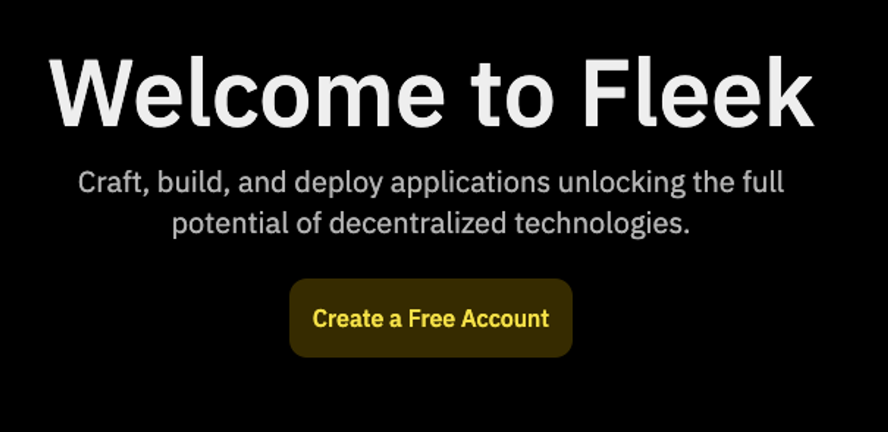

You’ll be prompted to create an account with an email address or a wallet.

Insert your email address in the box below, and click on continue.

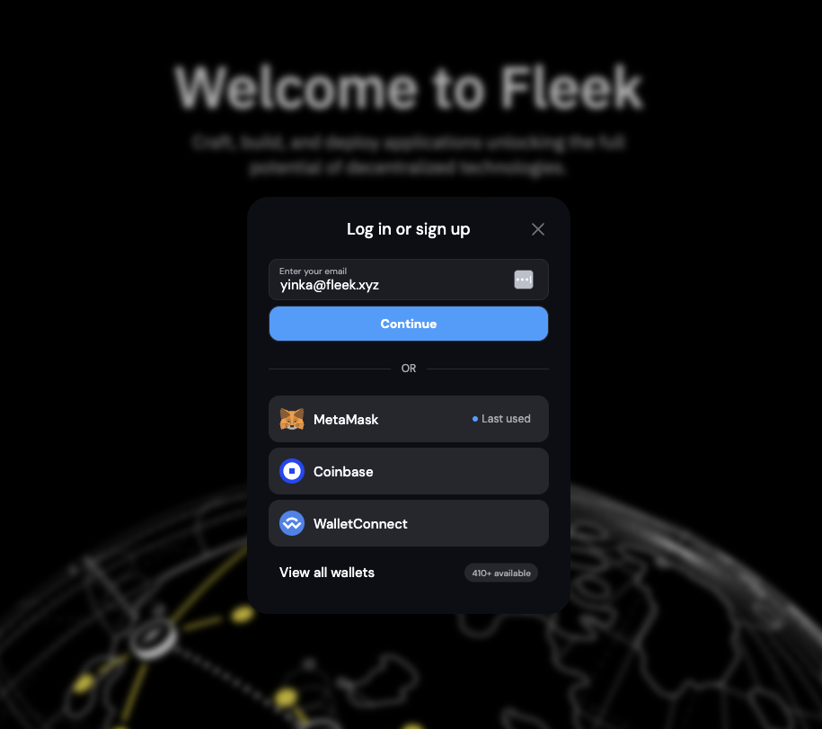

A 6-digit verification code will be sent to your email. Retrieve it and enter the code in the following modal.

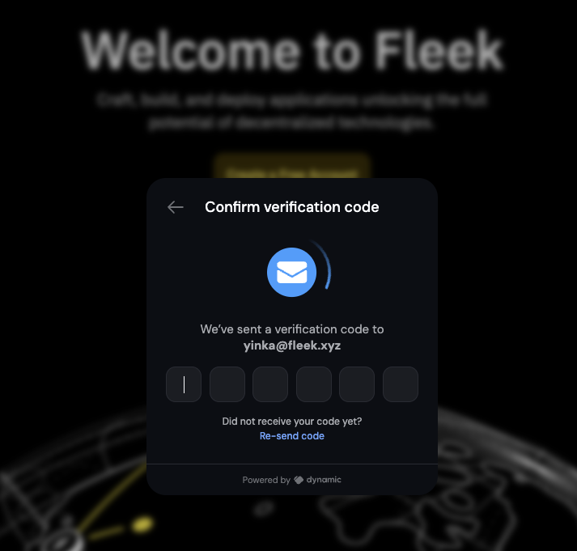

After the code is verified, you’ll be logged in and redirected to the Fleek Dashboard.

---

## GitHub account

You’ll also need to head over to [GitHub](http://github.com/) to create an account.

This is the repository of the react template we’ll be working with and deploying onto Fleek:

https://github.com/fleekxyz/react-template

Simply clone this repo onto your account, and we can move to the next step.

## Deploying site on Fleek

Once we have our repo cloned, the next step is the deployment!

Head over to the [Fleek dashboard](http://app.fleek.xyz/), Create a new project, and give it a name. You’ll be automatically switched to that project.

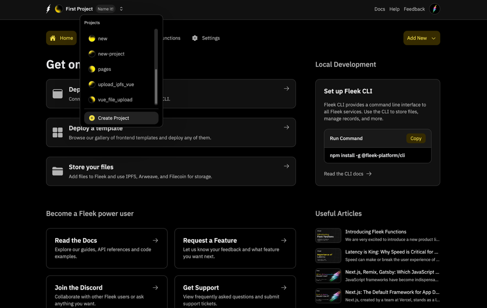

Click on the `Add New` button at the top right. Then click on `Deploy my site`

You’ll be brought to this page:

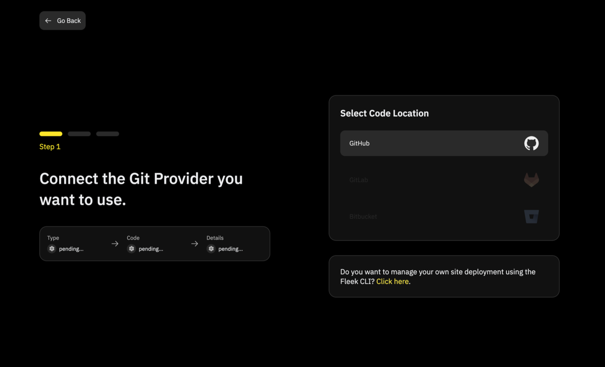

💡 Support for Gitlab and Bitbucket are underway!

Click on the GitHub icon. You’ll see a pop-up like this:

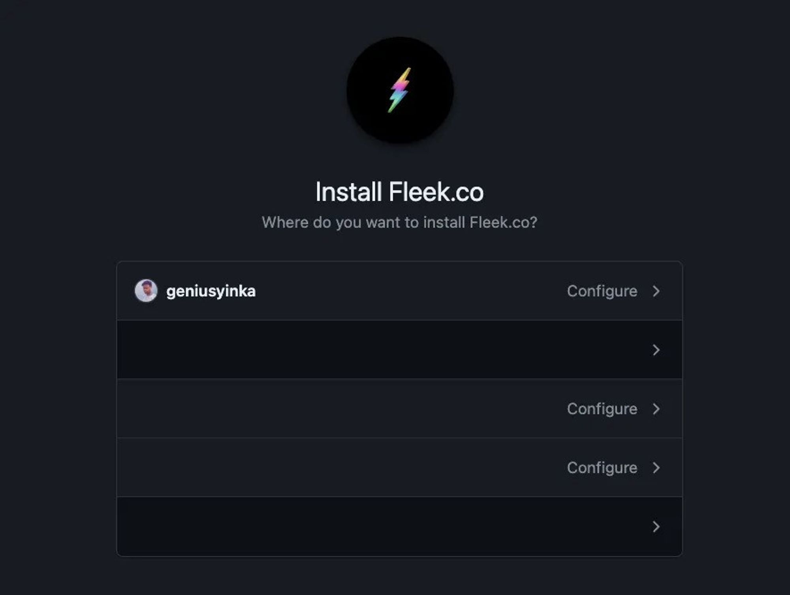

Choose the preferred account or organization. This will lead you to a page where you can grant access to either specific repositories or all repositories.

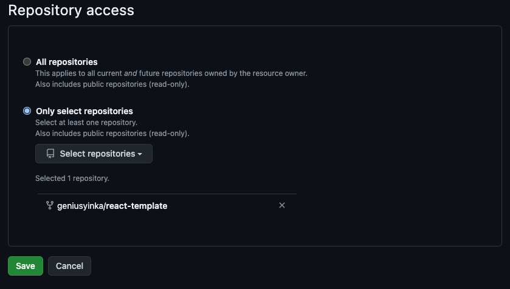

Once you’ve selected the repo(s) you would like to grant Fleek access to, click `Save`. You should see this— the image below shows a list of repos Fleek has access to.

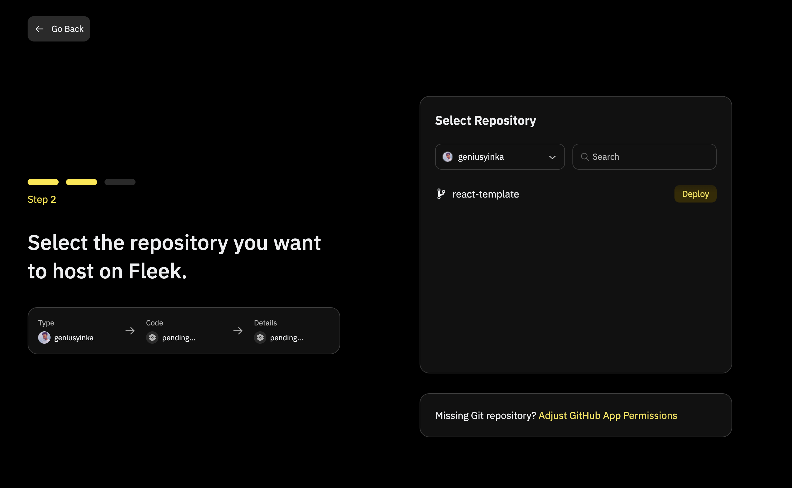

💡 To grant Fleek access to a different repository, simply click on the ‘Adjust GitHub App Permission’ button below.

The next step will be to click on the `Deploy` button of the repository you would like to deploy to Fleek.

You’ll then be brought to this page:

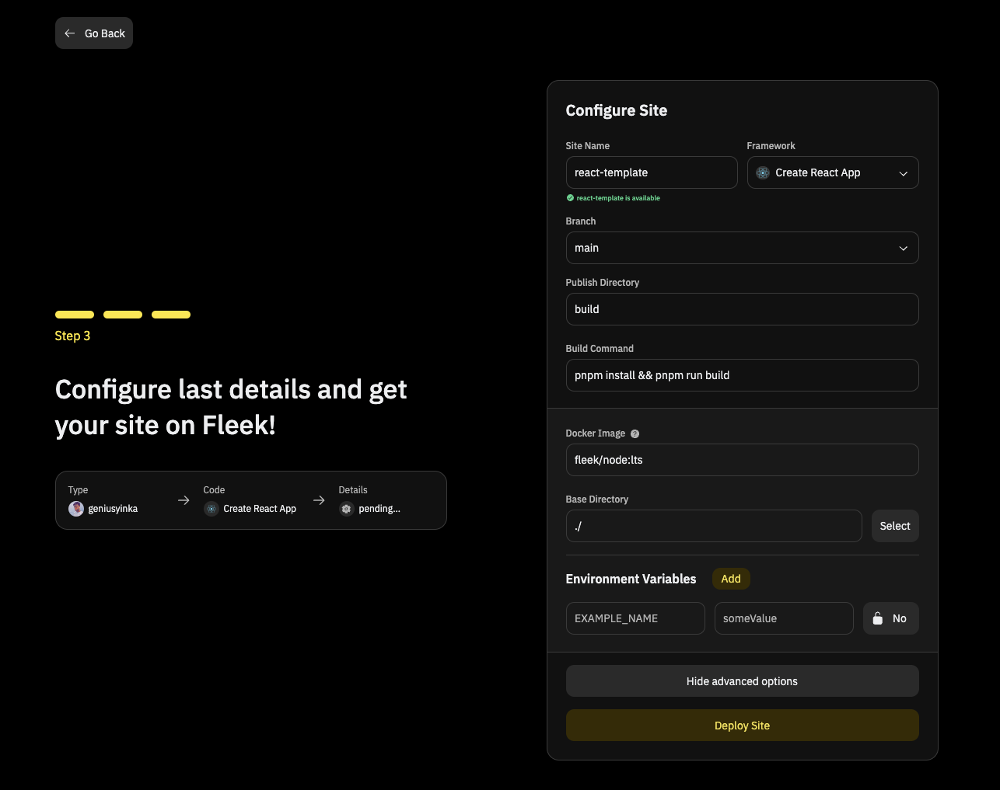

A few things to note about this page.

1. You can modify the `Site Name` to anything you want.
2. The framework is automatically detected by Fleek.
3. The `main` branch is automatically selected. If you’d like to deploy code from a different branch, feel free to select that branch.
4. The `Publish Directory` is also automatically determined by Fleek based on the **Default** publish directory by the framework. If you’ve made any modifications, change the name to reflect this.
5. The `Build Command` is also automatically determined by Fleek. If this is different from yours, modifications can be made.

### Advanced options

When you click on the `Show Advanced Options`

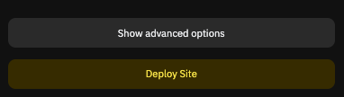

You can make modifications to things like:

- Docker Image & Tag
- The Base Directory
- The Environmental Variables

Once you are satisfied with the modifications you’ve made, simply click on the `Deploy Site` button to allow Fleek to begin the deployment process.

You will be automatically redirected to this page on the Fleek dashboard:

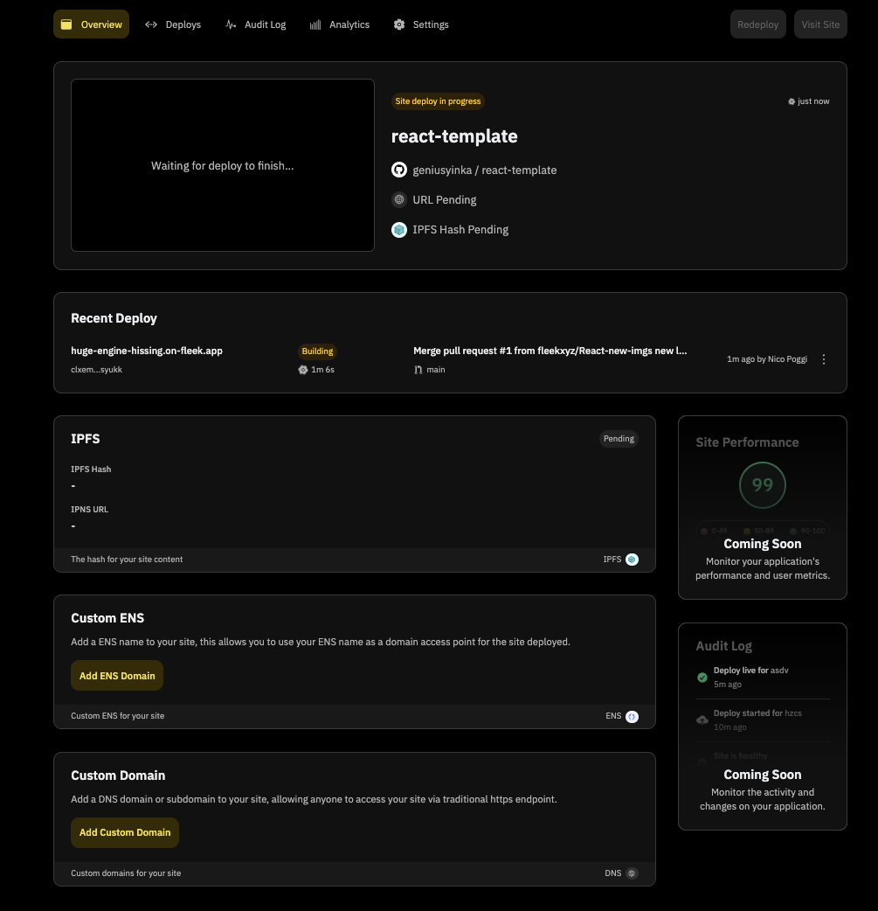

The `Overview` page shows you the status of your site deployment, you can also monitor the status of your deployment by clicking on the `Deploys` tab. The `Audit Log` , `Analytics`, `Settings`, have helpful information about your deployment as well.

Once your site has been successfully deployed, you should see a `Site is live` notification and your site’s URL.

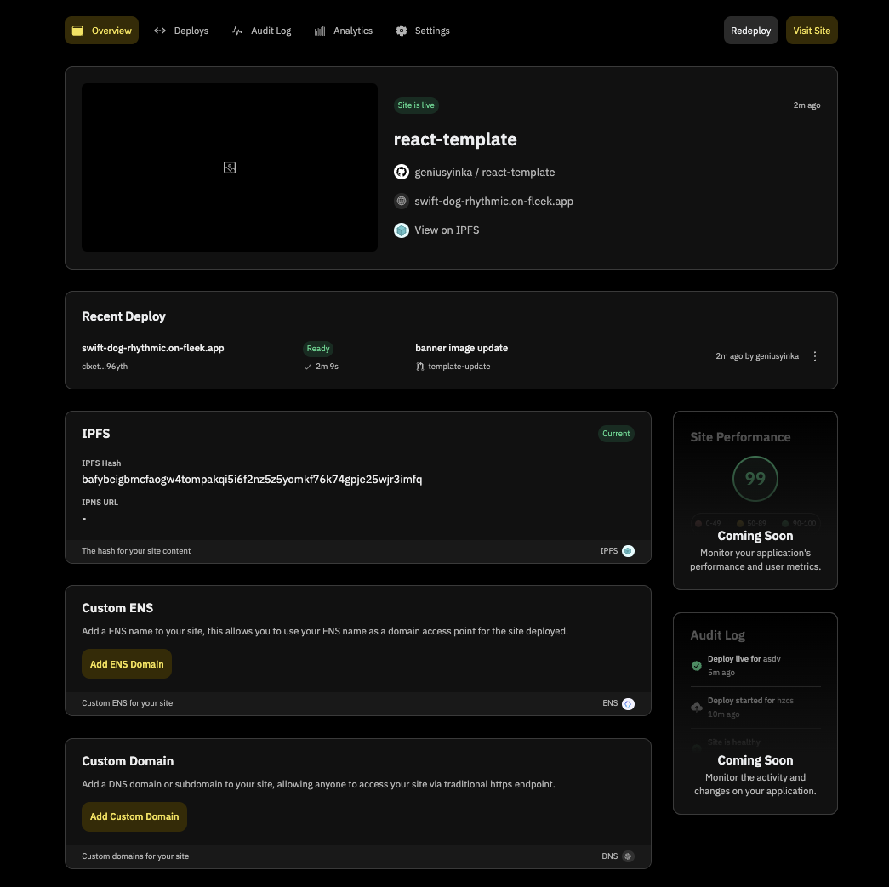

Click on the URL (For this example it’s https://wailing-action-mammoth.on-fleek.app/ but yours will be different) and it’ll take you to your fully functional React App!

**Congratulations! You’ve successfully deployed your React app onto Fleek!**

### Resources:

- [Understanding the Fleek Platform](https://fleek.xyz/docs/platform/)
- [Understanding Projects](https://fleek.xyz/docs/platform/projects/)
- [Domains](https://fleek.xyz/docs/platform/domains/)
