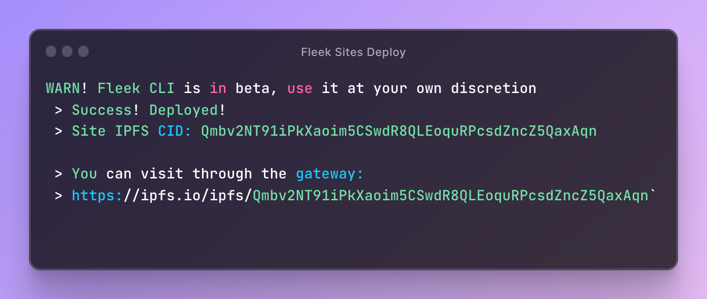

With our ready out-of-the-box templates & boilerplates, and the new Fleek CLI, deploying your first project to IPFS with becomes a lightning-fast process. Turn building apps from the group up into a three-step process: **Fork, Customize, and Deploy on Fleek**!

For access to the open-source repository, check out: https://github.com/fleekxyz/templates

Let’s explore how to deploy one of our templates, and go through the resources you need to get started:

---

## Deploying Your First Template on Fleek

We offer a wide range of templates & boilerplates divided into two categories: 'jamstack' & 'protocols'.

You’ll find a list of commands required in each template or boilerplate in their corresponding repository. Don't worry if some of these commands seem daunting– every repository explains each step in detail!

Before starting the template deployment process **make sure that you have the Fleek CLI installed and updated to the latest version**. For instructions on how to install the CLI, check out our [docs](https://docs.fleek.xyz/docs/CLI/).

### Step 1: Clone Repo Locally & Install Dependencies

All templates are available on GitHub and you can kickstart your project by simply forking or cloning your preferred framework/protocol repository. We have an ever-expanding library of IPFS-ready site templates and protocol boilerplates, including:

- [Next.js](https://github.com/fleekxyz/nextjs-template)
- [Astro](https://github.com/fleekxyz/astro-template)
- [React](https://github.com/fleekxyz/react-template)
- [Lens](https://github.com/fleekxyz/lens-template)
- [Ethereum](https://github.com/fleekxyz/ethereum-boilerplate)
- [Celo](https://github.com/fleekxyz/celo-starter-kit)

After choosing and cloning the repo, it's time to install the necessary dependencies, which will be stated at the root of your project. You can use NPM, PNPM, or Yarn to install the dependencies.

<video width="100%" height="auto" autoplay loop>
 <source src="./STEP1.mp4" type="video/mp4">
 Your browser does not support the video tag.
</video>

To start the deployment & customization process locally, users should run `pnpm run dev`

<video width="100%" height="auto" autoplay loop>
 <source src="./STEP3.mp4" type="video/mp4">
 Your browser does not support the video tag.
</video>

### Step 2: Run & Customize Your Project

With the dependencies installed, and your developer environment initialized, you're now set to run your project. To initialize your site, you'll need to run `fleek sites init`. At this point in the CLI, you will be prompted to input a name, directory location, and build command.

<video width="100%" height="auto" autoplay loop>
 <source src="./STEP2.mp4" type="video/mp4">
 Your browser does not support the video tag.
</video>

You can customize the build command directly through the CLI. **To take your template to the next level, you can use a file editor and modify the desired files to customize your site**!

### Step 3: Deploying the Template

This is the part where some people get a little lost, so let’s break it down. To deploy your site, first:

1. Build your project with the command listed on the repo’s readme. This builds a version of the production site in the previously set directory location.
   - Usually `pnpm build`
2. Deploy to IPFS with `fleek sites deploy`

``NOTE: If you configured a build command when setting up the site in the previous step using `fleek sites init`, you won’t need to run the build script– the CLI will build the site for you automatically!``

The CLI takes over from here, uploading the corresponding files and deploying your site to IPFS with a little magic in a few minutes. You will typically get an output like this:

Paste the URL into your browser and check out your brand new, IPFS-hosted site!

---

## Why Use Templates?

You might be wondering– why not just start your own Next.js project and deploy to IPFS using Fleek without a template?

**The answer**:

- Templates are configured to have a static output enabling easy site deployment to IPFS directly from the Fleek CLI.
- Configures the asset prefixing automatically–the site will render properly when accessed through a public IPFS gateway.

---

Hopefully, with these steps, deploying your first project using Fleek.xyz templates to IPFS with the Fleek CLI will be a breeze!

If you have any questions or encounter any issues, reach out to us in our [Discord](https://discord.gg/fleek) server! We’re also open to any and all template suggestions– let us know what you want to see next ⚡
