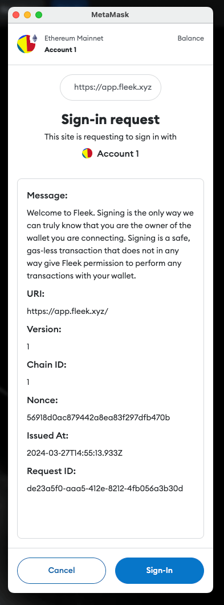

In this guide, you’ll learn how to build a file upload web app that takes any file and uploads it to IPFS. With Fleek there are a few ways you could upload files to IPFS, one being that you could use the Fleek CLI — we have a guide on that [here](https://www.youtube.com/watch?v=2OzwtDH7K0A&t=38s). You could also upload files directly from the [platform](https://www.notion.so/6c772a4a892943ce92479e5ad7cba582?pvs=21) or via the [SDK](https://docs.fleek.xyz/docs/SDK).

## What is Vue Js?

[Vue.js](https://vuejs.org/) is a progressive JavaScript framework used for building user interfaces. It's often compared to React, another popular framework. Vue.js simplifies the process of creating dynamic and reactive web applications. It offers features like component-based architecture, reactivity, and declarative rendering, making it efficient and flexible for frontend development. Vue.js is known for its gentle learning curve and scalability, making it a great choice for both small and large-scale projects.

In this guide, we’ll be making use of the SDK to build out our file upload app. We’ll call it: **Upload-It!**

Before we get started, let’s go over the requirements we’ll need to bring this to life!

# Requirements

- NodeJs 18+
- [Fleek Account](http://app.fleek.xyz)
- [GitHub Account](http://github.com)
- Fleek SDK
- Fleek CLI
- Repo: https://github.com/fleekxyz/vue-template

---

## Fleek Account Creation

The first thing we’ll need to do is create a Fleek account: head over to http://app.fleek.xyz, and click on the `Create a Free Account` button.

> 💡 Feel free to skip this step if you already have an account on [Fleek.xyz](http://Fleek.xyzapp.fleek.xyz)!


You’ll be prompted to create an account with your wallet or an email address. For the sake of this tutorial, we’ll be making an account using our MetaMask account.

Click on the `Metamask` option from the wallet list and you’ll be presented with a **sign-in** request in your browser extension. This is to verify ownership of your account.



Once you click on the **Sign-In** button, you’ll be redirected to the Fleek Dashboard.

### Fleek CLI Installation

As we are deploying the website using the **fleek-cli**, our next step will be to install the **fleek-cli** on our computer.

Open up your terminal and run:

```
npm install -g @fleek-platform/cli
```

This will globally install the `fleek-cli` onto your machine. Once installed, open the nextjs-template project in VSCode, and log into your Fleek account via the CLI. This will enable us to run CLI-related commands directly from our terminal.

To login, open your terminal and run:

```
fleek login
```

Click on the link displayed to log into your Fleek account. You should see a **Success! Logged in.**


Now that we've created our Fleek account and installed the CLI, let's proceed. If you want to follow along, the next step is to clone this GitHub repo. It's a Vue.js template that we'll use as the base for our file upload app: repo

However, if you prefer to review the finished app, you can find the repository for that version here: [link to the repository].

Now, clone the repository onto your machine. cd into the folder, run `npm install` to install the dependencies and then run `npm install @fleek-platform/sdk` to install the Fleek SDK.

You’re all set up— now let’s get started!

---

We’re going to create a new component under our `components` folder called `UploadComponent.vue` , and populate it with this:

```javascript

<template>
  <div class="upload-container">
    <label for="fileInput" class="file-label">
      <input
        type="file"
        id="fileInput"
        ref="fileInput"
        @change="handleFileChange"
        class="file-input"
      />
      Choose File
    </label>
    <div v-if="file" class="selected-file">
      Selected File: {{ file.name }}
    </div>
    <button class="upload-button" @click="uploadFile">Upload</button>
    <div v-if="uploading" class="upload-status">Uploading...</div>
    <div v-if="ipfsHash" class="upload-status">IPFS Hash: {{ ipfsHash }}</div>
    <div v-if="error" class="error-message">Error: {{ error }}</div>
  </div>
</template>

<script>
import { FleekSdk, ApplicationAccessTokenService } from '@fleek-platform/sdk';

export default {
  data() {
    return {
      file: null,
      uploading: false,
      ipfsHash: null,
      error: null,
      clientId: '<CLIENT_ID_GOES_HERE>', // Client ID Here
  },
  methods: {
    handleFileChange(event) {
      this.file = event.target.files[0];
    },
    async uploadFile() {
      if (!this.file) {
        this.error = "Please select a file.";
        return;
      }

      this.uploading = true;
      this.error = null;

      try {
        const content = await this.readFileAsync(this.file);
        const result = await this.uploadToIPFS(this.file.name, content);
        this.ipfsHash = result.cid.toString();
      } catch (err) {
        console.error("IPFS upload error:", err);
        this.error = "Failed to upload file to IPFS.";
      } finally {
        this.uploading = false;
      }
    },
    readFileAsync(file) {
      return new Promise((resolve, reject) => {
        const reader = new FileReader();

        reader.onload = () => {
          if (reader.result instanceof ArrayBuffer) {
            resolve(reader.result); // Resolve with ArrayBuffer
          } else {
            reject(new Error("Failed to read file content."));
          }
        };

        reader.onerror = (error) => reject(error);
        reader.readAsArrayBuffer(file);
      });
    },
    async uploadToIPFS(filename, content) {
      const patService = new ApplicationAccessTokenService({
        clientId: this.clientId,
      });

      const fleekSdk = new FleekSdk({ accessTokenService: patService });

      const result = await fleekSdk.ipfs().add({
        path: filename,
        content: content,
      });
      return result;
    },
  },
};
</script>

<style scoped>
.upload-container {
  display: flex;
  flex-direction: column;
  align-items: center;
  justify-content: center;
  height: 20vh; /* Full viewport height */
}

.file-label {
  display: inline-block;
  cursor: pointer;
  padding: 10px 20px;
  background-color: blue;
  color: white;
  border-radius: 5px;
  margin-bottom: 20px;
}

.file-input {
  display: none; /* Hide the actual file input */
}

.selected-file {
  margin-top: 10px;
}

.upload-button {
  padding: 10px 20px;
  background-color: blue;
  color: white;
  border: none;
  cursor: pointer;
}

.upload-status {
  margin-top: 20px;
}

.error-message {
  margin-top: 20px;
  color: red;
}
</style>
```

We’ll need to add a `client_id` before we’re able to make use of the Fleek SDK. To get one, we’ll open up our terminal and run `fleek applications create` this command is going to generate an applicationsTokenService (ATS) ID. You can read more about the ATS on the SDK section of the docs here: [Application Token Service](https://docs.fleek.xyz/docs/SDK#application-access-token)

When you run `fleek applications create` you should get a response that looks like this:

```javascript
> fleek applications create
> ✔ Type name of new application: … app
> ✔ Type white label domains separated by comma … your-app-domain.com
> Success! Successfully created. Your new application has client's ID: client_FYMego6wIogtm36sUFQb
```

Copy your client_id, and replace it at the `<CLIENT_ID_GOES_HERE>`.

Now that we’re all done with that, we’re going to open up our `index.ts` file under our `router` folder, and then link our `UploadComponent.vue` file. We’ll update it with this:

```javascript
import { createRouter, createWebHashHistory } from 'vue-router';
import UploadComponent from '../views/UploadComponent.vue';

const router = createRouter({
  history: createWebHashHistory(import.meta.env.BASE_URL),
  routes: [
    {
      path: '/',
      name: 'UploadFile',
      component: UploadComponent,
    },
    {
      path: '/about',
      name: 'about',
      // route level code-splitting
      // this generates a separate chunk (About.[hash].js) for this route
      // which is lazy-loaded when the route is visited.
      component: () => import('../views/AboutView.vue'),
    },
  ],
});

export default router;
```

### **Testing the Vue.js App**

1. **Run the Development Server**

- Open your terminal.
- Enter the command **`npm run dev`** to start the development server.
- This will launch your Vue.js app locally.

2. **Upload a Test File**

- Navigate to the app in your web browser.
- Use the file upload feature to select a file.
- Try uploading the file to IPFS using the app.
- Verify that the upload process works as expected.

> 💡 If you encounter any errors during testing, review your code and ensure it matches the provided instructions.

### **Preparing for Deployment on Fleek**

1. **Build the Static Site**

   - In your terminal, execute **`npm run build`**.
   - This command will compile your Vue.js app into a static site.
   - Upon completion, a new folder named **`dist`** will be generated.

   > 💡 Pay attention to the folder name `dist` as it contains your built app files.

2. **Create Fleek Deployment Configuration**

With the static site built, proceed to set up the Fleek deployment configuration.

Run:

```
fleek projects create
```

Assign a name to your new project. Then Run:

```
fleek sites init
```

Fill in the prompts with your responses

You’ll get a few prompts, populate them as you wish:


- _Type the name of your site_: › `[site-name]`
  - If there’s an existing site already with this name, it may ask if you want to link to this site. Please note that when you do this, you will overwrite everything on the previous site. Ensure that this is the outcome you desire, otherwise, select **N** and create a new site.
- _Specify the `dist` directory from where the site will be uploaded from_: › `dist`
- _Do you want to include the optional "`build`" command?_: › **`yes`**
- _Specify `build` command_: › `npm run build`
- _Select a format for how the site's configuration will be saved_: › `Javascript Json`

We’ve successfully created our config file. We can proceed to deploying our site.

## Deployment

The next step here will be to deploy our Vue app to Fleek.

We’ll do that by running:

```
fleek sites deploy
```

Fleek will begin uploading the files in our `dist` folder to IPFS. You should get a response that looks like this:

```
> Success! Deployed!> Site IPFS CID: QmVgNN84eJMPoxznUEFmjAhkbhiKS8ic39zucNkWfux3ft> You can visit through the gateway:> https://ipfs.io/ipfs/QmVgNN84eJMPoxznUEFmjAhkbhiKS8ic39zucNkWfux3ft
```

Your site has been successfully deployed!

Now head over to the dashboard [http://app.fleek.xyz](http://app.fleek.xyz/), and ensure you are on the right project (open the drop-down menu on the top left of the homepage and select the current project).


Click on Sites. Here, you should see your deployed site. If you’ve deployed more than one site into this project, they’ll all show up here:


Click on your deployed site. You should be brought to this page:


Click on the URL (For this example it’s https://early-motorcycle-limited.on-fleek.app/ but yours will be different) and it’ll take you to your fully functional UploadIt App!

From the [Fleek.xyz](http://fleek.xyz/) dashboard, you have the ability to manage a custom domain or ENS address for your site, as well as see deployment history and quickly manage site settings.

---

Congratulations! You just deployed your UploadIt Vuejs App to the Fleek.xyz platform. The basics from this guide can be taken and applied to any static VueJs app to deploy on Fleek.xyz

If you’d like to learn more about Fleek, visit our [documentation](https://docs.fleek.xyz/docs) page, join our [Discord server](https://discord.gg/fleek), and stay up to date with us on [X](https://twitter.com/fleek/)!

See you in the next guide 🤙

## Resources:

- Understanding Projects: https://docs.fleek.xyz/docs/Projects
- Sites: https://docs.fleek.xyz/docs/Sites
- Fleek CLI: https://docs.fleek.xyz/docs/CLI
- Fleek SDK: https://docs.fleek.xyz/docs/SDK
