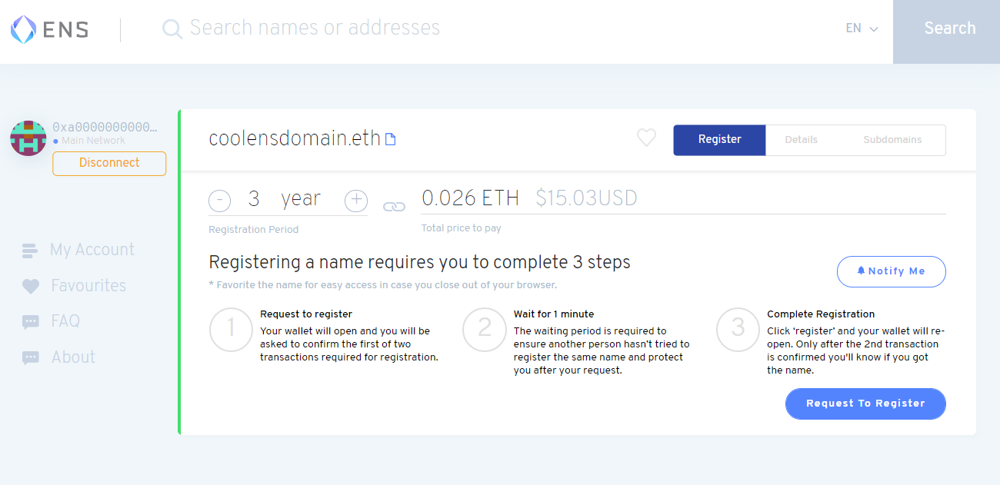

ENS ([Ethereum Name Service](https://ens.domains/)) domains, much like the name entails, are the decentralized Ethereum-based naming system alternative to DNS (Domain Name System).

Both carry out the same basic task. **They are lookup systems** which use domain names to map and reference complex addresses. The difference is that, while DNS uses domain names to translate a website’s underlying IP address, ENS uses .eth suffix domain names to reference [Ethereum](https://ethereum.org/) addresses, or any other hard to remember resources, like IPFS file hashes or Tor .onion addresses!

Instead of recalling, for example, a 42 character hexadecimal ETH wallet address that looks something like “oxe989eb1ddd3442a24…”, you can replace it with a more familiar ENS domain name that’s easier to remember, like **mywallet.eth**, and make it easier for anyone to make a transfer via an ENS-compatible wallet without typing down the full hexadecimal address.

But, there’s more to ENS domain names than just making memorable wallet addresses, or accessing your favorite IPFS-hosted picture on the go.

ENS opens up the door for websites, Dapps, and more Dweb resources/services to make themselves accessible via a **decentralized, censorship-resistant, and user-controlled** domain naming system.

Unlike DNS, which is handled by centralized authorities, ENS lives on smart contracts on the Ethereum blockchain and is censorship-resistant.

Let’s do an overview of what ENS domains are, why they are important, and how to buy and use them for your IPFS site.

**What you will learn on this article:**

- [What is the Ethereum Name Service (ENS)?](https://blog.fleek.co/posts/guide-ens-domains-ipfs-ethereum-name-service#what-is-the-ethereum-name-service-ens)
- [How to buy ENS domains and register them?](https://blog.fleek.co/posts/guide-ens-domains-ipfs-ethereum-name-service#how-to-buy-ens-domains-and-register-them)
- [How to link your ENS domain to an IPFS site with Fleek.](https://blog.fleek.co/posts/guide-ens-domains-ipfs-ethereum-name-service#how-to-link-ens-domains-to-ipfs-sites)

## **What is the Ethereum Name Service (ENS)?**

ENS is an open source, distributed, and community-owned naming system that resides in the Ethereum blockchain. It was developed at the Ethereum Foundation in early 2017, proposed and created originally by the developer Nick Johnson and Alex Van de Sande.

At its core, ENS is composed of two main pieces. **Firstly, the ENS registry,** which lives in a smart contract running on the Ethereum blockchain and has a record of all domains and subdomains, detailing the owner, resolver, and caching TTL (time-to-live) for all records under that domain.

**The second key piece are resolvers**, which are the actors responsible for translating the ENS domain names into the underlying referenced address or hash. These are also smart contracts on the blockchain, which carry the task of being asked what the “mywallet.eth” domain references, and responding with the resource’s address: ““oxe989eb1ddd3442a24…”.

With those two components we can map the basic ENS architecture and flow. When resolving an ENS address, one first queries the ENS registry for an ENS address → the registry then answers what resolver should be queried for the mapped content → and that resolver in return points the user to the final address or content the domain references.

Right now ENS is growing in popularity and browsers like Opera mobile, MetaMask mobile, or any popular browser using the MetaMask extension supports .eth domains. [Even in Fleek](http://fleek.co/), ENS domains are gaining a lot of traction! Over 10% of deployments in Fleek are associated with an ENS domain, and over 4000 sites have added an ENS name already.

What’s more, “.eth” is not the only suffix! As of today, some TLDs like .xyz [can be registered](https://docs.ens.domains/dns-registrar-guide) and claimed on ENS, however “.eth” does still benefit from being exclusively blockchain-native.

### **Why are ENS domains important?**

Not only ENS offers a decentralized alternative to address complex resources on or off the blockchain with easy-to-read names, but it also is a complementary piece on the **road to decentralizing web/app hosting entirely**.

Instead of having Domain Name Registrars like GoDaddy, and DNS Servers, ENS has two decentralized components that cut these middlemen and let the community handle both domain purchases/ownership and resolving.

After all, today in the Web 2.0, **most hosting components are centralized**: Domains, dedicated hosting servers, and CDNs. ENS is the starting point for changing that, by making internet naming decentralized.

And, when combined with [IPFS](https://ipfs.io/) (InterPlanetary File System), a distributed, P2P file system, ENS begins to open up the door for getting rid of the centralized, censorship-prone DNS components of Web 2.0, and making **decentralized, P2P and censorship-resistant websites & apps possible**.

Especially because of the fact ENS allows us to access content on decentralized storage like IPFS via decentralized [constant links](https://blog.fleek.co/posts/immutable-ipfs). Remember that, on IPFS, files are identified by their content not by a storage URL. Meaning their addresses/hashes (CID) change every time the content does. Imagine having to change your website’s url every time you made an update!

ENS adoption still needs to grow, and P2P content storage/delivery networks are evolving as well to better achieve this ([we’re working on that with Space](https://blog.space.storage/posts/how-is-space-different-from-cloud-storage)!). But, ENS domains -and the idea behind them- definitely represent the base structure of what hosting and content serving should look like in Web 3.0, because unlike DNS they are:

- Decentralized
- Immutable
- Censorship-resistant
- User-owned/controlled

And, above all, ENS resides in the Ethereum ecosystem, which is not a minor perk! Rather than being an alternate blockchain/network, it exists in an ecosystem in which it can easily interact with most of the decentralized use cases it pairs up well with: Dapps, Defi, NFTs, DAOs, wallets, etc.

Not only that, but it can integrate all of those use cases under a single address! With DNS, your domain, identity, payments, and bank are all separate things. ENS can unite it all in a single address that becomes not only your site, but identity, and bank. After all, not only it can carry an IPFS hash, but ETH, or BTC addresses and more things at once.

## **How to Buy ENS Domains and Register Them**

Let’s get started on your road to decentralizing your website using ENS and IPFS. The first step you need to take is **registering an ENS domain.** We’ll use ENS’s dashboard as an example, and then follow Fleek’s flow for integrating it with your IPFS-hosted site.

The acquisition, ownership, and registration aspect of ENS is decentralized as well.

Initially, domain name auctions lasted three days, in which a Vickrey Auction process was executed. Someone opened an auction for a name they wanted to buy, people bid for three days, and the winner owned the domain until they released it and recovered their funds. This, however, promoted domain squatting/hoarding, and a new model was introduced.

As of last year, **you can buy and register ENS domains instantly**, with a slight one minute delay. Instead of paying an undefined fee, there is a **yearly rent** model which costs approximately USD$5 payable in ETH (some domains are slightly more expensive due to popularity). These funds now go to [initiatives and grants](https://medium.com/the-ethereum-name-service/what-will-ens-do-with-all-that-rent-money-heres-what-you-need-to-know-c7fe26a7e0e9) to help maintain/develop ENS and the Ethereum ecosystem overall.

Let’s go over the registration process.

### **1. Go to the [ENS domain application](https://app.ens.domains/).**

To register your first ENS domain, visit the [Ethereum Name Service app](https://app.ens.domains/) and search for an address/name you want to register and is available. At the moment, you can register domains that are a minimum of 3 characters long (no maximum limit), and you can include emojis.

### **2. Connect to the Main Network.**

<video width="100%" height="auto" autoplay loop>
 <source src="./ens4.mp4" type="video/mp4">
 Your browser does not support the video tag.
</video>

To pay for the registration fee of your ENS domain, and declare your ownership for it, you will have to connect to the Mainnet using one of the offered integrations (MetaMask, WalletConnect, Portis, Torus, Authereum, MEW wallet). We’ll use [MetaMask](https://metamask.io/) for this example.

### **3. Define Registration Period and Confirm**

Choose for how long you will want to rent that domain, and verify the final ETH fee to pay. Once you’re good to go, hit “Request to Register” and a transaction will begin. It takes about one minute to verify because during that period the platform is verifying no one else already tried or is trying to acquire the same domain.

If everything is good, your wallet will pop up to execute the final transaction, and confirm your ownership and purchase.

### **4. Review Details and Setup Renewal Reminder**

Once your transaction is successful, you will see a page similar to the one above (using the ens.eth domain as an example). Let’s go over the details on this page.

**The registrant** is the owner of the ENS domain, in this case, it will be you! The registrant can set the controller address, change the resolver, or transfer the registration to a new owner.

**The controller** can be seen as the account or user who is in charge of changing the content/addresses/records on this domain, and create or manage subdomains. By default, the registrant will be the controller, but it can be modified.

**The resolver** is a smart contract that handles the translation from your ENS domain name to the content you actually link it to. By default, it is set to the Public Resolver managed by the ENS team but it can be modified for custom resolver contracts.

**The expiration date** is your renewal date for this domain, when you will have to pay again to maintain the domain’s ownership for a new period. Anyone can choose to pay to renew your domain’s ownership, without them gaining any control over it. **Set up a reminder** for your renewal date using the “Remind Me” button, which allows you to schedule an event in your calendar, or specify an email address where a notification will be sent.

**The records** in your domain are where the magic happens! Here you can specify all the resources/addresses that your ENS domain name references. For example, an ETH, BTC, LTC, or DOGE address, content such as the IPFS hash to your website, or text records for things like email or Twitter handles.

Each time you modify a record, there is a ETH gas transaction to be paid. Usually, this is a manual process that you have to do each time you make a new deployment for your website, but we’ll show you later how to automate it using Fleek! A quick spoiler: Fleek covers the cost for these gas fees so you don’t have to worry about it.

### **5. Configure Subdomains for your ENS Domain**

If you navigate to the third tap in your newly acquired ENS domain, you’ll see that you can easily configure new subdomains for any of your website/product needs.

Subdomains act exactly like your main ENS domain. They have their own records, controllers, resolvers, and you can point them to any other IPFS hash or resource you want. It is tied to the parent domain, which you as a registrant own.

## **How to link ENS Domains to IPFS Sites**

Now that you know how to get an ENS domain name, let’s see how you can host a distributed IPFS + ENS website using Fleek!

We’re using Fleek as our go-to example because, as of today, managing ENS domains is a pretty manual process, where you need to update the content hash and pay an ETH gas fee every time you make a new deployment to your website. Fleek automates that process, auto-updating the IPFS content identifier hash (CID) with each new deployment on your Github, also covering the cost of each transaction’s gas for you at our expense.

Alternatively you can see this [IPFS guide](https://docs.ipfs.io/how-to/websites-on-ipfs/link-a-domain/#domain-name-service-dns) to link your ENS domain manually to an IPFS-hosted site via the main ENS application, but remember that updating the content hash will be your responsibility upon each new content change on IPFS.

### **1. Host Your Site on IPFS Using Fleek + Github**

You can sign up for [Fleek’s free Basic](https://docs.fleek.co/hosting/site-deployment/) plan to get your first ENS+IPFS website up for this test. Before you begin, you will need to have your test site on a Github repository. You can use many popular frameworks, like Gatsby, Wordpress, NextJS, React, Hugo, Angular, etc. We have specific guides for [each of these](https://docs.fleek.co/tutorials/hosting/) frameworks to help prepare your site.

With the Github repository ready, deploying and hosting your site on IPFS takes just three steps: connect your repository, add your build settings, and deploy.

Fleek can auto detect the required build parameters from the inputted framework, but you can find advanced settings / configurations and a detailed explanation of these [on this guide](https://docs.fleek.co/hosting/site-deployment/#creating-a-deployment).

### **2. Add an ENS Domain to Your IPFS Site.**

Once your deployment is successfully finished, you will see your website’s detail and configuration page. Navigate to the **Settings → Domain Management** tab, where you will find the ENS setup flow waiting for you.

<video width="100%" height="auto" autoplay loop>
 <source src="./ens11.mp4" type="video/mp4">
 Your browser does not support the video tag.
</video>

First, **specify the ENS domain** you want to use as your IPFS sites’ address.

Then, you will need to **set Fleek as the controller** of that ENS domain through our platform, which will allow Fleek to point your IPFS site to the domain, and automatically update the content hash in the future whenever a new deployment is detected on your Github, quickly reflecting any changes.

_This doesn’t give Fleek ownership of the domain (you retain the role of the registrant)._

Finally, you will need to **verify your ownership** via MetaMask/Torus/Authereum and pay for the transaction’s ETH gas fee (the transaction that modifies your ENS controller setting).

This is the only gas fee that is paid from the user’s end. For all future deployments you make, **Fleek will cover the gas cost** associated with each automatic content hash update.

And that’s it! Once the transaction is verified, you can…

### **3. Test Your New ENS + IPFS Website!**

If you’re using an ENS-compatible browser, or if you have the **MetaMask extension** **installed** like in the GIF above, you can just type your address in the search bar “address.eth/” (don’t forget the “/”) and it should be automatically resolved: [fleekhq.eth/](http://fleekhq.eth/)

Or, if you have none of those, you can always append the “.link” suffix after your domain to visit your IPFS+ENS website on any browser, thanks to a service made available by ENS that makes all the .eth domains accessible via traditional DNS addresses.

## **Explore More on ENS and Stay Tuned!**

Now that you know how to register your first ENS domain, and how to use it together with IPFS to host websites, start exploring new use cases for it. Like [integrating it with your DApp](https://docs.ens.domains/dapp-developer-guide/ens-enabling-your-dapp) to allow users to use/display ENS addresses, or even let them name complex assets inside your platform using ENS.

**Stay tuned for more updates** on ENS features that are coming to Fleek ⚡ We’re currently working on an adjustment that would change how Fleek is given access to modify/update the records on your ENS domains automatically, by using the “setAuthorisation” function of the resolver, which is a more flexible approach than assigning us as the Controller itself because it allows users to continue to create subdomains themselves.

- [Sign up](https://app.fleek.xyz/) to try Fleek
- Join our [Community Chat](https://discord.com/invite/fleek)
- Follow us on [Twitter](https://twitter.com/fleek)
- Check out our [Tech Docs](/docs/)
- Contact us at support@fleek.xyz
