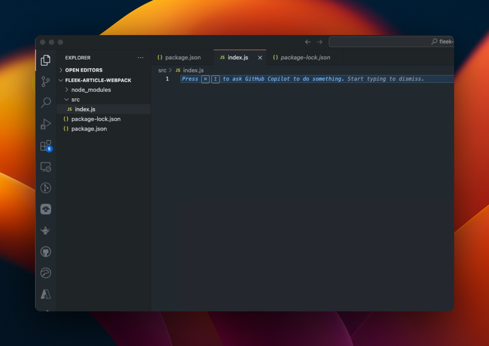
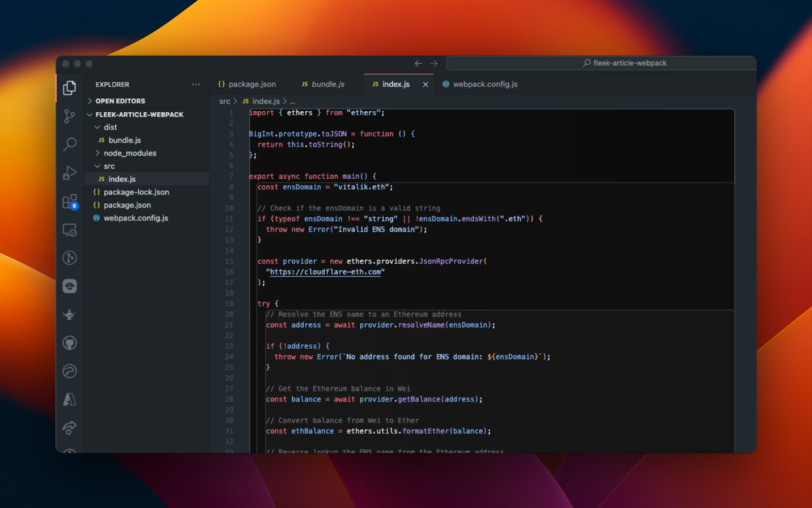

In this guide, we will show how to open a Websocket in a Fleek Function.

New to Fleek Functions? Fleek Functions are lightning-fast, auto-scaling edge functions built on top of Fleek Network’s on-chain cloud infrastructure. Fleek Functions allow serverless execution of javascript code which may provide a more performant, lower cost, easier to maintain, self-sovereign alternative to traditional serverless execution. You can find more info in our <u>[docs here](https://fleek.xyz/docs/platform/fleek-functions/)</u>.

Below we will build a simple Web3 Function that uses a websocket within a Fleek Function to stream Ethereum smart contract data which can be returned whenever the Fleek Function is called.

---

### **Prerequisites**

- Account on <u>[app.fleek.xyz/](https://app.fleek.xyz/)</u>, if you don’t already have one.
- <u>[Fleek CLI](https://fleek.xyz/docs/cli/)</u>
- <u>[Web3.js](https://www.npmjs.com/package/web3)</u>
- <u>[Webpack](https://webpack.js.org/guides/getting-started/#basic-setup)</u>
- Code editor of your choice
- Your terminal

### **Setup:**

After creating a directory for your project, open your terminal (make sure you change directories to the directory you created using the cd command) and run the commands below:

```jsx
npm init -y
npm install webpack webpack-cli --save-dev
npm i web3
```

After running the commands above, your directory should now look like this:



Ensure you have the Fleek CLI installed globally on your machine and log in following the <u>[quickstart guide](https://fleek.xyz/docs/cli/)</u>. Create a JavaScript file within your project’s directory using the touch command, or create it manually using your preferred code editor within your directory. Before we get started, you should set up your `webpack.config.js` to like the below:

```jsx
const path = require('path');

module.exports = {
  entry: './src/index.js',
  output: {
    library: {
      type: 'module',
    },
    filename: 'bundle.js',
    path: path.resolve(__dirname, 'dist'),
  },
  mode: 'none',
  experiments: {
    outputModule: true,
  },
};
```

---

## Implementing WebSocket in a Fleek Function:

This process involves 3 steps:

1. Implementing the websocket as an asynchronous module function.

2. Bundling the code with webpack.

3. Deploying the bundled file as a Fleek Function.

You can learn more about deploying bundled Fleek Functions in this <u>[guide](https://fleek.xyz/guides/running-bundled-webpack-functions-on-fleek/)</u>.

### **Implementing the websocket as an asynchronous module function:**

We will be using the web3.js SDK to connect to a smart contract and listen to a custom event which we will then perform an action when that event is emitted from the contract. The code to make all of this happen should look like this:

```jsx
export const main = async () => {
  const web3 = new Web3(
    'wss://arb-mainnet.g.alchemy.com/v2/kkd9LJZTw2aZZ12DbeZDUTymIoRifxqW',
  );

  // ABI of your contract, including functions and events
  const abi = [
    {
      inputs: [
        { internalType: 'address', name: '_api3ServerV1', type: 'address' },
        { internalType: 'bytes32', name: '_dapiNameHash', type: 'bytes32' },
        { internalType: 'address', name: '_oevBeneficiary', type: 'address' },
      ],
      stateMutability: 'nonpayable',
      type: 'constructor',
    },
    {
      inputs: [],
      name: 'api3ServerV1',
      outputs: [{ internalType: 'address', name: '', type: 'address' }],
      stateMutability: 'view',
      type: 'function',
    },
    {
      inputs: [],
      name: 'dapiNameHash',
      outputs: [{ internalType: 'bytes32', name: '', type: 'bytes32' }],
      stateMutability: 'view',
      type: 'function',
    },
    {
      inputs: [],
      name: 'oevBeneficiary',
      outputs: [{ internalType: 'address', name: '', type: 'address' }],
      stateMutability: 'view',
      type: 'function',
    },
    {
      inputs: [],
      name: 'read',
      outputs: [
        { internalType: 'int224', name: 'value', type: 'int224' },
        { internalType: 'uint32', name: 'timestamp', type: 'uint32' },
      ],
      stateMutability: 'view',
      type: 'function',
    },
  ];

  const contractAddress = '0x5Aba6949BC70c9eDA5E1E5B8d4aD3565f9Acbd09';

  const contract = new web3.eth.Contract(abi, contractAddress);

  try {
    const result = await contract.methods.read().call();
    return [`Value: ${result.value}, Timestamp: ${result.timestamp}`];
  } catch (error) {
    return [`Error: ${error.message}`];
  }
};
```

**Web3 Setup**: The code initializes a Web3 instance using a WebSocket provider URL (`Alchemy's Arbitrum mainnet`), allowing interaction with the Ethereum blockchain.

**Contract ABI and Address**: It defines an ABI (Application Binary Interface) that includes a function `readDataFeed` and an event `DataFeedRead`. This ABI represents the interface for a specific smart contract deployed at the address `0x5Aba6949BC70c9eDA5E1E5B8d4aD3565f9Acbd09`.

**Contract Instance**: A contract instance is created using the ABI and contract address, enabling interactions with the specified smart contract.

**Event Listener**: The code sets up a listener to call the `read()` event. This event includes information such as `value` (int224), and `timestamp` (uint32).

**Event Handling**: When the `read()` event is emitted by the contract, the listener captures the event data. The data is returned as an array of strings. If an error occurs, the promise is rejected. Otherwise, the promise resolves with the collected event data.

### **Bundling the code with webpack.**

To bundle the function, you simply run the command below in your terminal:

```
npm run build
```

When all is satisfied you should have your directory looking like this with a new directory called `dist` and a file called `bundle.js` inside it.



**Deploying the bundled file as a Fleek Function.**

First off, we need to create our Fleek Function. The command below creates a Fleek Function for us that we can then deploy to:

```
fleek functions create --name websocket-function
```

Where “websocket-function” is the name of our Fleek Function. The command to deploy should look like this:

```jsx
fleek functions deploy \
--name websocket-function \
--path ./dist/bundle.js --noBundle
```

Where “websocket-function” is the name of our Fleek Function and “./dist.bundle.js” is the path to the bundled file created by webpack when we bundled, If all the steps above go well, you should have:

```jsx
✅ Success! The deployment has been successfully created.
> You can call this Fleek Function by making a request to the following URL
🔗 https://fast-state-squeaking.functions.on-fleek.app
> You can also call this Fleek Network URL directly for increased performance (please keep in mind you will not be able to deactivate this link)
🔗 https://fleek-test.network/services/1/ipfs/bafybeibjl7dc3ku3ajsxr6huomiwies5xrxvj26dnfwdrotdj5u5uveepy
```

And that concludes it! We should have a <u>[URL](https://fast-state-squeaking.functions.on-fleek.app/)</u> that shows our websocket in action making real-time operations happen and updating with the latest information from the smart contract.

---

In this article, we explored how to set up a WebSocket in a Fleek Function, a powerful combination for enabling real-time data streaming with the flexibility and efficiency of serverless architecture. By leveraging Fleek Functions and WebSockets, we created a seamless data pipeline capable of delivering up-to-the-minute information from an Ethereum smart contract to end-users. This approach is particularly useful for applications requiring real-time updates, such as financial tickers, live sports scores, or IoT data streams.

By following the steps outlined—setting up the WebSocket, implementing the function, bundling the code with webpack, and deploying the function—we demonstrated a complete workflow from development to deployment. The resulting URL from Fleek provides a live endpoint for accessing the real-time data, showcasing the practical applications of this technology stack.

As we continue to develop more sophisticated applications, integrating technologies like Fleek Functions and WebSockets can significantly enhance the user experience by providing low-latency, real-time interactions. Whether you're building a financial application, a live chat service, or any other data-driven application, this combination offers a robust solution for modern web development needs.

If you’d like to learn more about Fleek, visit our <u>[documentation](https://docs.fleek.xyz/docs)</u> page, join our <u>[Discord server](https://discord.gg/fleek)</u>, and stay up to date with us on <u>[X](https://twitter.com/fleek/)</u>!
