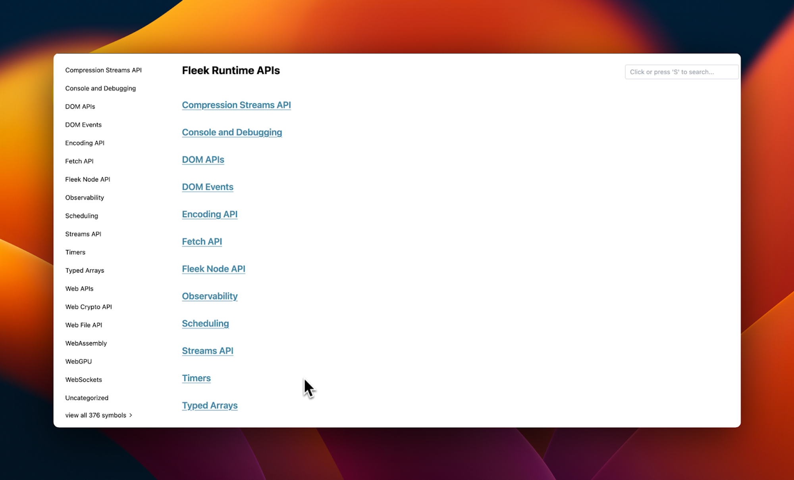
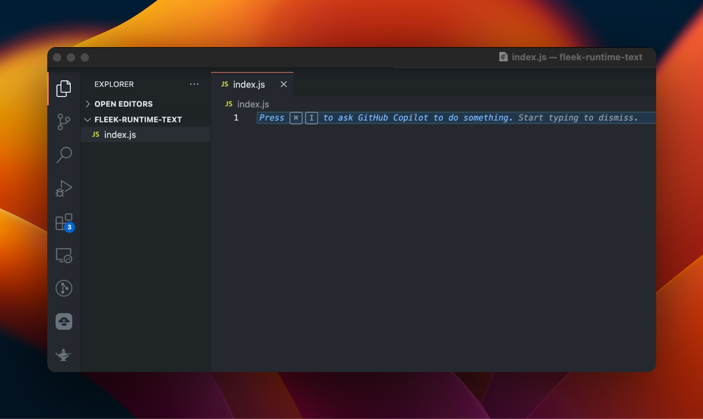
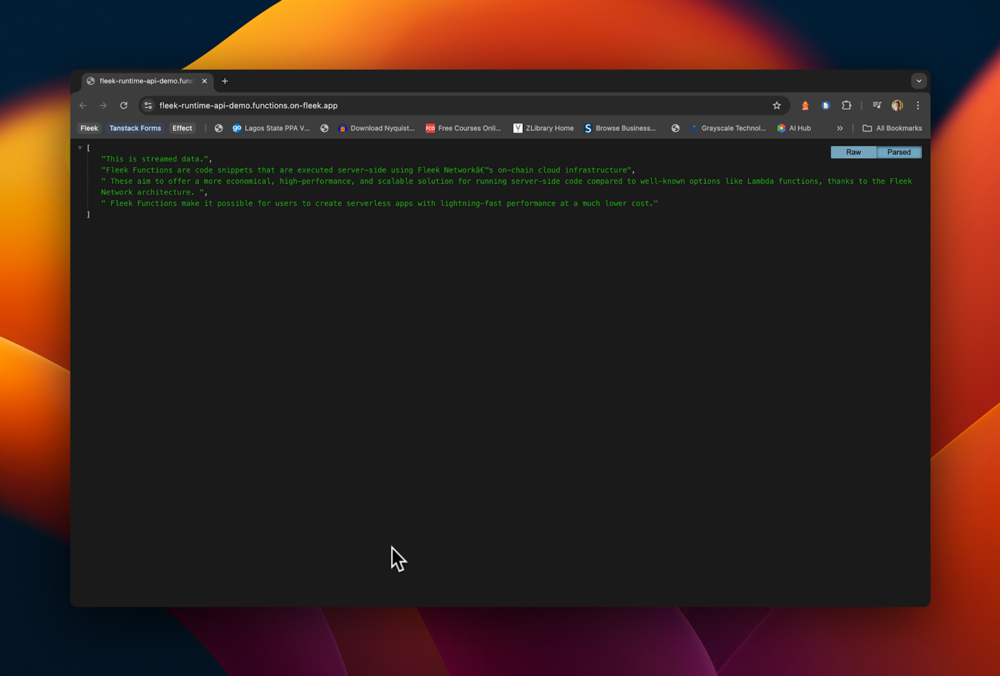

JavaScript runtimes are crucial for the execution of JavaScript code, whether in the context of a web page or on a server. They manage the environment, handle input/output operations, and provide the necessary tools and resources for running JavaScript programs effectively.

Fleek’s runtime is a server-side <u>[Deno](https://deno.com/)</u>-based runtime that executes Javascript and aids in building applications on <u>[Fleek Network](https://fleek.network/)</u>, with a combination of the many performance benefits from Fleek and Deno, including increased security, TypeScript support, and compatibility with Web APIs.

Fleek offers support for many runtime APIs that a typical JavaScript runtime should have which are documented <u>[here](https://fleek-network.github.io/js-docs/)</u>.

In this guide, we'll explore a simple script using Fleek runtime APIs and a Fleek Function.



---

### **Prerequisites**

- Account on <u>[Fleek app](https://app.fleek.xyz/)</u>, if you don’t already have one.
- <u>[Fleek CLI](https://fleek.xyz/docs/cli/)</u>
- Code editor of your choice
- Your terminal

Setup here is straightforward. You can create a directory on your machine and an `index.js` file within it. You should have something similar to this:



---

## **How to use Fleek runtime APIs**

To be able to use Fleek runtime APIs, we need to have a Fleek Function. Fleek Functions run Javascript on the server-side using Fleek Network by leveraging the JS runtime service, which in turn provides us the ability to interact with any of the runtime APIs through them.

You can find more about Fleek Functions and how to deploy one in our <u>[docs here](https://fleek.xyz/docs/platform/fleek-functions/)</u>.

Here we see a demonstration usage of a Fleek runtime API via a Fleek Function. The plan is to work with the <u>[Streams API](https://fleek-network.github.io/js-docs/streams-api.html)</u> and the `WritableStream` interface. This example is useful for managing streamed data, such as text or binary data, in this case however, we will be managing streamed text and see it in action via a Fleek Function.

Inside the `index.js` file you created, write the following function:

```jsx
export function main() {
  const result = [];

  const writableStream = new WritableStream({
    write(chunk) {
      result.push(chunk);
      console.log('Writing chunk:', chunk);
    },
    close() {
      console.log('Stream closed');
      console.log('Final result:', result.join(''));
    },
    abort(err) {
      console.error('Stream error:', err);
    },
  });

  const writer = writableStream.getWriter();

  // Write to the stream and then close it
  writer
    .write('This is streamed data.')
    .then(() =>
      writer.write(
        'Fleek Functions are code snippets that are executed server-side using Fleek Network’s on-chain cloud infrastructure',
      ),
    )
    .then(() =>
      writer.write(
        ' These aim to offer a more economical, performant, and scalable solution for running server-side code than well-known options like Lambda functions, thanks to Fleek Network's architecture. ',
      ),
    )
    .then(() =>
      writer.write(
        ' Fleek Functions make it possible for users to create serverless apps with lightning-fast performance at a much lower cost.',
      ),
    )
    .then(() => writer.close())
    .then(() => console.log('Stream writing complete'))
    .catch((error) => console.error('Error:', error));

  return result;
}
```

The function `main` demonstrates using WritableStream to handle streamed data. It initializes an array to store data chunks and sets up a WritableStream with methods for writing data, handling closure, and error management. The stream's writer is used to write multiple chunks of text sequentially. Once all data has been written, the stream is closed. This logs the final combined result.

The function returns the array of data chunks, although it may not contain all data immediately due to asynchronous operations.

Finally, let’s deploy the function as a Fleek Function and see it running on edge.

**Deploying the Fleek Function**

This includes two simple, straightforward steps which will require that you have the <u>[Fleek CLI](https://fleek.xyz/docs/cli/)</u> installed globally and your terminal open.

**1. Create and name the Fleek Function.**

The command below creates a function and takes an argument for the custom name you want to provide your Fleek Function:

```
fleek functions create --name fleek-runtime-test
```

**2. Deploy your function to the Fleek Function.**

Deploying the function is easy given that you have created the function. The command below achieves this:

```
fleek functions deploy \
--name fleek-runtime-test \
--path ./index.js
```

In the above command, you can see that we included the name of the Fleek Function “fleek-runtime-test” and the path to the file “./index.js”.

If all goes well, you should have the below in your terminal:

```
✅ Success! The deployment has been successfully created.

> You can call this Fleek Function by making a request to the following URL:
🔗 https://fleek-runtime-api-demo.functions.on-fleek.app/
> You can also call this Fleek Network URL directly for increased performance. Please keep in mind you will not be able to deactivate this link.
🔗 https://fleek-test.network/services/1/ipfs/bafkreibo2wgtcqsqm4rqbcwxcn7rkqnhgbeupx4rjkvoh7pxlif6cur6vm
```

We’re practically done at this point. You can view the Fleek Function <u>[here](https://fleek-runtime-api-demo.functions.on-fleek.app/)</u>. Your output upon visiting the endpoint should look like this:



---

## **Building with Fleek runtime APIs**

Fleek’s runtime APIs provide a robust platform for developing efficient, modular applications, offering a similar experience to traditional runtime environments. Here are a few specific project ideas to explore using Fleek runtime APIs:

1. **Serverless API gateways**: Build Fleek Functions that leverage runtime APIs to handle data processing tasks. These functions can pull data from various sources, perform computations or transformations, and serve the processed data through an API endpoint, offloading heavy computation from the client side.

2. **Real-time data processing**: Utilize Fleek's runtime APIs to create and manage data streams. Developers can write applications that process incoming data in real time, store or modify it, and then stream the results to files on IPFS or locally, making it ideal for analytics or monitoring tools.

3. **Static site generators**: Develop tools that use Fleek Functions to dynamically generate static websites. These generators can pull content from various sources, apply templates, and render the final HTML files, which are then hosted on IPFS or other platforms. This is a fast and scalable way to deploy content-rich sites.

4. **Microservices architecture**: Implement microservices that perform specific, isolated tasks using Fleek Functions. Each service can handle a distinct part of an application, such as user authentication, data processing, or notifications, enabling a modular and maintainable architecture.

5. **Edge computing applications**: Create applications that run computations at the network edge, closer to end users. This setup reduces latency and improves performance for services like personalized content delivery, IoT data processing, or real-time communication platforms, leveraging Fleek's network and runtime capabilities.

...and anything else that would benefit from a more secure, cost-effective, performant, and scalable Javascript runtime.

---

Fleek Functions allows developers to build scalable server-side applications at a lower cost than traditional serverless solutions. The guide outlines the process of setting up and deploying a Fleek Function, highlighting Fleek's user-friendly approach and integration with modern JavaScript technologies. Fleek's infrastructure simplifies deploying serverless applications, enabling developers to focus on innovation without managing traditional server resources.
