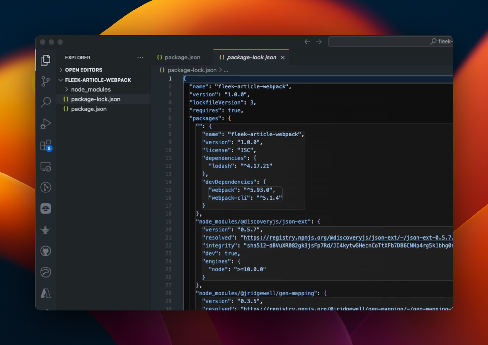
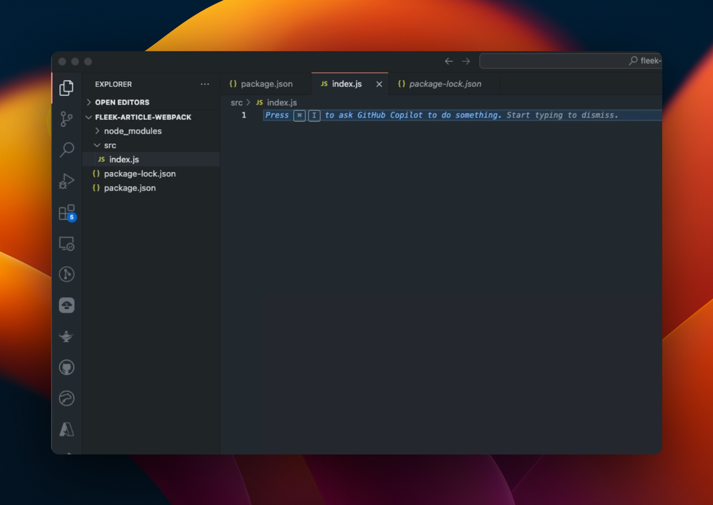
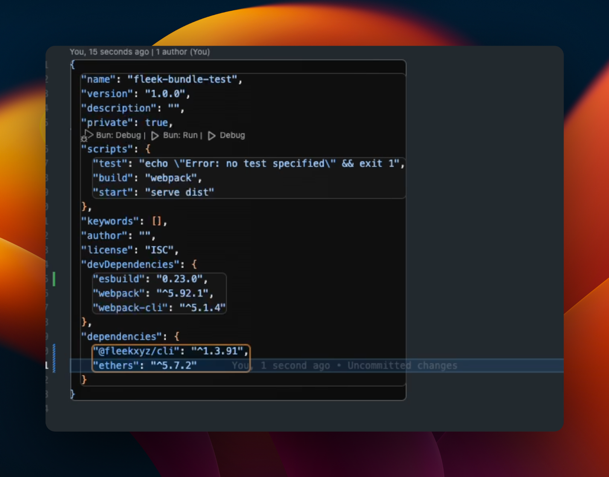
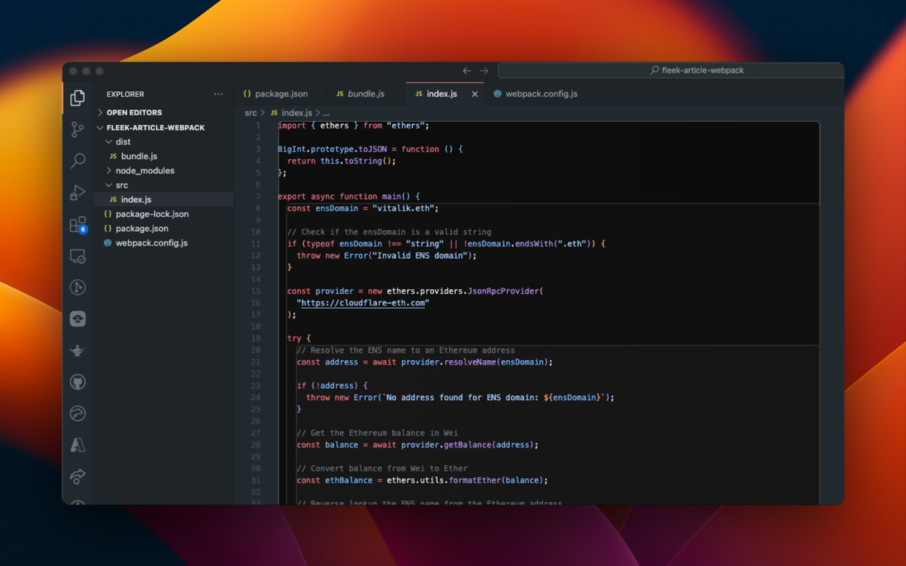
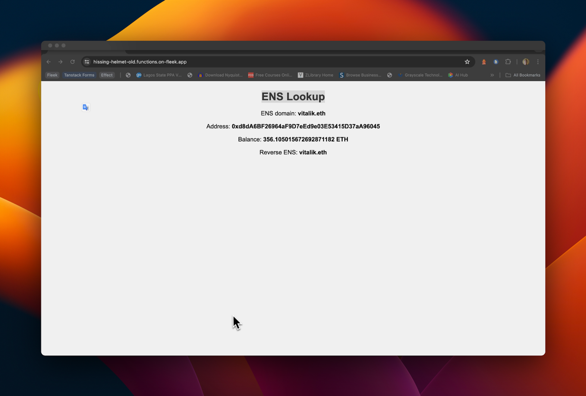

With the alpha release of Fleek Functions, you can now make any serverless function a Fleek Function that can be called via a URL in your code.

```
🔗 https://thundering-joystick-most.functions.on-fleek.app/
```

Fleek Functions are lightning-fast, auto-scaling edge functions built on top of Fleek Network’s on-chain cloud infrastructure. Fleek Functions allow serverless execution of javascript code which may provide a more performant, lower cost, easier to maintain, self-sovereign alternative to traditional serverless execution. You can find a very detailed reference for Fleek Functions in our <u>[docs here](https://fleek.xyz/docs/platform/fleek-functions/)</u>.

In this guide, we will showcase how you can use Fleek Functions to run bundled functions and call them via a URL.

---

### Prerequisites:

Before we start, we need to have a few things in check. We start with defining a few key terms we will be using throughout this guide:**Bundlers**: Tools that process and combine multiple JavaScript files and their dependencies into a single file (or a few files) to improve web application performance and management. Examples are <u>[esbuild](https://esbuild.github.io/getting-started/#install-esbuild)</u>, <u>[webpack](https://webpack.js.org/guides/getting-started/)</u>, <u>[Rollup](https://rollupjs.org/)</u>, <u>[Parcel](https://parceljs.org/)</u>. We will be using webpack for this guide.

- **Modules**: Self-contained units of JavaScript code that can be imported and exported between different files, promoting code reusability and modularity in application development.
- **Webpack**: A powerful module bundler for JavaScript applications, capable of transforming and bundling resources like scripts, styles, and images into optimized output for efficient browser delivery.

### Requirements:

- Account on <u>[app.fleek.xyz/](https://app.fleek.xyz/)</u>, if you don’t already have one
- <u>[Fleek CLI](https://fleek.xyz/docs/cli/)</u>
- <u>[Webpack](https://webpack.js.org/guides/getting-started/#basic-setup)</u>
- <u>[ethers](https://docs.ethers.org/v5/)</u>
- Code editor of your choice
- Your terminal

### Setup:

Some of the steps here have already been outlined in the <u>[“Getting Started”](https://webpack.js.org/guides/getting-started/#basic-setup)</u> page of the webpack docs linked above.

After creating a directory for your project, open your terminal (make sure you change directories to the directory you created using the `cd` command) and run the commands below:

```jsx
npm init -y
npm install webpack webpack-cli --save-dev
npm install ethers
```

After running the commands above, your directory should now look like this:



Ensure you have the Fleek CLI installed globally on your machine and log in following the <u>[quickstart guide](https://fleek.xyz/docs/cli/)</u>. Create a JavaScript file within your project's directory using the `touch` command, or create it manually using your preferred code editor within your directory. Let's get started!

---

## Writing and bundling the function:

We will break this down into 4 steps:

1. Setting up your directory.

2. Writing your JavaScript function in the specified file.

3. Adding the webpack config to ensure our bundle output is a module.

4. Running the bundle script.

### Setting up your directory:

Following the webpack documentation, you can set up your directory by first creating an `src` folder and creating your JavaScript file within it; let’s call our file `index.js`. After this step, your directory should look like this:



### Writing your JavaScript function in the specified file

In your file (index.js in this case), write the below function:

```jsx
import { ethers } from 'ethers';
import { JsonRpcProvider } from 'ethers';

export const main = async ({ path = 'vitalik.eth' }) => {
  const ensDomain = path.split('/').pop();

  if (typeof ensDomain !== 'string' || !ensDomain.endsWith('.eth')) {
    throw new Error('Invalid ENS domain');
  }

  const provider = new JsonRpcProvider('https://cloudflare-eth.com');

  try {
    // Resolve the ENS name to an Ethereum address
    const address = await provider.resolveName(ensDomain);

    if (!address) {
      throw new Error(`No address found for ENS domain: ${ensDomain}`);
    }

    // Get the Ethereum balance in Wei
    const balance = await provider.getBalance(address);

    // Convert balance from Wei to Ether
    const ethBalance = ethers.formatEther(balance);

    // Reverse lookup the ENS name from the Ethereum address
    const reverseName = await provider.lookupAddress(address);

    return `<html>
    <body style="font-family: Arial, sans-serif; text-align: center; background-color: #f0f0f0; padding: 20px;">
      <h1 style="color: #333;">ENS Lookup</h1>
      <p style="font-size: 18px;">ENS domain: <strong>${ensDomain}</strong></p>
      <p style="font-size: 18px;">Address: <strong>${address}</strong></p>
      <p style="font-size: 18px;">Balance: <strong>${ethBalance} ETH</strong></p>
      ${
        reverseName
          ? `<p style="font-size: 18px;">Reverse ENS: <strong>${reverseName}</strong></p>`
          : ''
      }
    </body>
    </html>`;
  } catch (error) {
    console.error('Error:', error.message);
    return `<html>
    <body style="font-family: Arial, sans-serif; text-align: center; background-color: #f0f0f0; padding: 20px;">
      <h1 style="color: red;">Error</h1>
      <p style="font-size: 18px;">${error.message}</p>
    </body>
    </html>`;
  }
};
```

The function in this JavaScript code above resolves an ENS domain to its corresponding Ethereum address, retrieves the address's Ether balance, and performs a reverse lookup of the ENS name. It then formats this information into an HTML string for display. The function includes error handling to manage invalid ENS domains and other potential issues during the lookup process.

### Adding the webpack config:

The way bundling works is that our bundler combines the file together with its dependencies into a single file that is equivalent to what the original function is. With webpack and most bundlers, we use configuration options to help define some behaviors we would like to see like:

- Where the output file will be and what it will be called.
- Whether or not our output file is a module.

Most of the options can be found within the <u>[webpack config](https://webpack.js.org/guides/getting-started/#using-a-configuration)</u>. Our webpack config for our purposes will be this:

```jsx
const path = require('path');

module.exports = {
  entry: './src/index.js',
  output: {
    library: {
      type: 'module',
    },
    filename: 'bundle.js',
    path: path.resolve(__dirname, 'dist'),
  },
  mode: 'none',
  experiments: {
    outputModule: true,
  },
};
```

Where:

**Entry Point:** Specifies ./src/index.js as the entry file where webpack starts the bundling process.

**Output Configuration:**

- **Library Type:** Sets the library type to "module," indicating the output will be in the ES module format.
- **Filename:** Names the output file bundle.js.
- **Path:** Specifies the output directory as dist, resolved relative to the current directory.

**Mode:** Sets the mode to "none," meaning no default optimizations (neither development nor production) will be applied. We can also set the mode to “production” as well, and it will still work.

**Experiments:** Enables outputModule to allow the use of ES modules in the output.

### Running the bundle script:

Running the bundle script is straightforward as you can add a script called `build` in your `package.json`. This is what it looks like after adding it:



Now, to run the script, type the following command in your terminal:

```
npm run build
```

After running the script above, you should have the following directory, with a new `dist` directory and a new file called `bundle.js` inside it:



There you have it, you have successfully bundled your function!

---

## Deploy Your Bundled Function As A Fleek Function:

Now at this very point, we have successfully created our bundled JavaScript function! Now, Fleek offers a lightning-fast way to run bundled functions on the edge! All we have to do is to deploy this function as a Fleek Function.

First off, we need to create our Fleek function. The command below creates a Fleek function for us that we can then deploy to:

```
fleek functions create --name bundled-function
```

Where “bundled-function” is the name of our Fleek function. The command to deploy should look like this:

```
fleek functions deploy \
--name bundled-function \
--path ./dist/bundle.js --noBundle
```

Where `bundled-function` is the name of our Fleek Function and `./dist.bundle.js` is the path to the bundled file created by webpack when we bundled, If all the steps above go well, you should have:

```✅ Success! The deployment has been successfully created.

> You can call this Fleek Function by making a request to the following URL

🔗 https://hissing-helmet-old.functions.on-fleek.app

> You can also call this Fleek Network URL directly for increased performance (please keep in mind you will not be able to deactivate this link)

🔗 https://fleek-test.network/services/1/ipfs/bafkreidqejeivh7rxpvdfuesmzovpc7rz6jn5vov4kw2x7s6fiwriczvve
```

Now on going to the <u>[URL](https://hissing-helmet-old.functions.on-fleek.app/vitalik.eth)</u> the endpoint should respond with a page displaying the result of our function:

There you have it! We have been able to successfully deploy and run a bundled Javascript package as a Fleek Function; a very impressive feat indeed.

For more information on deploying Fleek Functions, including step-by-step instructions, click <u>[here](https://fleek.xyz/docs/cli/functions/#create-a-fleek-function)</u>.

---

In this guide, we walked through the process of bundling a JavaScript function using webpack and deploying it as a Fleek Function. By leveraging Fleek's performant, lower cost, easier to maintain, self-sovereign infrastructure, we can create scalable and fast edge functions that can be invoked via URL.



### Key Takeaways:

1. **Understanding Fleek Functions**: Fleek Functions are designed to be quick, scalable, and efficient, running on Fleek Network’s on-chain cloud infrastructure.

2. **Bundling with Webpack**: We utilized Webpack to bundle our JavaScript function along with its dependencies into a single file, ensuring optimized performance and easier deployment.

3. **Deployment**: With Fleek CLI, deploying our bundled function was straightforward, enabling us to call the function via a URL endpoint.

By following the steps outlined, you can easily bundle and deploy your own functions, harnessing the power of Fleek's edge functions to enhance your applications. Whether you're optimizing for performance, scalability, or ease of deployment, Fleek provides a robust platform to achieve your goals. Happy coding!
