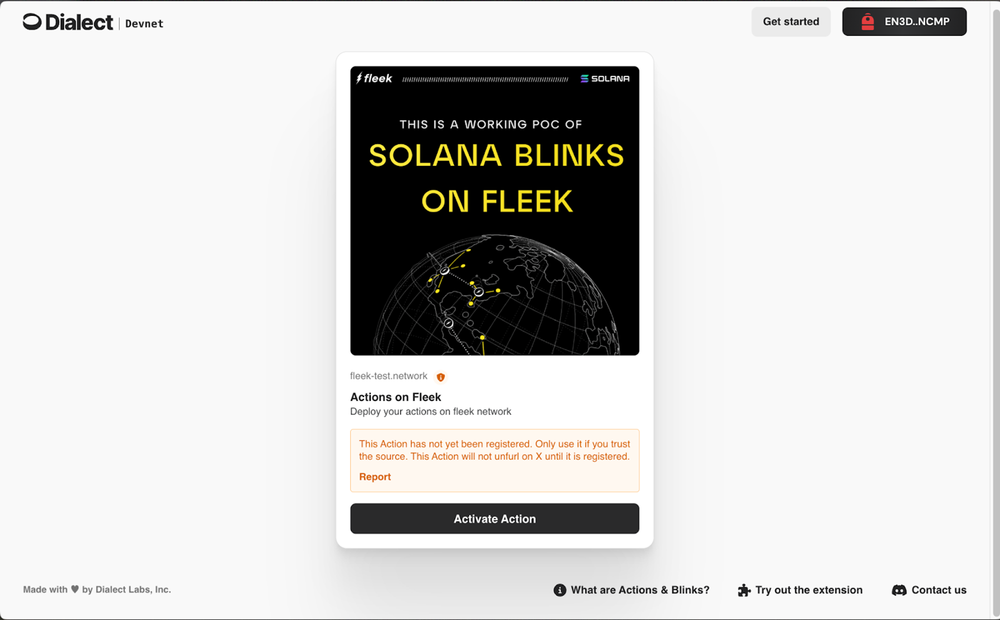
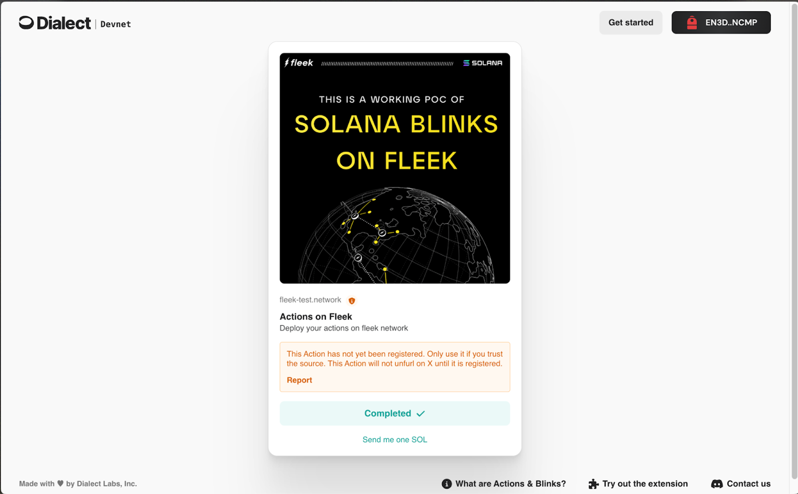

As Fleek moves towards providing more full stack support, we recently explored deploying Solana Blinks using <u>[Fleek Functions](https://fleek.xyz/docs/cli/functions/)</u>. Today we will be diving deep into the specifics of Solana Blinks and what makes them a perfect fit to be deployed on Fleek. We will also be discussing how HTTPS request methods can be handled by the same Fleek Function.

### Understanding Solana Actions & Blinks

To build your first Solana Blink, let’s first quickly understand Solana Actions. Solana Actions are APIs that help send transactions on the Solana blockchain. These transactions are accessible over a variety of mediums beyond just a wallet. Blinks, or `*Blockchain Links*`, transform any Solana Action into a shareable link with extensive metadata.

It is important to note that browser-aware clients like wallet extensions are required to be able to parse Solana Blinks and turn them into accessible user interfaces that allow interactions with Solana. Right now, you can use Backpack or Phantom wallet extensions to access Blinks.

One of the main value adds of Solana Blinks is they allow Solana users to do onchain actions (Claim airdrops, buy NFTs, swap tokens etc.) directly on X, Farcaster, and other places where users are natively located. Instead of the typical flow of redirecting away from their current experience, developers can bake Solana Actions into other apps and allow them to interact without leaving the app.

You can learn more about Solana Actions & Blinks <u>[here](https://solana.com/docs/advanced/actions)</u>.

### Fleek Functions

Fleek Functions are code snippets executed server-side using Fleek’s edge-optimized onchain cloud infrastructure. Fleek Functions allow serverless execution of javascript code which you can use to develop easy and scalable ways of executing transactions on the Solana blockchain. In this guide we will be using the @solana/web3.js package bundled along with a Fleek Function.

The use cases for Fleek Functions go way beyond just executing Solana Actions and Blinks– anywhere you would execute javascript functions, Fleek Functions may provide a more performant, lower cost, easier to maintain, self-sovereign alternative. You can learn more about building with Fleek Functions in our <u>[docs](https://fleek.xyz/docs/cli/functions/)</u>.

---

## Executing Solana Actions with Fleek Functions

Let us now look at how a Solana Action can get executed as a Fleek Function-

1. The client starts execution by making a GET request to the Fleek Function wrapping the Solana Action. The Fleek Function will respond with corresponding metadata related to the Action.
2. Icon, title, description, and label related to Solana Action are now visible. A suitable UI is rendered for it as soon as the client app (eg - a Solana wallet) parses the URL.
3. As the user interacts with the UI by clicking the button, the client makes a POST request to the Fleek Function instructing it to build the transaction.
4. Transaction is sent back to the client and upon successful signature, the wallet finally sends the transaction to the blockchain.

---

Building a Solana Blink with Fleek Functions

Now, it's time we start coding our own Solana Blink on Fleek. For this example, we will be sending an onchain memo for 0.1 SOL-

1. We begin by initializing NPM in an empty directory-

```javascript
mkdir blink-on-fleek
npm init -y
```

2. Install the necessary dependency

```javascript
npm i @solana/web3.js
```

3. Create an empty javascript file called index.js and start by importing the following from solana/web3.js

```javascript
import {
  Transaction,
  SystemProgram,
  Connection,
  clusterApiUrl,
  PublicKey,
} from '@solana/web3.js';
```

- `Transaction` class helps build the transaction object. Later on it is used to define the transaction fee payer and latest blockhash for the transaction sent and other such properties related to the transaction.
- `SystemProgram` provides a transfer method that will be used to send 0.1 SOL from one account to another.
- `Connection` and `clusterApiUrl` help maintain a secure connection with the Solana Devnet
- `PublicKey` creates a new public key object

4. We will now export `main()` so we can add logic inside it

```javascript
import {
  Transaction,
  SystemProgram,
  Connection,
  clusterApiUrl,
  PublicKey,
} from '@solana/web3.js';
export const main = async (req) => {};
```

5. We must pass appropriate metadata that would comply with the given <u>[specification](https://solana.com/docs/advanced/actions#specification)</u> for Solana Blinks

```javascript
import {
  Transaction,
  SystemProgram,
  Connection,
  clusterApiUrl,
  PublicKey,
} from '@solana/web3.js';
export const main = async (req) => {
  const metaData = [
    ['Content-Type', 'application/json'],
    ['Access-Control-Allow-Origin', '*'],
    ['Access-Control-Allow-Methods', ['GET', 'POST', 'OPTIONS']],
    [
      'Access-Control-Allow-Headers',
      ['content-type', 'accept-encoding', 'authorization'],
    ],
  ];
};
```

6. Solana Blinks require the GET and POST HTTPS methods to receive and send appropriate information. Therefore now let's track the method and build a conditional flow accordingly

```javascript
import {
  Transaction,
  SystemProgram,
  Connection,
  clusterApiUrl,
  PublicKey,
} from '@solana/web3.js';
export const main = async (req) => {
  const metaData = [
    ['Content-Type', 'application/json'],
    ['Access-Control-Allow-Origin', '*'],
    ['Access-Control-Allow-Methods', ['GET', 'POST', 'OPTIONS']],
    [
      'Access-Control-Allow-Headers',
      ['content-type', 'accept-encoding', 'authorization'],
    ],
  ];

  if (method === 'POST') {
  } else {
  }
};
```

7. Now let’s _focus_ on the POST method. Here, we have to pick the public key of the account that will be signing the transaction. The public key must be sent in the body of the POST request as specified in the <u>[Blink specification](https://solana.com/docs/advanced/actions#post-request)</u>. We will also build the transaction here as follows -

```javascript
if (method === 'POST') {
  const account = new PublicKey(req.body.account);

  let transaction = new Transaction().add(
    SystemProgram.transfer({
      fromPubkey: account,
      toPubkey: new PublicKey('<add-receiving-public-key>'),
      lamports: 100000000,
    }),
  );
}
```

8. Now, in the same conditional block, let’s make a connection to the Solana devnet, fetch the recent blockhash, and serialize the transaction. Serialized transactions must be made into a base64-encoded string to fit the Solana Action specification.

```javascript
if (method === 'POST') {
  const account = new PublicKey(req.body.account);

  let transaction = new Transaction().add(
    SystemProgram.transfer({
      fromPubkey: account,
      toPubkey: new PublicKey('<add-receiving-public-key>'),
      lamports: 100000000,
    }),
  );
  const connection = new Connection(clusterApiUrl('devnet'), 'confirmed');
  const blockHash = (await connection.getLatestBlockhash('finalized'))
    .blockhash;
  transaction.feePayer = account;
  transaction.recentBlockhash = blockHash;

  const serializedTransaction = transaction.serialize({
    requireAllSignatures: false,
    verifySignatures: true,
  });
  const transactionBase64 = serializedTransaction.toString('base64');
}
```

9. Finally, let’s build the POST Response and return it

```javascript
if (method === 'POST') {
  const account = new PublicKey(req.body.account);

  let transaction = new Transaction().add(
    SystemProgram.transfer({
      fromPubkey: account,
      toPubkey: new PublicKey('<add-receiving-public-key>'),
      lamports: 100000000,
    }),
  );
  const connection = new Connection(clusterApiUrl('devnet'), 'confirmed');
  const blockHash = (await connection.getLatestBlockhash('finalized'))
    .blockhash;
  transaction.feePayer = account;
  transaction.recentBlockhash = blockHash;

  const serializedTransaction = transaction.serialize({
    requireAllSignatures: false,
    verifySignatures: true,
  });
  const transactionBase64 = serializedTransaction.toString('base64');
  const resp = {
    transaction: transactionBase64,
    message: 'Send me one SOL',
  };
  const body = JSON.stringify(resp);
  return { body: body, headers: metaData };
}
```

10. Now that the POST method is complete, we must move to building the logic for the GET method. All we have to do is build a response object with icon, title, description and label fields. You can learn more about the GET response body specification <u>[here](https://solana.com/docs/advanced/actions#get-response-body)</u>

```javascript
if (method === 'POST') {
  // All the code discussed in step 9
} else {
  const resp = {};
  resp.icon =
    'https://t3.ftcdn.net/jpg/05/59/27/48/360_F_559274893_O9iSRQwTKIkAooNTglilMgx2yMcXK9Or.jpg';
  resp.title = 'Actions on Fleek';
  resp.description = 'Deploy your actions on fleek network';
  resp.label = 'Activate Action';

  return { body: JSON.stringify(resp), headers: metaData };
}
```

<u>[Here is the complete code for Solana Blinks on Fleek](https://github.com/KanishkKhurana/solana-blink-on-edge/blob/main/src/index.js)</u>

With this, the code for the Fleek Function is complete. It is now time to use the Fleek CLI to create and deploy this Fleek Function-

1. Install the Fleek CLI

```javascript
npm i -g @fleek-platform/cli
```

2. Log in and select a suitable project

```javascript
fleek login
```

3. Create the Fleek Function

```javascript
fleek functions create --name myFunction
```

4. Deploy the Fleek Function

```javascript
fleek functions create --name myFunction --path ./index.js
```

As the Fleek function gets deployed, it will return the following output -

```javascript
Bundling code: [████████████████████████████████████████] 100% | ETA: 0s | 100/100

Uploading code to IPFS: [████████████████████████████████████████] 100% | ETA: 0s | 312773/312773

✅ Success! The deployment has been successfully created.

> You can call this Fleek Function by making a request to the following URL
🔗 https://great-exabyte-billions.functions.on-fleek.app
> You can also call this Fleek Network URL directly for increased performance (please keep in mind you will not be able to deactivate this link)
🔗 https://fleek-test.network/services/1/ipfs/bafkreic2xx3rayap3lhzwm3zrshcmaewj7jj4b2lt7e27tnf5m7ij5bxdm
```

💡: We recommend using the Fleek Network URL for the purpose of this tutorial

You can <u>[click here](https://fleek.xyz/docs/cli/functions/)</u> to learn more about Fleek Functions.

Finally, head over to <u>[dial.to](https://dial.to/devnet)</u> to unfurl your Fleek Function into a Solana Blink. Paste the Fleek Network URL in the input box and press submit.


Here is what the Solana Blink will look like -



After the user clicks the “Activate Action” button, the wallet will get triggered and as the transaction is confirmed, the Solana Blink reaches its final state as follows -



> ⚠️ : to successfully unfurl these links on apps and websites your Solana Blink must be registered with Dialect. To do that please <u>[fill this form](https://airtable.com/appGlCDHyLzKnyljX/pagIjqCnWiA7jppHM/form)</u>.

---

Congratulations! With this you have completed the tutorial and successfully executed a Solana Blink on a Fleek Function. You can now expand your learning to build interesting use cases on Solana and execute them as a Fleek Function for scalable and performant execution and ensure that your Solana Blink exists perpetually.

To learn more about the benefits of building with Fleek Functions, <u>[click here](https://fleek.xyz/blog/announcements/introducing-fleek-functions/)</u>.
