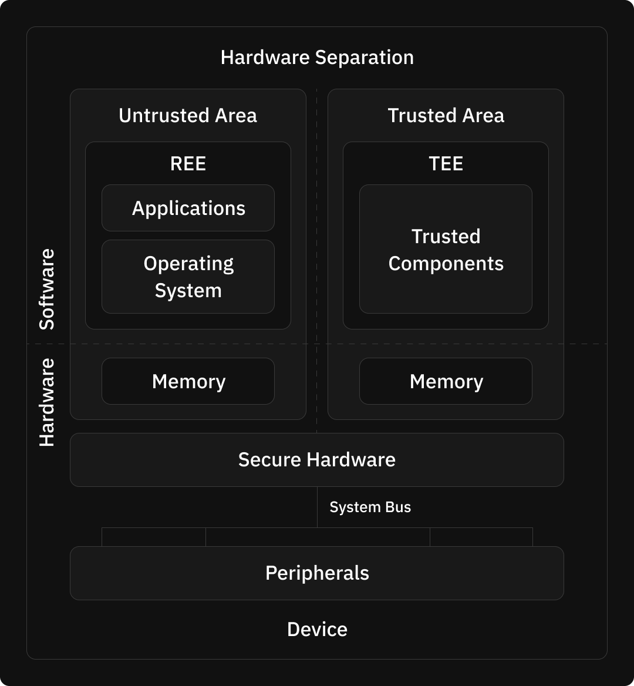

As Fleek progresses towards providing a comprehensive full stack developer experience, including upcoming TEE capabilities, it is pivotal to pay close attention to modern data requirements and large scale data applications. Apps and developer infrastructure today deal with high data throughput and it is important to have systems in place that can keep all information protected, wherever it is exposed. This becomes integral specially in a distributed, onchain network where multiple network participants are involved in processing data.

Trusted Execution Environments (TEEs) thus become an important part of Fleek onchain cloud platform as they enable confidential computing solutions that allow users to unlock insights and collaborate with partners while maintaining control of the data and its privacy, regardless of where the data sits. This is possible with Intel Software Guard Extensions (Intel SGX) on 3rd Gen Intel Xeon Scalable processors.

The aim of this blog is to help users and developers gain a foundational understanding of TEEs and how it is implemented using Intel SGX processors. We will be learning about the benefits of TEEs along with some components and data flows that are used to make these processors functional.

---

## What are TEEs?

Trusted Execution Environments (TEEs) are secure regions within a processor, designed to execute sensitive code and handle critical data while ensuring protection from unauthorized access or modifications by external actors and in some cases, even the system itself. TEEs leverage hardware-based isolation, which enforces strict boundaries between the secure execution environment and the rest of the system, including the operating system (OS), hypervisor, and other applications. This isolation is achieved using advanced hardware techniques, such as address space separation, where the TEE operates in a separate memory region that is inaccessible to non-secure parts of the system. This hardware-enforced isolation ensures that even if the OS or hypervisor is compromised, the integrity and confidentiality of the operations within the TEE remain intact.

TEEs provide secure multi-party computation (MPC), a critical feature for distributed systems. Secure MPC allows multiple parties in a distributed network to jointly compute a function over their inputs while keeping those inputs completely private. TEEs enable this by securely isolating each party's inputs, ensuring that even during the computation, the data remains confidential and protected from other actors in the network, or external threats.

Remote attestation is another essential feature of TEEs. It ensures that code running within a TEE is verifiable by the network participants. This process involves the generation of a cryptographic report by the TEE, which includes a measurement of the enclave's code and state. This report is signed using a hardware-protected key, ensuring its authenticity. The remote party can then verify this report, ensuring that the enclave is running the expected code on genuine hardware. This capability is crucial in scenarios like cloud computing or distributed networks, where trustless execution needs to be established. By combining hardware-enforced isolation, memory encryption, and remote attestation, TEEs provide a robust platform for executing sensitive operations securely, even in environments where the underlying system cannot be fully trusted. You can also perform local attestation, which helps prove the identity and authenticity of an enclave to another enclave on the same platform

<u>[Diagram Credit - Javier González](https://www.researchgate.net/publication/297732884_Operating_System_Support_for_Run-Time_Security_with_a_Trusted_Execution_Environment)</u>

A Rich Execution Environment (REE) is a general-purpose operating environment in a device, such as a smartphone or computer, where most applications run. It provides a wide range of functionality but lacks the strong security guarantees of a Trusted Execution Environment (TEE). REEs are more susceptible to attacks and vulnerabilities due to their complex and feature-rich nature

---

## What are SGX processors?

<u>[Intel Software Guard Extensions (SGX)](https://www.intel.com/content/www/us/en/architecture-and-technology/software-guard-extensions-processors.html)</u> are a set of security-related instruction codes designed to enhance the security and privacy of applications, particularly in environments where data sensitivity is critical. Intel SGX employs memory encryption and hardware-enforced access controls to alter the way data is accessed, creating secure enclaves of protected memory for running applications and data. It is important to note that the concepts we covered in the section on TEEs above, using SGX integrated processors, can be practically implemented as well.

SGX achieves this by creating secure, isolated regions of memory known as **enclaves**. These enclaves provide a trusted execution environment (TEE) where applications can run securely. Trust assumptions here are extremely succinct as fewer components or code are involved in the **trusted computing base (TCB)**, reducing the risk of vulnerabilities and potential attacks. Memory encryption is particularly critical, as it ensures that all data stored in the enclave’s memory is encrypted with keys that are only accessible within the processor. The decryption of data occurs only within the CPU, making it impossible for an attacker to extract meaningful information, even if they gain physical access to the memory

Intel SGX introduces new CPU instructions to manage the lifecycle of enclaves:

- **ECREATE**: Initiates the creation of an enclave by initializing an SECS.
- **EADD**: Adds a page to an enclave during the build process.
- **EINIT**: Marks the completion of the enclave build process, preparing it for execution.
- **EENTER**: Transfers execution to code within the enclave.
- **EEXIT**: Exits the enclave, returning to non-enclave code.
- **EGETKEY**: Generates cryptographic keys unique to the enclave.
- **EREPORT**: Creates a cryptographic report about the enclave, crucial for attestation.

In cases where sensitive data needs to be stored safely outside the memory of an enclave, we perform data sealing. Here we use the EGETKEY instruction, which allows an enclave to derive cryptographic keys based on its identity and other attributes. The derived keys are unique to the enclave and the platform, ensuring that sealed data can only be accessed under very specific conditions.

### Components and flows of SGX processors

Intel SGX processors have 2 operational stages -

1. **Deployment** - this is where the SGX unit is provisioned and the system is made ready to attest to services. This process is run to set up and utilize the Trusted Compute Base (TCB). It is a mix of software, firmware and hardware of the bare metal system. Provisioning data includes the provisioning ID and information about the system’s TCB

   once the Intel SGX unit is provisioned

2. **Runtime** - As the SGX system sets up properly, we can now run the evidence generation and quote verification processes that help enclaves to securely communicate. This is important because in an onchain setup, we have various nodes and running them trustlessly is integral to the success of the data processing capabilities of the Fleek platform.

Evidence (or quotes) are generated using the Intel ECDSA quote generation library and the generated quote is signed with the platform key. Key is obtained via the quote provider library.

To verify the validity of the quote, the quote verification library is used by the party relying on the SGX environment for its data processing needs. This process is called attestation. Let’s explore the steps here in detail to understand how attestation works -

**Quote Generation**

1. The quote generation process in SGX utilizes the Quote Generation Library (QGL), which interfaces with the Quoting Enclave (QE) to produce ECDSA-signed quotes.
2. Before quote generation, the enclave must generate a report that includes details about the enclave, signing authority and other attributes
3. The Quoting Enclave uses the Provisioning Certification Enclave (PCE) to access the Attestation Key (AK) and the final signature in the quote contains both the certification of the ephemeral key and the quote signature.

**Quote Verification**

1. ECDSA public key is extracted from the quote’s certification data and certification signature is verified using Intel's public Attestation Key.
2. Enclave’s identity and Trusted Computing Base (TCB) level checks are done
3. Quote's timestamp verified to be within an acceptable range.
4. Supplemental data analysis, security considerations and performance optimisations are performed to ensure that data throughput can happen at high speeds.

To learn more about this, you can explore the <u>[Intel docs here](https://www.intel.com/content/www/us/en/developer/tools/software-guard-extensions/training.html)</u>.

---

## Security Features of SGX Processors

Beyond the above explained security benefits of SGX processors related to data sovereignty, and enclave based architectures, SGX also has a few more security benefits that are worth mentioning -

1. **Integrity protection** - SGX implements a Merkle Tree structure to detect any unauthorized modifications to enclave memory. Each cache line is associated with a version number to prevent replay attacks and Message Authentication Codes are used to ensure the integrity of data moved between CPU and system memory.
2. **Side-Channel Attack Mitigations** A side-channel attack is a security vulnerability that seeks to extract information or manipulate the execution of a program by analyzing or taking advantage of indirect effects caused by the system or its hardware. Using microcode updates by intel and constant time algorithms in the SGX SDK, most of these attacks are protected against.
3. **Trusted Time** - Monotonic Counters and Time Stamping allow for Hardware-based counters that only increments, never resets or rolls over and allows enclaves to create time-stamped quotes for time-sensitive operations respectively.

---

In conclusion, by providing hardware-backed isolated execution environments, TEEs enable the creation of secure enclaves within cloud infrastructure, allowing for the confidential processing of sensitive blockchain operations. This capability addresses one of the primary concerns in onchain protocols: the inherent transparency that, while ensuring integrity, often hinders adoption in privacy-sensitive sectors. SGX enclaves can securely manage private keys, execute confidential smart contracts, and perform privacy-preserving computations on encrypted data, enabling use cases in fields like healthcare, finance, and supply chain management where data confidentiality is paramount.

Furthermore, TEEs can serve as trusted oracles, bridging the gap between on-chain and off-chain data with heightened integrity guarantees, thus expanding the scope of real-world applications for onchain cloud platforms.

You can learn more about Fleek, Fleek Network, and Fleek Functions, and how TEEs and SGX are integral to Fleek’s distributed, onchain edge network in our <u>[docs](https://fleek.xyz/docs/)</u>, by joining our <u>[Discord](http://discord.gg/fleek)</u> Server or following <u>[Fleek](https://x.com/fleek)</u> on X ⚡
