<u>[Vitalik Buterin’s website](https://vitalik.eth.limo/index.html)</u> has been a community-favorite resource for blockchain and web3 knowledge since its inception. It contains valuable information on the Ethereum roadmap and technical deep dives on all sorts of concepts relevent to the onchain ecosystem as a whole– **but, did you know all of this is deployed on Fleek?**

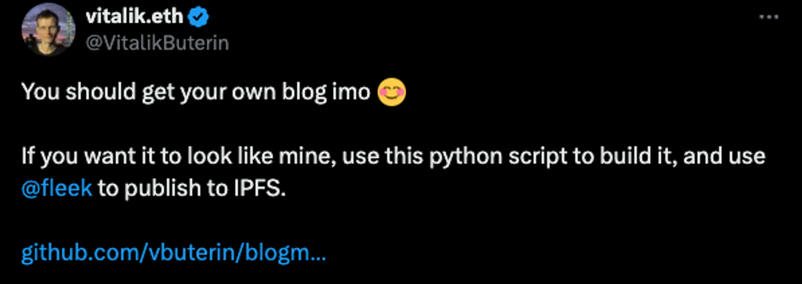


The blog website follows a minimal UI with focus on loading pages quickly and rendering markdown. The template for the blog is open source and can be found <u>[here](https://github.com/vbuterin/blogmaker)</u>.

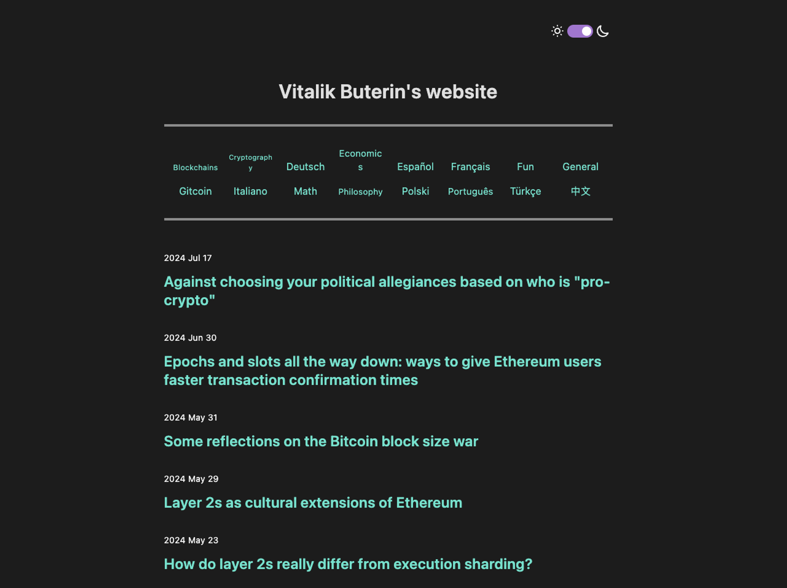

In this tutorial, we will be showing you how to fork this template and deploy your own Vitalik-inspired blog on Fleek. Towards the end, we will also help you deploy this template in one-click using <u>[Fleek's template gallery](https://app.fleek.xyz/templates/)</u>.

---

## Requirements

- An account on <u>[app.fleek.xyz](https://app.fleek.xyz/)</u>
- <u>[Python](https://www.python.org/)</u> installed locally
- <u>[PIP](https://pip.pypa.io/en/stable/installation/)</u> installed locally
- <u>[Pandoc](https://pandoc.org/installing.html) installed</u>
- A <u>[Github](https://github.com/)</u> Account
- Code editor

> ⚠️: You only need to install Python, PIP and Pandoc if you want to compile the site locally. You can also skip these and just edit the blogs. Upon Deployment, Fleek will take care of compiling the site for you.

## Setup

1. Start by forking <u>[Vitalik’s repository](https://github.com/vbuterin/blogmaker)</u>

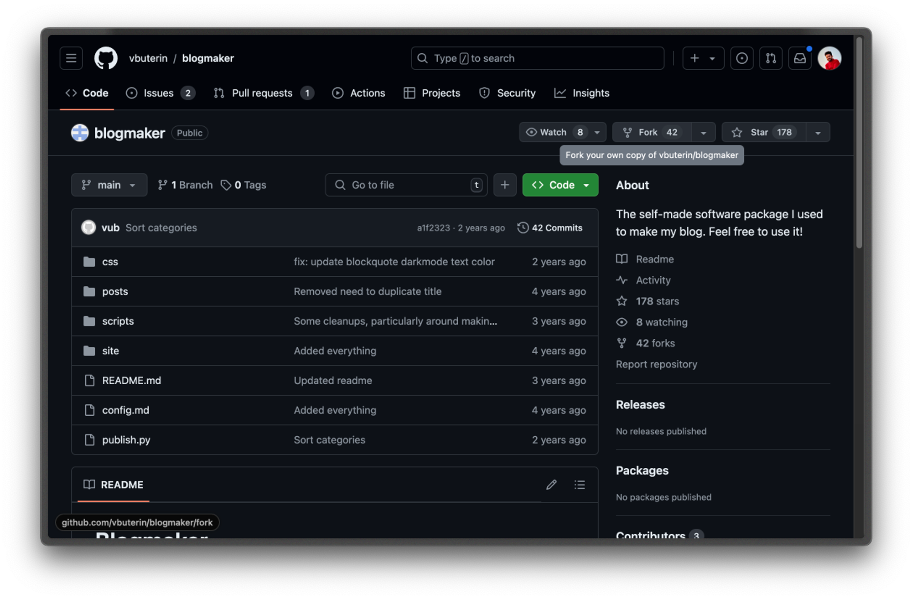

2. Now in an empty directory, clone the forked blogmaker project as follows-

```
mkdir blog
cd blog
git clone https://github.com/<your-github-username>/blogmaker.git
```

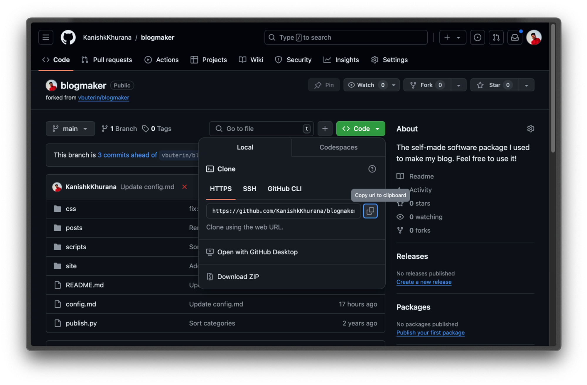

Great job! You now have blogmaker website locally setup on your system.

---

## Adding Blogs and Compiling Locally

Let’s now explore how we can add more blogs to this website and compile markdown to HTML to render the complete website-

1. Head over to the posts folder and create a new file called `newblog.md`

2. Add the following content to `newblog.md` -

```
[category]: <> (test)
[date]: <> (2024/07/19)
[title]: <> (my blog)

<!--- content goes here --->
This is a new blog post!
```
Each blog post contains the following properties -

- **Category**: this defines the category to which your blog posts belong. It is particularly useful in sorting and arranging blogs in the longer run.
- **Date:** this helps arrange all blog posts chronologically
- **Title**:This is the title of the blog post

>💡: Please note that you can change the content here as per your needs.

3. Once you are done adding content to your new blog, run the following command in your terminal to compile all new markdown based blogs to HTML and add them to the main HTML file. This will edit the site folder and prepare it for hosting on Fleek -

```
./publish.py posts/*
```

This will result into a site directory similar to this -

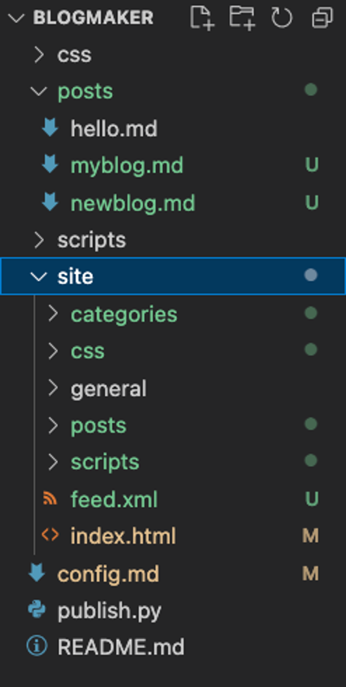

>⚠️: If you don't want to compile your site locally, you can skip this step and move to the next one.

4. Finally, head over to `config.md` and make the following changes to ensure it deploys correctly on Fleek -

```
[title]: <> (Vitalik Buterin's website)
[icon]: <> (http://vitalik.ca/images/icon.png)
[domain](http://localhost:5500)
[posts_directory](./posts)
```

>💡: You can edit the title and icon here to fit your specifications

- Commit changes and push to GitHub -

```
git add .
git commit -m "feat: new blogs added"
git push origin main
```

Awesome! You have now explored blogmaker properly and added your own blog post to it. Let’s move forward and deploy it on Fleek.

---

## Deploying Blogmaker on Fleek

1. Head over to <u>[app.fleek.xyz](https://app.fleek.xyz/)</u> and log in. For the purpose of this tutorial we will be logging in using our email account -

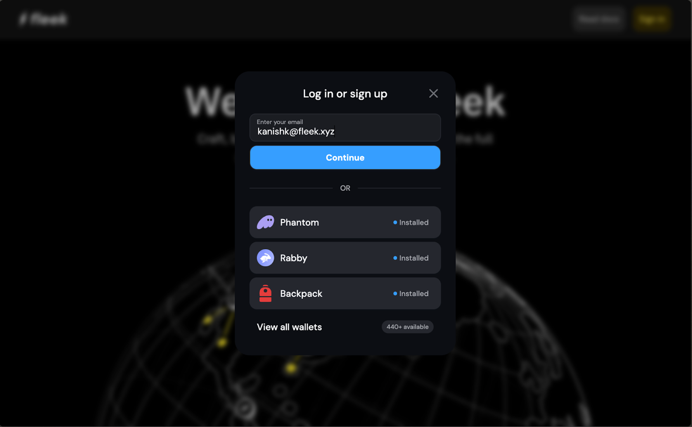

Enter the OTP and you are good to continue -

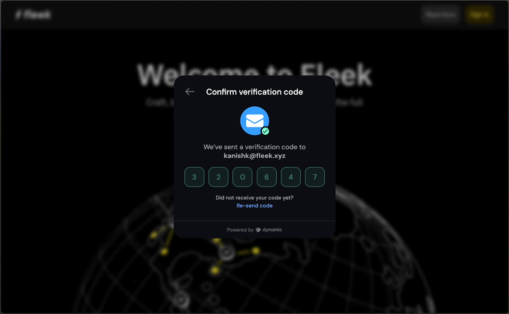

2. On the top right corner of the screen, you will see a “Add new” button. Click on it and select the “Deploy my site” option from the dropdown -

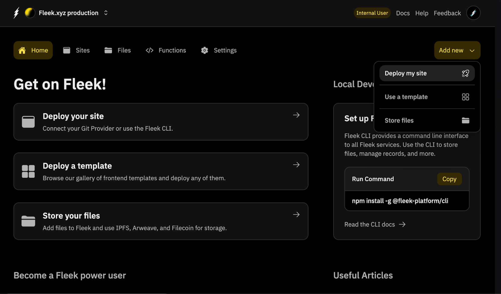

3. Select the location of your code. In our case it is Github. (Gitlab and Bitbucket will be supported soon) -

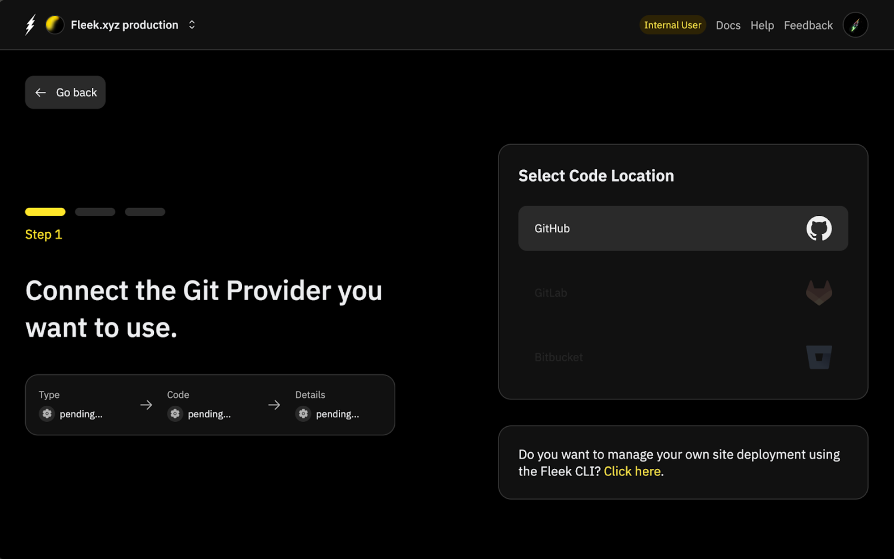

4. Ensure you select the correct GitHub Organization in the dropdown where you saved your Blogmaker repository and as you find Blogmaker in the list, click on “Deploy” -

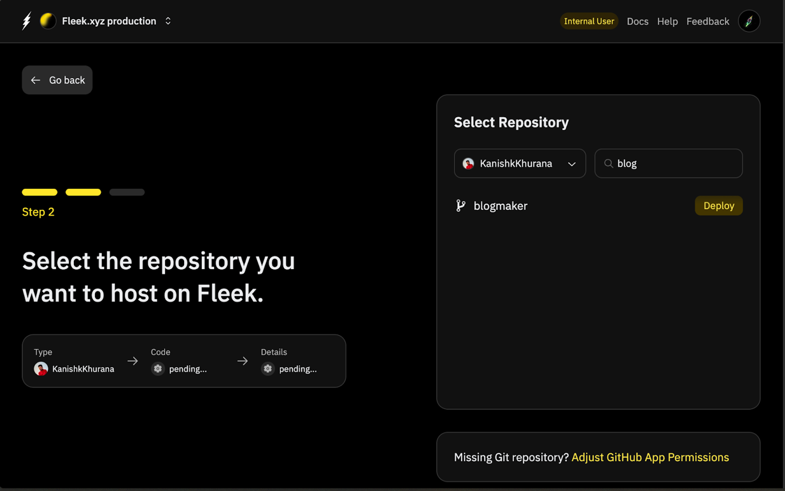

>💡: Incase you don't see your repository in the list, click on “Adjust GitHub App Permissions” to configure GitHub app permissions.

5. Give your site a name and set all the other properties as follows -
    - **Site Name**: `blogmaker`
    - **Framework**: `Other`
    - **Branch**: `main`
    - **Publish Directory**: `site`
    - **Build Command**: `apt-get update && apt-get install -y pandoc && python publish.py posts/`

Now click on “Show advanced options” and edit the “Docker Image” as follows -

Docker Image: `python:3.9-slim`

> ⚠️:  No need to edit any other properties

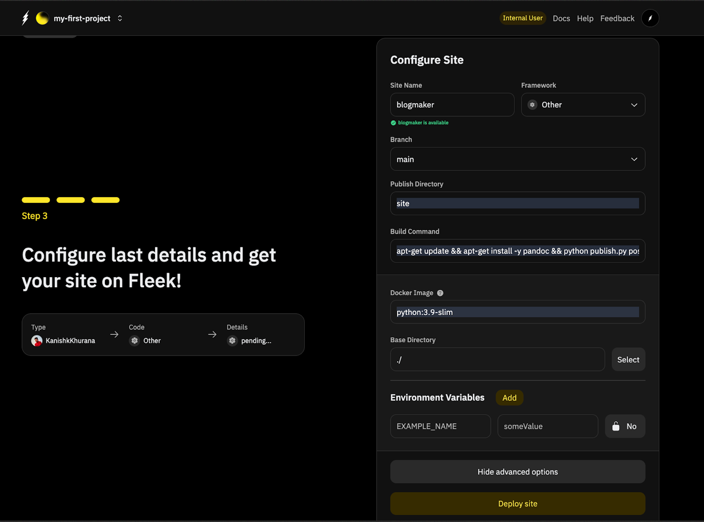

6. Finally, click on “Deploy site”. You will be redirected to the following page -

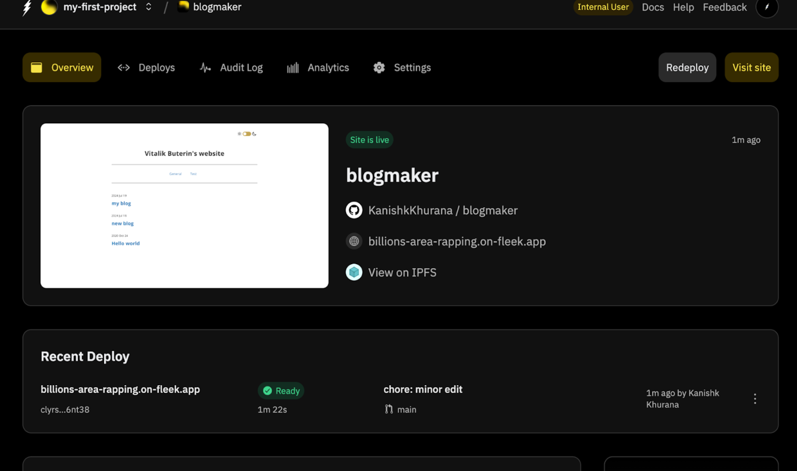

You will notice the site building has started. It will take a couple minutes and once complete, your blog website will be ready and will look like this -

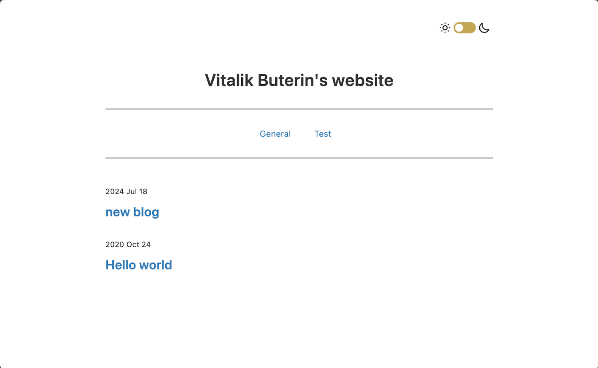

This website is accessible at - <u>https://billions-area-rapping.on-fleek.app/</u>. You can edit the domain, by <u>[connecting your ENS or traditional DNS domain](https://fleek.xyz/docs/platform/domains/)</u>, in your site settings.

Amazing!! You have now successfully understood Vitalik’s Blogmaker template and deployed your own Blogmaker website that’s completely functional.

---

## Pro Tip: Using the Blogmaker Template

You can also deploy the “Blogmaker by Vitalik” template using Fleek’s template library and expedite your process of deploying a completely functional and lightning fast blog website in just a few clicks.

### Here’s how -

1. Head over to the <u>[this link](https://app.fleek.xyz/templates/clyqjmjng0001q94by3huy892/)</u> and view the “Blogmaker by Vitalik” template. Click the “Deploy template” button on the top right corner -

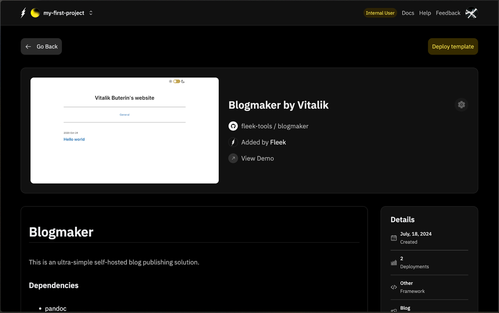

2. Select where you want to store your code. In our case it will be on GitHub -

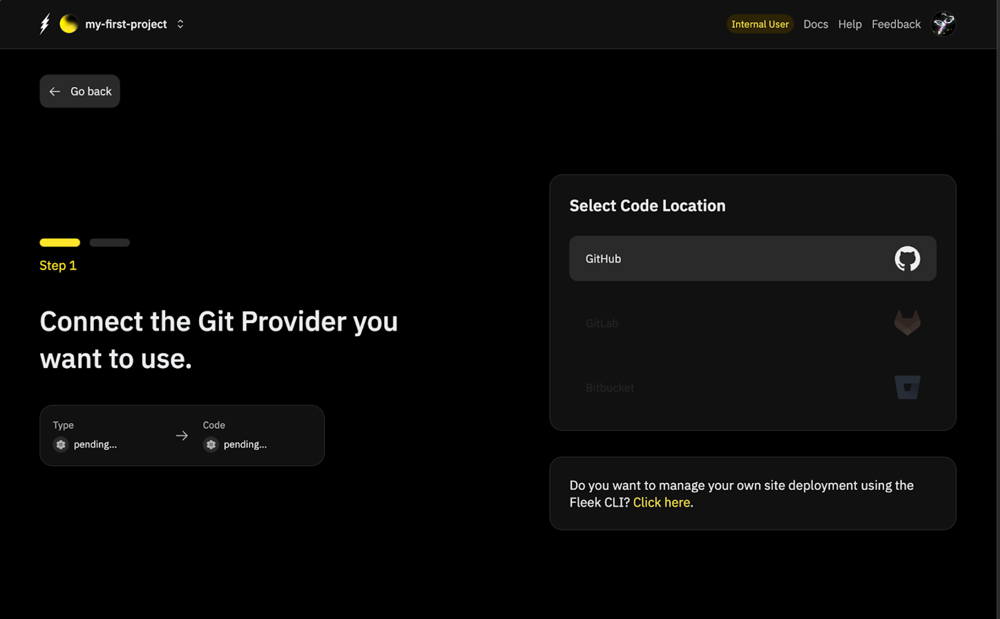

3. Fleek will now inject the Blogmaker Template code repository in your GitHub account so you have full access and permissions to edit it later on. Select the correct GitHub account and give your repository an appropriate name. Then click on “Create and deploy template” -

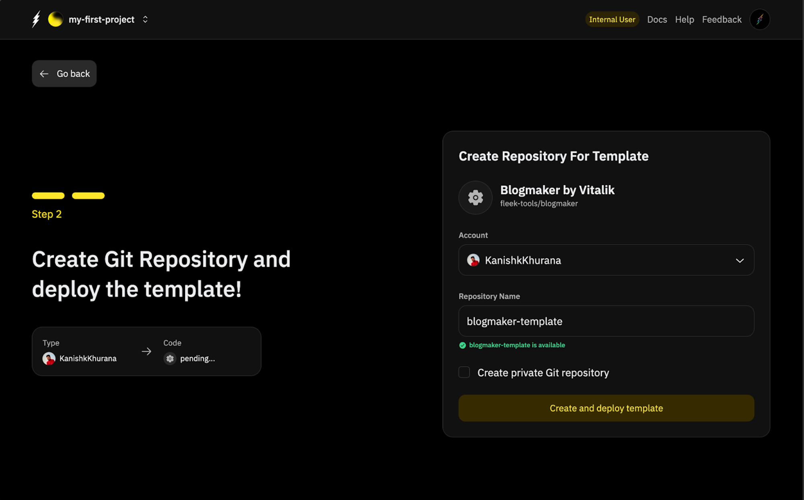

You will be redirected to the deployment page which is similar to the page we saw before  -

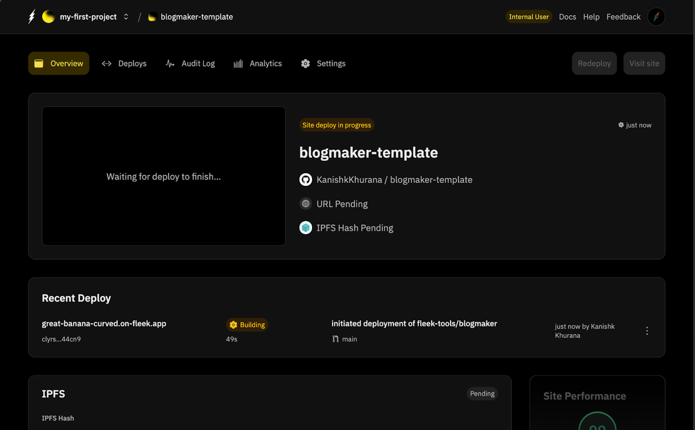

4. Finally, as we discussed before, a GitHub repository titled “blogmaker-template” will be available in the list of repositories for your GitHub account -

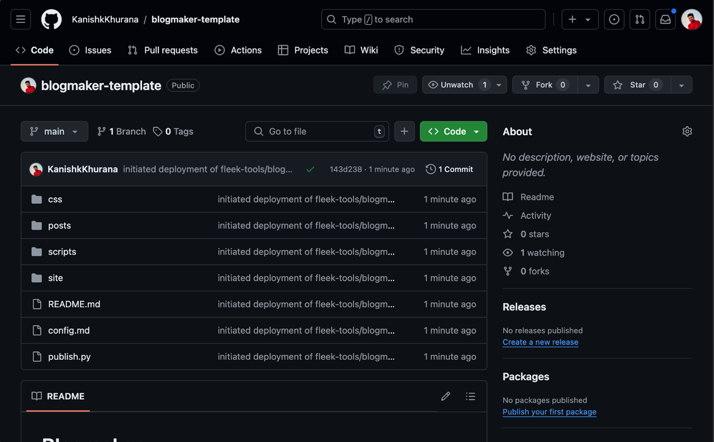

And just like that, you have a fully functioning, IPFS-hosted blog that auto updates on each commit.  In the future, you can clone this and make any edits you feel fit. As you push changes to this repository, it will automatically deploy to your blog website using Fleek.

---

Congratulations!! You have now covered all the flows related to deploying Vitalik’s Blogmaker Template on Fleek. We hope to see your knowledgeable blog websites soon and if you have any questions, please reach out to us <u>[here](https://discord.gg/fleek)</u>.

To learn more about Fleek, head over to the <u>[documentation here](https://fleek.xyz/docs/)</u>.