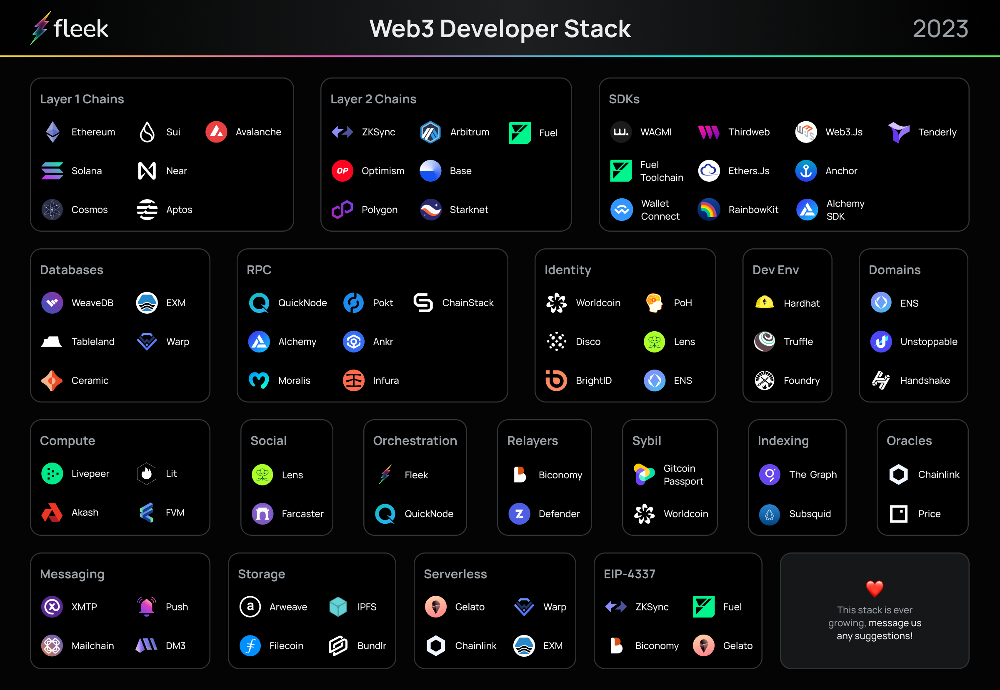

Web3 is full of noise and hype.

The relationship between network effects, developer ecosystems, and network value translates to everyone and every protocol gunning for your attention. Many will say and do almost anything in order to get you to try out their product, often going as far as to be dishonest in their marketing.

As a developer working in this space it’s hard to figure out which of the thousands of protocols and tools are actually useful and mature enough to start building with, and the tradeoffs between the various options that exist.

**In this post we lay out the most useful and mature protocols, products, tools, and SDKs for developers looking to build within web3 today** and highlight some important and powerful ones that will be coming to market soon.

The approach taken is geared towards builders looking to implement features like file storage, smart contracts, databases, apis, and website hosting. We’ll outline the protocols and tools that enable you to build applications today, and try to highlight some of the areas that are still not mature enough to be considered for real-world usage.

---

## Blockchains

At the core of the web3 movement are the blockchain protocols enabling smart contracts, dApps, storage protocols, and digital currencies among an array of other things.

Most blockchains fall into one of two categories: Layer 1, or Layer 2:

- A layer 1 blockchain, or base/settlement layer, is the foundational protocol of a blockchain network, comprising its core consensus mechanism, cryptography, and basic operational rules. Examples of Layer 1 blockchains are Solana, Cosmos, and Ethereum.

- A Layer 2 is a protocol built on top of the base layer to enhance the network's scalability and transaction throughput. These solutions offload some of the transaction processing from the main chain, helping to reduce network congestion, lower transaction fees, and speed up transactions. Examples of Layer 2 solutions include Optimistic Rollups for Ethereum and side chains like Polygon POS.

In brief, **Layer 1 blockchains represent the foundational protocols, while Layer 2 blockchains are built on top of L1’s to help improve their performance and scalability, providing a secondary layer of infrastructure to offset cost/load**.

### Where to build?

It’s not possible to say that one blockchain is the best and that’s what you should use–it’s much more nuanced than that. Each has their own ecosystem and set of benefits, trade offs, and use cases.
With that being said, some are more mature than others, with longer track records and larger developer ecosystems.

_Here is a list of blockchains that have a healthy ecosystems and developer communities that are safe bets to consider building on_:

#### Layer 1

- [Ethereum](https://ethereum.org/en/) - original smart contract platform.
- [Cosmos](https://cosmos.network/) - enables scalable, interoperable blockchains with decentralized, secure, cross-chain communication through Tendermint and PoS.
- [Solana](https://solana.com/) - delivers high-speed, low-cost transactions with efficient consensus, proof-of-history, and parallel processing capabilities.
- [Aptos](https://aptoslabs.com/) - offers a scalable, secure, decentralized blockchain with proof-of-history consensus and innovative parallel processing capabilities powered by Move programming language.
- [NEAR](https://near.org/) - a scalable Layer 1 blockchain with a sharding architecture, enabling high-throughput. NEAR's developer-friendly features include a simplified account model, support for familiar programming languages, and a gas-efficient fee structure.
- [Sui](https://sui.io/) - next-generation smart contract platform with high throughput, low latency, and an asset-oriented programming model powered by Move programming language.
- [Avalanche](https://www.avax.com/) - provides a highly scalable, fast, and secure blockchain platform with unique consensus and interoperability.

#### Layer 2

- [ZKSync](https://zksync.io/) - provides scalable, secure Layer-2 Ethereum transactions using zkRollups, reducing costs and improving speed.
- [Polygon POS](https://polygon.technology/) - Ethereum sidechain. One of the most used protocols, has tens of thousands of dApps, more than 3 million average daily transactions.
- [Starknet](https://www.starknet.io/en) - offers scalable, Ethereum Layer-2 solutions using zero-knowledge proof technology for increased efficiency.
- [Optimism](https://www.optimism.io/) - enhances Ethereum with fast, secure Layer-2 scaling using optimistic rollup technology for transactions.
- [Arbitrum](https://arbitrum.foundation/) - expands Ethereum capacity via Layer-2 rollup technology, enabling fast, low-cost, secure transactions.
- [Fuel](https://www.fuel.network/) - Fast modular execution layer with parallel transaction execution, a custom vm (FuelVM) developer toolchain (Forc), and a Rust-based DSL (Sway). Still in beta.
- [Base](https://base.org/) - a new Ethereum L2 offering low-cost, secure web3 onboarding, EVM equivalence, gasless transactions, and multichain interoperability, while integrating with Coinbase's ecosystem and leveraging Optimism's open-source technology for scale and high throughput.

---

## Storage protocols

Decentralized storage protocols provide **distributed data storage across a network of nodes instead of relying on a central servers**.

These protocols are used for data availability, censorship resistance, security, and cost-efficiency and are important because they offer a resilient, secure, and open alternative to traditional centralized storage systems.

As a developer, you’ll use these protocols to store things like images, videos, documents, and even metadata in the form of JSON for NFTs.

### Where You Can Start

- [Arweave](https://www.arweave.org/) is the only widely used protocol that offers permanent, immutable file storage. Bundlr Network makes it simple to upload files instantly to Arweave and has friendly developer SDKs and command line tools. [Bundlr](https://bundlr.network/) enables instant availability and inexpensive transaction costs and has helped Arweave achieve [massive growth](https://twitter.com/samecwilliams/status/1642963677044424705). Arweave is also now being used in many other ways than just purely file storage, like web hosting for permanent apps and for creating an [array of various types of databases](https://twitter.com/dabit3/status/1639344468821196800).

- [IPFS](https://ipfs.tech/) is a peer-to-peer network for efficient immutable file sharing. IPFS has gained significant adoption among developers due to its innovative approach to addressing some of the limitations of the traditional client-server model of the web. IPFS uses content-addressing to uniquely identify files based on their cryptographic hash, rather than their location on a specific server. This approach ensures that files can be retrieved from multiple sources, enhancing the reliability and redundancy of data. [NFT.storage](http://NFT.storage), [web3.storage](http://web3.storage), and [Infura](https://www.infura.io/product/ipfs) all offer easy to use APIs for storing data to IPFS.

- [Filecoin](https://filecoin.io/) is a developer-oriented, decentralized storage platform that, unlike IPFS, employs blockchain-based incentives to encourage secure and efficient data storage sharing.

- [Bundlr](https://bundlr.network/) is a data layer and permanent storage integrated with Arweave that aims to solve complex data integrity issues, permissionless. Bundlr's goal is to make data accessible to everyone in a secure and scalable way. The platform is designed to support a wide range of applications and use cases, from supply chain management to digital identity verification.

---

## SDKs

Those that have been around the space awhile may recall the previous abysmal developer experience for builders in web3.

While there still is a lot of opportunity for improvement, we now have a more robust selection of tools and SDKs that make our lives much easier than in the past.

- [WAGMI](https://wagmi.sh/) - a collection of React Hooks enabling wallet connection, ENS integration, message signing, contract interaction, and more with caching, request deduplication, and persistence.
- [Thirdweb](https://thirdweb.com/) - TypeScript, React, Python, React Native, Unity, Go SDKs and UI elements for interacting with EVM compatible contracts and ThirdWeb APIs
- [Ethers.js](https://ethers.org/) - a lightweight, modular JavaScript library for EVM development.
- [Web3.js](https://web3js.readthedocs.io/en/v1.8.2/) - enables EVM network interaction, dApp development, and smart contract management in JavaScript.
- [WalletConnect](https://walletconnect.com/) - an open source protocol for connecting decentralized applications to mobile wallets with QR code scanning or deep linking.
- [RainbowKit](https://www.rainbowkit.com/) - a fast, easy and highly customizable way for developers to add a great wallet experience to their application
- [Anchor](https://www.anchor-lang.com/) - Solana's development frameworks for writing safe, secure, and efficient high-level programs on Solana. Abstracts away low-level Rust and Solana code.
- [Alchemy SDK](https://www.alchemy.com/sdk) - a comprehensive, stable, and effective Javascript SDK for interacting with the blockchain.
- [Fuel Toolchain](https://www.fuel.network/) - an end to end set of tools for building smart contracts. Instead of having to piece everything together like we may have done in the past with Solidity and it’s ecosystem, the Fuel Toolchain includes everything you need to build, test, and deploy smart contracts including Sway, a new Rust-based programming language.
- [Tenderly](https://tenderly.co/) - a Web3 development platform that facilitates and improves the process of creating smart contracts. By integrating debugging features, monitoring capabilities, and blockchain infrastructure, it offers developers a more seamless experience. Tenderly caters to Web3 developers throughout the entire smart contract development lifecycle, covering aspects from initial ideation and prototyping to deploying, monitoring, and managing on-chain interactions.

---

## Sybil Resistance

Sybil resistance refers to a system's ability to defend against Sybil attacks; **an attack vector where a single entity creates multiple fake identities to manipulate or disrupt the network, gain influence, or compromise its security and functionality**.

In the context of web3, sybil resistance is _crucial_ for maintaining the integrity, trustworthiness, and proper functioning of the system. Applications need access to tools that not only provide sybil resistance for individual users, but also solutions that easily integrate with their existing APIs and systems.

No perfect solution exists as of today, but both Gitcoin Passport and WorldCoin offer interesting solutions for enabling Sybil Resistance for application developers:

- [Gitcoin Passport](https://passport.gitcoin.co/) - a sybil resistance protocol and identity aggregation dApp built on the Ceramic Network. Users can collect various identity attestations, called "stamps", from web2 and web3 authenticators all in one place. These stamps give users a score which can be used to gate access or entry into web3 applications and forms.
- [WorldCoin](https://worldcoin.org/) - enables individuals to verify their humanness online while maintaining their anonymity through zero-knowledge proofs. Individuals can receive a future-proof unique human credential through a secure biometric device in a privacy-preserving manner. This is a great post if you’d like to learn more about WorldCon’s controversial approach to sybil resistance.

---

## Oracles

Web3 oracles **allow smart contracts to securely and reliably access off-chain data, APIs, and other external resources**. They are essential in the blockchain ecosystem because they act as bridges between on-chain and off-chain data.

- [Chainlink](https://chain.link/) - remains the gold standard in oracles. In ChainLink, multiple independent nodes collect data from various sources and perform aggregation and consensus to provide a reliable data feed to smart contracts. The network ensures the integrity and accuracy of the data by relying on a reputation system and economic incentives for the node operators
- [Price Oracles](https://oracles.rip/)- Price is a (newer) permissionless and reliable oracle solution that leverages Uniswap V3 and automation to provide safe price quotes on any existing token.

---

## Databases and Data Protocols

Databases and Data Protocols on web3 are **essential components that facilitate the storage, management, and exchange of information in a decentralized manner**. These components play a vital role in the functionality of decentralized applications (DApps) and Web3 services.

- [WeaveDB](https://weavedb.dev/) - provides horizontally expandable database, enabling organizations to effortlessly scale their database in response to increasing data and traffic demands. Being decentralized, WeaveDB removes the single point of failure risk associated with traditional databases. The platform is engineered to reduce latency and guarantee swift and efficient database operations, even when scaled. Furthermore, WeaveDB supplies developers with an extensive array of tools required to construct a wholly decentralized application.
- EXM - EXM also enables developers to create permanent data stores on Arweave. The underlying infrastructure is similar to that of WeaveDB though it lacks opinions and therefore is more flexible but also will need more initial setup.
- [Warp Contracts](https://warp.cc/) - Similar to EXM but requires a wallet to pay for transactions whereas EXM uses an API Key.
- [Tableland](https://tableland.xyz/) - is a decentralized database system that breaks down conventional relational databases into two parts: an on-chain registry featuring access control rules (ACR) and a collection of unrestricted databases. Each table is created as an ERC721 token on the foundational EVM-compatible layer, with an on-chain table owner responsible for establishing ACR permissions.
- [Ceramic](https://ceramic.network/) - ComposeDB on Ceramic serves as an effective instrument for developing decentralized applications. Composites consist of data sets that outline the graph database structure for an application, facilitating data reuse and sharing among various applications. Developers in the community create these Composites, which contribute to Ceramic's ecosystem, enabling immediate interoperability without requiring any additional integration.

---

## RPC

Remote Procedure Call (RPC) **serves as a communication medium, facilitating the interaction between applications and a blockchain**. It functions as a connector between decentralized applications (DApps) and the blockchain, enabling the DApps to transmit requests to nodes and obtain corresponding responses.

- [Pocket Network](https://www.pokt.network/) - Is a decentralized protocol that provides a network of RPC nodes to relay blockchain data/calls from any supported blockchain to DApps and end-users. It acts as a bridge between the DApp and a blockchain, allowing the dApp to send requests to the nodes, and receive responses in return. Pocket decentralizes this “middleware” layer between DApps and blockchains.
- [Alchemy](https://www.alchemy.com/) - Alchemy is an infrastructure provider that offers developer tools and APIs to build, scale, and optimize applications on many blockchain networks. It simplifies the process of accessing and interacting with blockchains, enabling developers to focus on creating innovative solutions and applications.
- [Infura](https://www.infura.io/) - is an infrastructure-as-a-service (IaaS) platform that provides developers with access to Ethereum and IPFS networks through a suite of scalable, reliable, and secure APIs. It simplifies the process of building and deploying decentralized applications (DApps) by removing the need for developers to set up and maintain their own Ethereum nodes.
- [ANKR](https://www.ankr.com/) - offers RPC endpoints to a variety of L1s and L2s including Ethereum, Arbitrum, Avalanche, Optimism, Solana, NEAR, and Aptos.
- [Quicknode](https://quicknode.com) - diversity of RPC endpoints, access 19 chains across 35+ networks like Flow, Polygon ZK EVM, Base, and Arbitrum Nova
- [Moralis](https://moralis.io/) - is a backend-as-a-service (BaaS) platform designed specifically for building decentralized applications (DApps); It offers a suite of powerful tools, services, and APIs that streamline the development process, allowing developers to create scalable and performant applications without the need for extensive backend infrastructure.
- [ChainStack](https://chainstack.com/) - offers RPC endpoints to a variety of L1s and L2s including Ethereum, Arbitrum, Avalanche, Optimism, Solana, Polygon zkEVM, NEAR, and Aptos.

---

## Compute

It’s the **processing power or computational resources required to perform tasks and execute code** within decentralized applications and smart contracts on blockchain networks.

- [Livepeer](https://livepeer.org/) - Decentralized video streaming platform built on the Ethereum blockchain. It aims to provide a more cost-effective and scalable solution for live video streaming compared to traditional centralized platforms. By leveraging a network of community-driven nodes that transcode and distribute video streams, Livepeer ensures efficient resource utilization and encourages broader participation in the video streaming ecosystem.
- [Akash Network](https://akash.network/) - A decentralized cloud computing platform that aims to provide a more affordable and open-source alternative to traditional cloud services. It leverages blockchain technology and a peer-to-peer network to connect users who need computing resources with those who have idle capacity to share. By creating a competitive marketplace for computing resources, Akash Network promotes cost efficiency, enhanced security, and greater transparency in the cloud computing industry.
- [Lit Protocol](https://litprotocol.com/) - Lit Protocol represents a decentralized key management network driven by threshold cryptography. As a blockchain-neutral middleware layer, Lit facilitates data reading and writing between blockchains and off-chain platforms, enabling conditional decryption and programmatic signing capabilities.
- [FVM](https://fvm.filecoin.io/) - FVM is a runtime environment designed for smart contract execution, known as actors, on the Filecoin network. It allows developers to create innovative use cases: including data access control, data DAOs (decentralized autonomous organizations), perpetual storage, collateral leasing, and Ethereum-compatible fungible and non-fungible tokens.

---

## Identity

In theory, **web3 protocols should enable self-sovereign identity and give users more ownership and control over them**.

In practice, we’ve yet to really see a clear winner or a polished, interoperable, and well-adopted standard picked up by more than a handful of apps, so in reality there is no clear winner or perfect solution to mention, but here are a few options.

- [Proof of Humanity](https://proofofhumanity.id/) - a decentralized and open-source protocol on the Ethereum blockchain that aims to establish a Sybil-resistant registry of unique human identities. It is designed to prevent the creation of multiple fake identities (Sybil attacks) by verifying that each registered user is a real, living human being.
- [WorldCoin](https://worldcoin.org/) - also mentioned previously, they have recently launched the World ID and SDK. World ID is a new privacy-first protocol that aims to bring global proof of personhood to the internet. Enables authentication to websites, mobile apps and crypto apps while proving you’re a unique and real person without sharing personal data.
- [Disco](https://www.disco.xyz/) - leverages DIDs and the Ceramic network to enable a self-sovereign identity protocol for users to configure their credentials, and developers to access them.
- [Lens Protocol](https://www.lens.xyz/) - Lens Protocol profiles enable a permissionless identity infrastructure for profile creation and access.
- [ENS](https://ens.domains/) - a decentralized domain name system built on Ethereum. ENS allows users to register human-readable domain names (e.g., "example.eth") that can be used to replace long and complex Ethereum addresses. This makes it easier for users to interact with addresses, smart contracts, dapps, and other blockchain-based resources.
- [BrightID](https://www.brightid.org/) - a decentralized, privacy-preserving digital identity verification solution that uses a social graph-based approach to prove users' uniqueness and prevent sybil attacks, enabling access to online services that require proof of unique human identity.

---

## Development Environments

This is a very important piece when you’re trying to build because the web3 development environment is a collection of tools, frameworks, and software that developers use to create, test, and deploy applications, smart contracts, or any other software project. Development environments **help streamline the development process, making it more efficient and productive**.

And in the web3 ecosystem we have many tools but some of the main ones are:

- [Hardhat](https://hardhat.org/) - Ethereum development environment that aims to help developers build, test, and deploy smart contracts with ease. It provides a powerful task runner, a flexible plugin system, and an extensible configuration that makes it easy to set up and use.
- [Truffle](https://trufflesuite.com/) - development environment, testing framework, and asset pipeline for Ethereum-based smart contract development. It simplifies the entire process of building, testing, and deploying smart contracts on the Ethereum network.
- [Foundry](https://getfoundry.sh/) - a modular toolkit for Ethereum application development written in Rust. Foundry allows developers to write their scripts and tests in Solidity so they have less context switching than if they were writing their tests and scripts in Python or JavaScript. It includes other tools like a local development node, a CLI for sending RPC calls, and a Solidity REPL among other things.

---

## Indexing

Indexing is part of the most important components within web3 - it’s **the process of organizing and categorizing data from blockchain networks** to make it easily accessible, searchable, and usable by users or applications.

- [The Graph](https://thegraph.com/en/) - an open-source decentralized protocol designed to provide a way to index, query and retrieve data from blockchain networks and other data sources.
- [Subsquid](https://www.subsquid.io/) - It’s a full stack blockchain indexing SDK, accompanied by tailored data repositories (Archives), specifically designed to efficiently retrieve vast quantities of historical on-chain information.

---

## Domains

Web3 domains **function similarly to the traditional Domain Name System (DNS) used for internet domains, but with the added benefits of blockchain technology**, such as decentralization, security, and censorship resistance. Domain names can be registered, transferred, and managed using blockchain transactions.

In addition to mapping domain names to wallet addresses, they also may support other resource types, including IPFS content hashes, decentralized websites, and other blockchain addresses.

- [ENS](https://ens.domains/) (also mentioned above)
- [Unstoppable Domains](https://unstoppabledomains.com/) - a blockchain-based domain name system that allows users to register and own decentralized domain names with extensions like ".crypto" and ".zil." These domain names are not controlled by traditional domain registrars and are instead registered as NFTs on supported blockchains.
- [Handshake](https://handshake.org/) - a decentralized, permissionless naming protocol that aims to replace the traditional Domain Name System (DNS) root zone file and certificate authorities with a blockchain-based solution. Handshake is designed to enhance the security, censorship resistance, and decentralization of the internet's naming infrastructure. Handshake allows users to register and own top-level domain names directly on the Handshake blockchain. These TLDs are not controlled by traditional domain registrars and are instead registered as cryptographic assets.

---

## Hosting / Orchestration

Web3 aims to create a decentralized internet ecosystem, which requires new hosting and orchestration solutions that are different from traditional centralized approaches - with this, you can **deploy and scale dAPPs within the blockchain, utilizing distributed storage systems, infrastructure protocols**, and on-chain data that these orchestrators help faciliate.

- [Fleek](https://fleek.xyz/) - We’re a web3 infrastructure platform that simplifies the process of building, deploying, and scaling decentralized applications and websites on different blockchain networks and distributed storage systems like IPFS, Arweave, Filecoin, etc. It provides a suite of developer tools, including domain management, storage, and hosting services.
- [QuickNode](https://www.quicknode.com/) - A blockchain infrastructure provider that offers fast, reliable, and scalable access to blockchain network data and interactions on Ethereum, Bitcoin, Binance Smart Chain, and others via easy-to-use API access to these networks, get alerts, and react to them with actions.

---

## Messaging Protocols

We’re starting to see some high quality messaging protocols come to market in the past year, many of them already being used at scale and in production.

These messaging protocols **offer users encrypted messaging that typically carries across multiple apps, and offers developers permissionless, public infrastructure that they can use to build their apps**.

- [XMTP](https://xmtp.org/) - enable encrypted wallet to wallet communication across EVM-compatible networks.
- [Push](https://push.org/) - a web3-native communication protocol, enabling cross-chain notifications and messaging for dapps, wallets, and services.
- [MailChain](https://mailchain.com/) - a multi-chain communication protocol that helps users communicate across any protocol. It provides end-to-end encryption by default, and supports 1:1, 1:many, and group communication.
- [DM3](https://dm3.network/): A decentralized web3 messaging protocol that provides end-to-end encryption, ensuring the security, privacy, and anonymity of both the sender and recipient in message exchanges.

---

## Social Protocols

Web3 social protocols **enable developers to build social apps using decentralized, public, and permissionless infrastructure**.

Web3 social is exciting because it unlocks a use case that is already well understood and used by billions of people around the world everyday.

- [Lens](https://www.lens.xyz/) - a protocol and suite of APIs, tools, and SDKs that make it easy to build social apps or integrate social features into existing apps. Similar to the rapid development enabled by managed services or serverless infrastructure, developers only have to focus on building the client-side web or mobile apps while the APIs and infrastructure are maintained and improved by the Lens team.
- [Farcaster](https://www.farcaster.xyz/) - a sufficiently decentralized social network. It is an open protocol that can support many clients, just like email. Users will always have the freedom to move their social identity between applications, and developers will always have the freedom to build applications with new features on the network.

---

## Serverless Functions

Serverless functions have become popular and **enabled developer productivity and velocity in the web2 world**. Products like AWS Lambda, Vercel, and Google Cloud Functions allow developers to focus on writing business logic instead of managing complex back end infrastructure.

There are protocols and services attempting to replicate this functionality but in reality nothing is quite there yet in terms of features, quality of service, and developer experience.

- [Chainlink Functions](https://chain.link/functions) -offer trust-minimized computing infrastructure for your smart contracts. Your smart contract submits code to a Decentralized Oracle Network, where each oracle within the network executes the code within a serverless environment. The network consolidates results from all independent executions and delivers the final outcome to your smart contract. The code may range from basic calculations to retrieving data from API sources.
- EXM - a language-agnostic serverless environment powered by Arweave, and enables developers to create permanent, serverless functions on the blockchain. These functions can store and update state but do not have access to any third-party libraries like npm packages, limiting their usefulness compared to traditional serverless functions and often function more as a database or data store. EXM abstracts away the need to use wallets and instead offers an API Key authorization model.
- [Warp Contracts](https://warp.cc/) - data-driven smart contracts on Arweave. Similar to EXM except is lower level and requires a blockchain wallet.
- [Gelato](https://www.gelato.network/) - a decentralized, protocol-agnostic automation service built on Ethereum. It allows developers to automate smart contract execution and users to set up several triggers to execute transactions on Ethereum. Gelato Network provides an infrastructure for developers to create dApps (decentralized applications) with built-in automation features.

---

## Account Abstraction

By **turning accounts into smart contracts**, features like multi-chain interaction, delegation, account recovery, social login, and gasless transactions can be enabled among other things.

Account abstraction abstracts away the limitations of externally owned accounts and opens the door to the superior UX necessary for the average user to enjoy using web3 applications.

- [EIP 4337](https://eips.ethereum.org/EIPS/eip-4337) - enables account abstraction with any EVM compatible chain
- [Fuel](https://www.fuel.network/) and [ZKSync](https://zksync.io/) have account abstraction built in at the protocol level.
- [Biconomy](https://www.biconomy.io/) - suite of tools that enable developers to build blockchain applications with a superior user experience, based heavily on account abstraction and smart contract wallets.
- [Gelato](https://www.gelato.network/) - incorporates and can enable account abstraction into its services.

---

## Relayers

Meta Transactions involve transactions generated and signed by an individual, then executed by a trusted intermediary known as a Relayer.

The Relayer's role is to **sign and submit valid transactions to the network, paying the associated gas expenses**.

The identity of the user who initially initiated the transaction is retained, allowing users to engage with smart contracts directly without necessarily requiring a wallet or token ownership, opening the door to more accessible applications (via these gasless transactions).

- [Biconomy](https://www.biconomy.io/) - relayer and gasless transactions enabled via Account Abstraction. Their service allows you to send transactions and takes care of transaction signing, nonce management, gas pricing estimation, and resubmissions so you don’t have to worry about monitoring transactions to ensure they get mined.
- [OpenZeppelin Defender](https://www.openzeppelin.com/) - enables users to submit transactions through a standard HTTP API while handling the secure storage of private keys, transaction signing, nonce management, gas price estimation, and transaction resubmissions on user’s behalf.

---

## Other Protocols

[Superfluid](https://www.superfluid.finance/) - an asset streaming protocol that brings subscriptions, salaries, vesting, and rewards to apps, DAOs, and any crypto-native user or business. Using their SDKs, developers can automate recurring transactions and payments in a way that was not possible in the past unless they were to roll their own complex solution on their own.

---

We hope all of these resources and information on the whole web3 stack serve you as a tool to start to build in the ecosystem!

If you want to read more about infrastructure on web3 you can find our Build3rs Stack series on our [guides](/guides/) ⚡️
