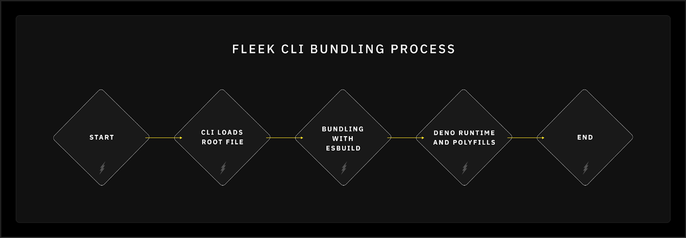

Bundling is the process of combining multiple files into one or a few files. This is crucial in developing web applications because it improves performance and efficiency. Bundling allows developers to reduce the number of HTTP requests required to load a webpage, which accelerates page load time and improves user experience.

---

## Bundling for web applications

Bundlers like Webpack, esbuild, and Parcel take the various modules and dependencies of your application and combine them into one or more bundle files. These tools also optimize the code by removing unnecessary characters and performing other transformations, such as transpiling newer syntax into versions compatible with older environments.

Bundling is an essential optimization technique that can be used to reduce the number of server requests for different types of files, whether they are scripts, stylesheets, or other assets. By merging multiple files together into fewer bundles, it minimizes the number of requests needed to load a page. When bundling is used, a web application can combine numerous files into just a few bundles, which are then downloaded for each page.

Since the browser downloads the bundles synchronously, page rendering is blocked until all bundles are fully downloaded. However, the time saved by reducing the number of server requests from hundreds to just a few typically outweighs the delay caused by synchronous downloading.

---

## Bundling for Fleek Functions

Bundling is a critical step in preparing your code for deployment on Fleek. This process ensures that Fleek Functions can seamlessly integrate with any package or SDK, providing the flexibility needed to perform a wide range of functions and implement complex computational tasks at the edge. By optimizing performance and ensuring perpetual availability, bundling enhances the efficiency and reliability of your applications.

The <u>[Fleek CLI](https://fleek.xyz/docs/cli/)</u> manages this process with precision, packaging your code and its dependencies in a way that maximizes performance and minimizes potential issues. This streamlined approach not only simplifies the deployment process but also significantly improves the developer experience by allowing you to focus on just writing code. Here’s a clear and concise guide on how the Fleek CLI handles bundling and how it enhances the overall developer experience:

1. **Mitigating import strategy issues**

   Different projects might use various importing strategies. Bundling standardizes these strategies, reducing compatibility issues across different environments and modules.

2. **Polyfilling unsupported features**

   Bundling provides a convenient way to polyfill unsupported Node.js features, ensuring your code runs smoothly in the Deno runtime environment used by the Fleek Network.

3. **Improving performance**

   Bundling makes the source code more performant by reducing the number of network requests needed to load different modules and scripts in the browser. This consolidated approach leads to faster load times and better runtime performance for web applications.

4. **Simplifying code transport**

   By composing all source code files into a single file, bundling simplifies the process of transporting your code. This is particularly useful for deployment to distributed storage systems like IPFS or S3, where a single bundled file is easier to manage and deploy than multiple files.

### How the Fleek CLI handles bundling

1. **Loading the root file**

   When you initiate bundling, the Fleek CLI starts by loading a root file from the path you specify. This root file serves as the entry point for the application.

2. **Bundling with esbuild**

   The CLI uses `esbuild` to bundle all your code, along with any third-party modules your code depends on. Bundling helps to:

   - **Optimize performance:** By combining all code into a single file, the startup performance improves as loading the script is easier and quicker.
   - **Ensure compatibility:** Bundling ensures that all necessary dependencies are included, and unnecessary dependencies are striped off, avoiding runtime errors due to missing modules.
   - **Skip unnecessary steps:** Users have the option to skip the bundling step if desired, or bundle them manually to fit their use case.

3. **Deno runtime and polyfills**

   Fleek Network uses Deno’s core engine to interpret JavaScript and TypeScript (coming soon) code.

**N.B.**: If you encounter any error while bundling your files, please reach out to us on <u>[Discord](https://discord.gg/3jaaE9Nc)</u>.

4. **Unsupported Node.js modules**

   Due to security and compatibility concerns, certain Node.js modules cannot be supported by the Fleek CLI. Examples include:

   - **`fs` (File system):** Deno handles file system operations differently. For security reasons, direct file system access is restricted.
   - `child_process`: Spawning new processes can pose security risks, hence it’s not supported.
   - `dgram`: Sending and receiving UDP packets is not supported due to compatibility issues.

---

Bundling is a fundamental process that goes beyond combining files; it’s about optimizing, securing, and simplifying the deployment process for edge functions on Fleek Network. Understanding and leveraging how bundling works on the Fleek CLI is imperative for developers to optimize, ensure compatibility, and secure their applications, leading to a superior development experience.

**What's next?**

To dive deeper into Fleek Functions, visit our <u>[documentation](https://fleek.xyz/docs/cli/functions/)</u>. Get hands-on experience by building practical and unique use cases with your favorite SDKs on Fleek Functions.

## **Resources**:

Introducing Fleek Functions: <u>https://fleek.xyz/blog/announcements/introducing-fleek-functions/</u>

Fleek Functions CLI: <u>https://fleek.xyz/docs/cli/functions/</u>

Fleek documentation: <u>https://fleek.xyz/docs/</u>
