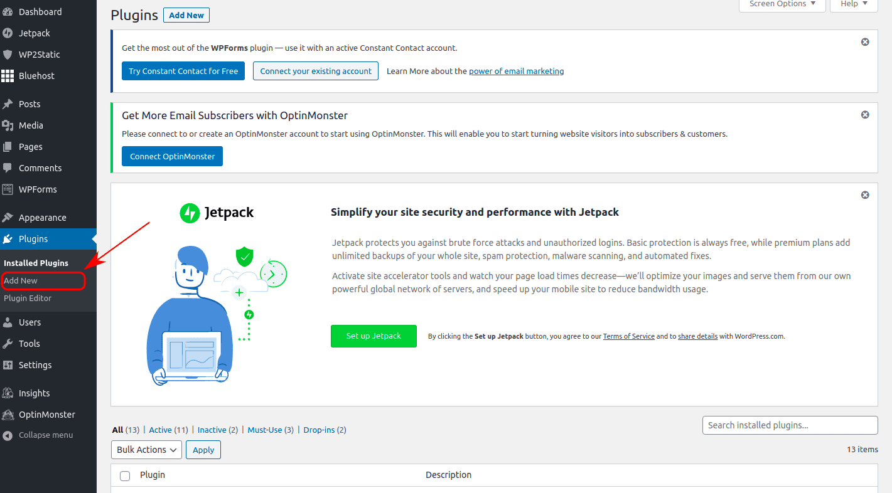
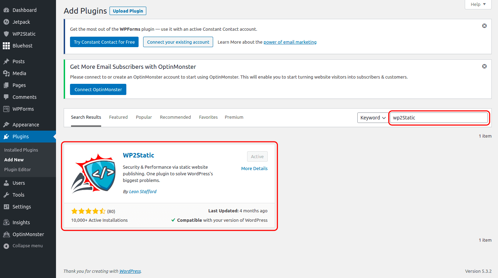
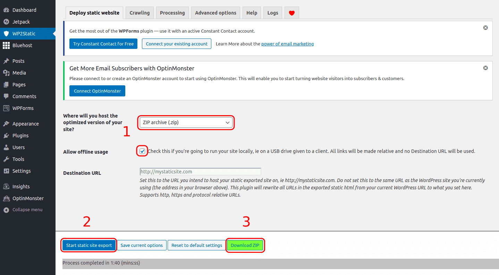
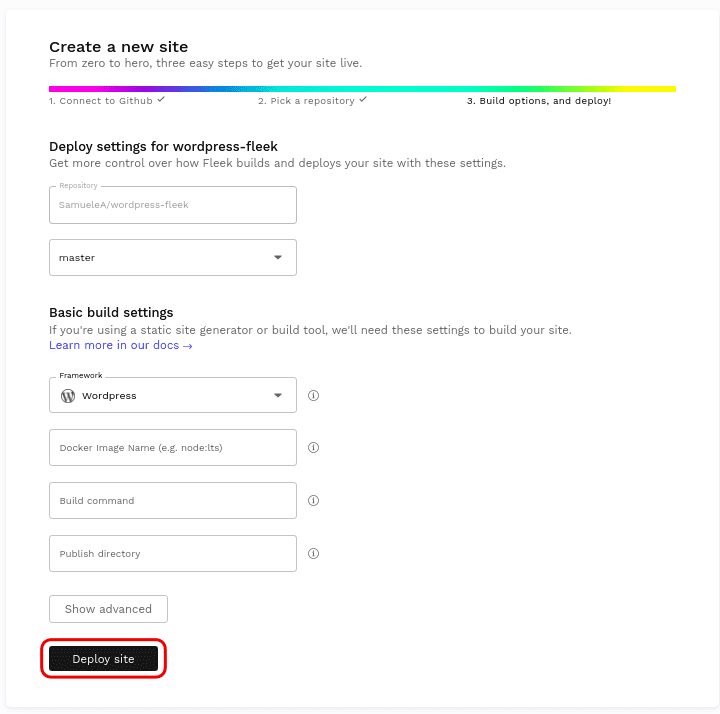
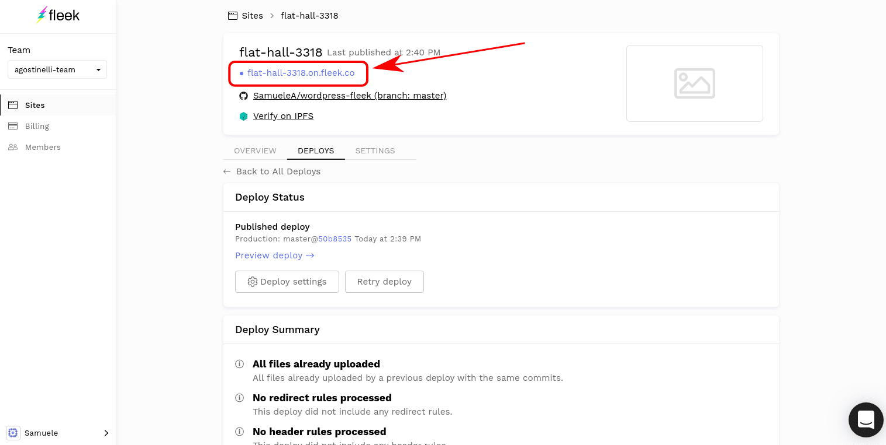

Fleek allows websites to easily find a home on IPFS where they can rest readily accessible, permanent, and uncensorable. In this tutorial, we will show you how simple it is to export a Wordpress site, host it on IPFS and share it with the world. First, we will show how to export the site using a plugin and then we will upload the exported site to WordPress.

## **Exporting the Wordpress Site as a Static Website**

First, we must install a plugin that will allow us to export the site’s HTML, CSS, and JavaScript files. In the Wordpress site’s admin panel go to “Plugins” => “Add New” on the left-hand side menu.

Next, search for the plugin called “WP2Static”, download it and activate it.

The plugin will create a new menu option on the left-hand side menu name “W2PStatic”.When clicking on it, we must fill the form as shown in the image below by selecting the “Zip archive (.zip)” in the dropdown menu and checking the “Allow offline usage” option. This will create a zip archive with no preset root path which will render the site’s paths compatible with the IPFS deployment. After that, click “Start static site export”, wait until the export is done, and download the file via the “Download ZIP” button.

Finally, the downloaded file can be unzipped. The folder contains the totality of the Wordpress Site. The next step is to push it to IPFS!

## **Pushing the Site to IPFS through Fleek**

Fleek will take care of deploying the site to IPFS. To allow Fleek to get the files, we must first push the exported site to [github](https://github.com/). To do so, simply create a new repository and follow the instructions. Once you are done, the result should look similar to the following repo: https://github.com/SamueleA/wordpress-fleek, with the index.html file in the root folder. Then, we log into Fleek and add a new site.

We must authenticate with our GitHub account and find the repo containing the Wordpress file.

The next step is to input information such as build command and public folder. However, the default values are already good, therefore we can directly click on “Deploy Site” without having to alter the settings.

And that is all! Once the site is done deploying, which should take around a minute, the site will be available through the .tmnl.co address in blue. In our case, the blog is now accessible through IPFS at this address: https://flat-hall-3318.on.fleek.co/

## **Share!**

Congratulations! Your content is now deployed and a part of IPFS! Your cool site can be shared with the world either with the Fleek-provided URL, or by adding one of your domains to Fleek, or through IPFS by clicking on “Verify on IPFS”. You can now be confident that your site is safe and untouchable on IPFS!

- [Sign up](https://app.fleek.xyz) to try yourself
- Join our [Community Chat](https://discord.com/invite/fleek)
- Follow us on [Twitter](https://twitter.com/fleek)
- Check out our [Tech Docs](/docs/)
- Contact us at support@fleek.xyz
