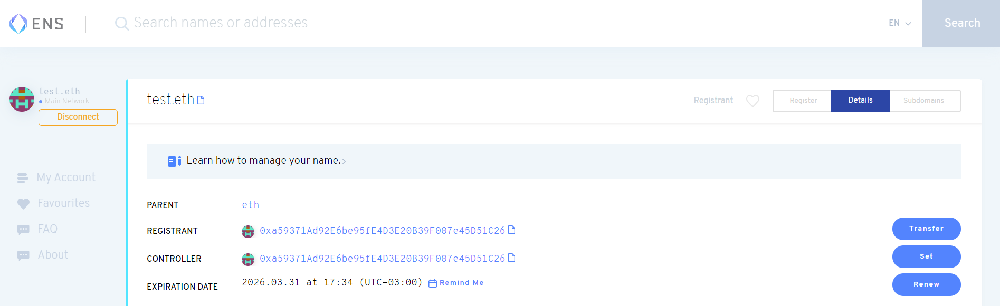

## Verifying your .eth domain was linked properly

You can quickly test that the ENS domain is correctly synced with the IPFS hash of the current build by appending `.limo` after the domain. EG: [https://⚡⚡⚡.eth.limo](https://xn--57haa.eth.limo/) thanks to a gateway service provided by ENS and Cloudflare. Anyone can access your site this way. Else, you can try an ENS-compatible browser like [Brave](https://brave.com/) or install the [MetaMask](https://metamask.io/) browser extension.

An alternative to eth.link is eth.limo! It's a decentralized option (Cloudflare's eth.link is centralized and can experience downtimes) that was created so that there is not only one Web2 gateway to IPFS+ENS sites. As easy as .eth.link. You just add .limo at the end of your ENS name. EG, http://ens.eth.limo/

### Can't access your ENS domain via any browser?

You must ensure that your browser is able to resolve ENS domains. You can test this functionality with Fleek's homepage: [fleek.eth](https://app.ens.domains/fleek.eth).

It doesn't work? Then your browser might not support ENS domain resolving natively. [Here's a list of compatible browsers](<https://medium.com/the-ethereum-name-service/all-the-ways-you-can-surf-the-decentralized-web-today-bf8e7a42fa27#:~:text=There%20are%20at%20least%20five,and%20Unstoppable%20Browser%20(desktop)>). However, **the easiest way to resolve and visit .eth websites** is installing the [MetaMask](https://metamask.io/) wallet browser extension, that adds support for ENS to any browser.

### Have a compatible browser, but ENS domain doesn't work?

It's possible the link doesn't immediately work. Most browsers, if not all of them, will redirect the user to an IPFS gateway and it is possible that the content for that IPFS hash has not yet propagated to the gateway. Wait a few minutes if that is the case.

### ENS domain stuck in "pending transaction" after new deployment

If after making a new deployment, you see in the Domain Management tabs in your site that the ENS domain has a "Pending Transaction" alert, you might be experiencing an issue with a stuck transaction.

The most common cause of this is that you were using an ENS domain with Fleek before [Fleek started using IPNS](https://blog.fleek.co/posts/ens-now-on-ipns-hash-updates) to update content records on ENS on each deployment. After this change, all users were migrated to the new IPNS system after they made a new deployment.

However, if for some reason, the transaction that migrated your record to IPNS got stuck (due to shifting gas prices, or an error), it can cause your site to stay in this "Pending Transaction" state indefinitely.

Let's solve this.

**1. Visit the ENS Domains App to Confirm the Issue**

Visit the [ENS Domains App](https://app.ens.domains/) and verify your address is the domain's controller. An easy way to check this is to see if the controller address matches the registrant. If that is not the case, then Fleek is possibly still set as the controller.

**2. Change the Controller Back to Your Address**

If you are not the controller of your ENS domain, re-set the controller to your own Ethereum address to retake back full control. Why do you need to be the controller? You need to be the controller to modify records yourself, which you will need to do in step 4 when you set the new Content Hash for your ENS domain.

You will need to authenticate with a wallet/address to prove ownership of the name, and trigger a transaction to update the controller back to your address.

<video width="100%" height="auto" autoplay loop style="margin-bottom:20px;">
  <source src="change-controller.mp4" type="video/mp4">
</video>

**3. Go back to Fleek, and delete the ENS domain from site**

Now that you have permission to edit records on your domain again, you can go back to Fleek and:

1. Find the site that has the ENS domain with a pending transaction.
2. Delete/remove the ENS domain name from the site.

<video width="100%" height="auto" autoplay loop style="margin:20px 0;">
  <source src="ens-remove.mp4" type="video/mp4">
</video>

**4. Re-add the ENS Domain to your site**

After removing it, you can **add the ENS domain name back to your site**, but this time since you are the controller, you will be able to verify, and **Set the Content Hash** for the new IPNS record yourself.

This is done by triggering a transaction verification flow using MetaMask, or any compatible wallet, in which you modify the content hash record on your domain to your new IPNS address.
